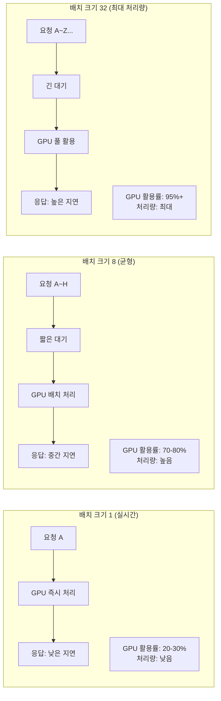
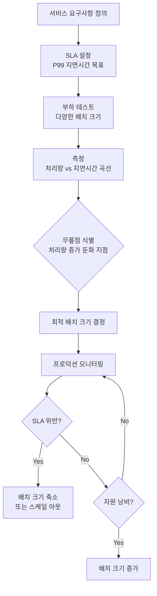

# 추론 지연-처리량 트레이드오프 (Latency-Throughput Tradeoff)

## 개요

LLM 추론 시스템에서 **지연시간(Latency)**과 **처리량(Throughput)**은 근본적으로 긴장 관계에 있다. 지연시간을 낮추려면 요청이 들어오는 즉시 처리해야 하고, 처리량을 높이려면 여러 요청을 묶어 배치로 처리해야 한다. 이 두 목표 사이의 최적 균형점을 찾는 것이 추론 서빙 시스템 설계의 핵심 문제다.

## 지연시간과 처리량의 정의

- **지연시간(Latency)**: 단일 요청이 입력부터 완전한 출력까지 걸리는 시간. 사용자 경험 지표
  - TTFT (Time To First Token): 첫 토큰 생성까지의 시간
  - TPOT (Time Per Output Token): 이후 각 토큰 생성 간격
  - E2E Latency: 전체 응답 완료까지의 시간
- **처리량(Throughput)**: 단위 시간당 처리하는 토큰 수 또는 요청 수. 시스템 효율 지표
  - Tokens/sec: 초당 생성 토큰 수
  - Requests/sec: 초당 완료 요청 수
  - GPU Utilization: GPU 연산 자원 활용률

## 배치 크기와 트레이드오프

배치 크기(batch size)는 이 트레이드오프를 조절하는 핵심 파라미터다.

GPU는 병렬 행렬 연산에 최적화되어 있어, 배치 크기가 1일 때는 연산 유닛의 대부분이 유휴 상태다. 배치 크기를 늘리면 GPU 활용률이 증가하여 처리량이 선형 이상으로 증가하지만, 각 요청이 배치 구성을 기다리는 시간이 추가된다.

## Little의 법칙과 큐잉 이론

시스템의 안정 상태를 이해하는 데 Little의 법칙이 유용하다:

$$L = \lambda \cdot W$$

- $L$: 시스템 내 평균 요청 수 (동시 처리 중인 요청)
- $\lambda$: 초당 도착 요청률 (Requests Per Second)
- $W$: 시스템 내 평균 체류 시간 (지연시간)

처리량($\lambda$)을 높이면 같은 지연시간($W$) 하에서 더 많은 동시 요청($L$)을 처리할 수 있다. 반대로 지연시간 SLA를 고정하면 허용 가능한 부하($\lambda$)의 상한이 결정된다.

## SLA와 P99 지연시간

프로덕션 서비스에서 지연시간 목표는 **평균(P50)**이 아닌 **P99** (99번째 백분위수)로 설정해야 한다:

| 지표 | 설명 | 권장 목표 (예시) |
|------|------|----------------|
| P50 (중앙값) | 절반의 요청 처리 시간 | 1초 |
| P95 | 95% 요청 처리 시간 | 3초 |
| P99 | 99% 요청 처리 시간 | 5초 |
| P99.9 | 999개 중 999개 | 10초 |

배치 크기를 늘리면 평균 지연시간은 개선되지만 P99가 악화될 수 있다. 불운한 요청이 큰 배치의 끝에 배치되면 매우 긴 대기를 경험하기 때문이다. 동적 배치([[dynamic-batching]])는 이 문제를 완화한다.

## 최적 운영점 찾기

처리량-지연시간 커브에서 처리량 증가 폭이 급격히 줄어드는 "무릎점(knee point)"이 일반적으로 최적 운영 지점이다. 이 지점 이후로는 지연시간이 급격히 증가하면서 처리량 이득은 미미해진다.

## 연속 배치와 동적 배치

정적 배치(static batching)의 한계를 극복하기 위해 현대 서빙 엔진은 [[dynamic-batching|동적 배치]]와 연속 배치(continuous batching)를 채용한다. 이 기법들은 고정 배치 크기 없이 새 요청을 진행 중인 배치에 동적으로 추가하여 지연시간과 처리량의 균형을 자동으로 조절한다. 서빙 인프라 전체 구조는 [[model-serving]] 참조.

## 관련 문서

- [[model-serving]] - 서빙 인프라와 트레이드오프 관리
- [[dynamic-batching]] - 동적 배치로 트레이드오프 완화
- [[continuous-batching]] - 연속 배치 기법
- [[token-streaming-sse]] - 스트리밍이 체감 지연시간에 미치는 영향
- [[llm-inference-metrics]] - 추론 성능 지표 체계
