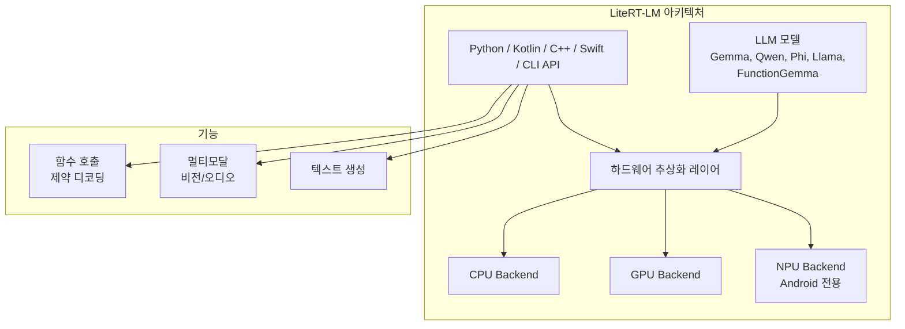

# Google LiteRT-LM

엣지 디바이스(Android/iOS/Web/IoT)에서 [[context-engineering|LLM]]을 프로덕션 수준으로 배포하기 위한 Google의 오픈소스 고성능 추론 프레임워크. 1.5GB 미만 메모리, 100ms 미만 지연을 목표로 설계됐다.

## 개요

LiteRT-LM은 "프로덕션 레디(Production-Ready)" 크로스 플랫폼 LLM 인퍼런스 프레임워크로, 모바일(Android/iOS), 데스크톱(Windows/macOS/Linux), 웹, IoT(Raspberry Pi 등) 환경을 모두 지원한다. 하드웨어 가속(CPU/GPU/NPU)을 추상화하여 개발자가 플랫폼별 최적화를 직접 다룰 필요 없이 일관된 API로 엣지 LLM을 배포할 수 있다.

## 핵심 특징

### 크로스 플랫폼 지원

| 플랫폼 | CPU | GPU | NPU |
|--------|-----|-----|-----|
| Android | O | O | O |
| iOS | O | O | - |
| macOS | O | O | - |
| Windows | O | O | - |
| Linux | O | O | - |
| Web | O | - | - |

NPU 가속은 현재 Android 전용으로, 모바일 AI 가속칩을 직접 활용할 수 있다.

### 지원 모델
- **Gemma 시리즈**: Gemma4 변형 (2.5-3.6 GB), Gemma-3n
- **Qwen**: 0.5B - 1.5B 범위
- **Phi-4-mini**
- **FunctionGemma**: 289 MB (경량 함수 호출 전용)
- **Llama** 및 기타 오픈 모델

### API 매트릭스

| API | 상태 | 주요 용도 |
|-----|------|-----------|
| CLI | Early Preview | 빠른 테스트/프로토타이핑 |
| Python | Stable | 데스크톱 프로토타이핑, Raspberry Pi |
| Kotlin | Stable | Android 네이티브 앱, JVM 도구 |
| C++ | Stable | 고성능 크로스 플랫폼 코어 로직 |
| Swift | In Development | iOS/macOS 지원 (추가 예정) |

## 기술 상세

### 성능 벤치마크 (Gemma-4-E2B, 2.58 GB 기준)

| 디바이스 | 가속기 | Prefill (tk/s) | Decode (tk/s) | TTFT |
|---------|--------|---------------|---------------|------|
| Samsung S26 Ultra | CPU | 557 | 47 | - |
| Samsung S26 Ultra | GPU | 3,808 | 52 | - |
| iPhone 17 Pro | CPU | 532 | 25 | - |
| iPhone 17 Pro | GPU | 2,878 | 56 | - |
| MacBook Pro M4 | CPU | 901 | 42 | - |
| MacBook Pro M4 | GPU | 7,835 | 160 | - |

**핵심 수치**:
- Prefill 속도: CPU 133-901 tk/s, GPU 최대 11,234 tk/s
- TTFT (Time to First Token): GPU 가속 시 0.1초 수준
- 피크 메모리: 607-1,733 MB (디바이스별)
- MacBook Pro M4 GPU에서 decode 160 tk/s는 실시간 대화형 사용에 충분한 수준

### 주요 기능

- **함수 호출(Function Calling)**: 에이전틱(Agentic) 워크플로우 지원. FunctionGemma(289MB)로 경량 함수 호출 전용 모델도 제공
- **멀티모달**: 비전(Vision) 및 오디오(Audio) 입력 처리. 이미지 이해, 음성 인식 등 온디바이스에서 처리
- **제약 디코딩(Constrained Decoding)**: 출력 정확도 향상을 위한 구조화된 생성. 함수 호출 시 JSON 스키마 준수 보장
- **하드웨어 추상화**: 플랫폼별 가속기를 단일 API로 통합. CPU/GPU/NPU 전환이 API 수준에서 투명

### 엣지 배포 시나리오

LiteRT-LM의 주요 타겟 사용 사례:

- **모바일 앱**: 오프라인에서도 동작하는 AI 어시스턴트 (607MB 메모리로 동작 가능)
- **IoT/임베디드**: Raspberry Pi 등에서 Python API로 경량 LLM 배포
- **에이전틱 워크플로우**: FunctionGemma + 제약 디코딩으로 디바이스 내 도구 호출 체인 구현
- **프라이버시 민감 앱**: 의료/금융 데이터를 디바이스에서만 처리, 서버 전송 없음

### 클라우드 추론 대비 트레이드오프

| 항목 | LiteRT-LM (엣지) | 클라우드 추론 |
|------|------------------|-------------|
| 지연 | 0.1초 미만 (TTFT) | 네트워크 지연 포함 |
| 프라이버시 | 데이터 디바이스 내 유지 | 서버 전송 필요 |
| 모델 크기 | 289MB-3.6GB | 제한 없음 |
| 성능 | 디바이스 하드웨어 제약 | GPU 클러스터 활용 |
| 비용 | 초기 배포 후 무료 | 토큰 기반 과금 |
| 오프라인 | 완전 지원 | 불가 |

## 경쟁 프레임워크 비교

| 프레임워크 | 제공사 | 플랫폼 범위 | NPU 지원 | 모델 생태계 |
|-----------|--------|-----------|---------|-----------|
| LiteRT-LM | Google | 6개 (Android/iOS/Mac/Win/Linux/Web) | Android | Gemma, Qwen, Phi, Llama |
| llama.cpp | 커뮤니티 | 데스크톱 중심 | 제한적 | Llama 패밀리 중심 |
| MLX | Apple | macOS/iOS 전용 | Apple Neural Engine | 범용 |
| ONNX Runtime | Microsoft | 크로스 플랫폼 | DirectML | 범용 |

LiteRT-LM의 핵심 차별점은 Google이 직접 관리하는 모델 최적화(Gemma 시리즈)와 Android NPU 네이티브 지원이다. llama.cpp가 커뮤니티 주도로 광범위한 모델을 지원하는 반면, LiteRT-LM은 프로덕션 안정성과 공식 지원 모델의 최적화에 집중한다.

## 관련 문서

- [[on-device-llm]] -- 온디바이스 LLM / 엣지 AI 배포 개념
- [[ai-inference-[[quantization-model-compression|quantization]]-2026]] -- 엣지 배포를 위한 양자화 기법
- [LiteRT-LM GitHub](https://github.com/google-ai-edge/LiteRT-LM)
- [Google AI Edge - LiteRT-LM Overview](https://ai.google.dev/edge/litert-lm/overview)
