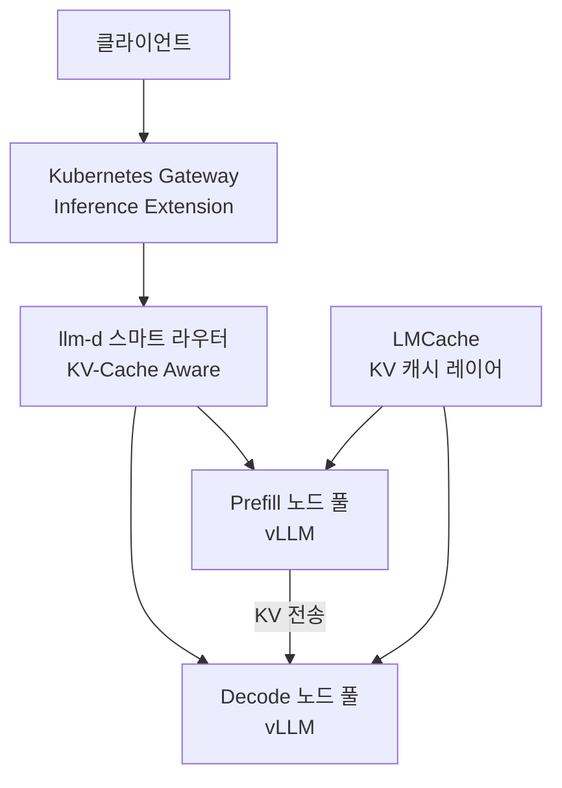

# llm-d & Gateway API Inference Extension

vLLM + Kubernetes Gateway API Inference Extension 기반의 CNCF 분산 추론 스택. IBM/Red Hat/Google/NVIDIA가 주도하는 쿠버네티스 네이티브(Kubernetes-native) 대규모 LLM 서빙 표준이다.

## 제품 정체성

- **llm-d**: 분산 추론 데몬(daemon). vLLM 위에서 KV 캐시 인식 라우팅, 디스어그리게이션(prefill/decode 분리), 멀티 노드 추론을 조율
- **Gateway API Inference Extension**: Kubernetes SIG-Network가 관리하는 LLM 서빙 특화 게이트웨이 확장. 모델별 라우팅, 크리티컬 요청 큐, 어댑터 라우팅 기능 제공

## 왜 중요한가

2026년 3월 24일 llm-d가 CNCF Sandbox에 편입되었고, Gateway API Inference Extension v1.4.0이 3월 20일 GA(General Availability)되면서 쿠버네티스 네이티브 분산 추론의 공식 표준 경로가 됐다.

## 아키텍처

핵심은 **KV 캐시 인식 라우팅**: 동일 시스템 프롬프트를 가진 요청을 같은 KV 캐시를 가진 노드로 보내 중복 계산을 원천 차단한다.

## 주요 컴포넌트

| 컴포넌트 | 역할 |
|---------|------|
| llm-d 추론 게이트웨이 | HTTP/gRPC 요청 수신 및 라우팅 |
| KV-Cache Aware Scheduler | 캐시 히트율(hit rate) 최대화 노드 선택 |
| llm-d-kv-cache-manager | LMCache와 연동한 분산 KV 캐시 관리 |
| Prefill-Decode 디스어그리게이션 | 첫 토큰 지연(TTFT)과 처리량(TPS) 독립 최적화 |
| Gateway API Inference Extension | 모델별 우선순위 큐, 크리티컬 요청 보장 |

## Gateway API Inference Extension 핵심 기능

- **InferencePool**: 동일 모델 서빙 파드(pod) 그룹을 풀(pool)로 추상화
- **InferenceModel**: 모델 이름과 우선순위를 오브젝트로 관리
- **Critical 요청 큐**: SLA가 있는 요청을 일반 배치 요청보다 우선 처리
- **LoRA 어댑터 라우팅**: 어댑터별로 특화 파드로 동적 라우팅

## 실무 적용 관점

- **K8s 네이티브 서빙**: 기존 Kubernetes 인프라에 llm-d를 CRD(Custom Resource Definition)로 추가하면 즉시 분산 추론 환경 구성
- **디스어그리게이션 활용**: 긴 프롬프트가 많은 워크로드(RAG, 에이전트)에서 Prefill/Decode 분리로 TTFT 50% 이상 단축
- **다중 모델 관리**: 하나의 Gateway로 여러 모델/어댑터를 동시 서빙하며 우선순위 관리
- **CNCF 생태계 호환**: Prometheus 메트릭, OpenTelemetry 트레이싱과 기본 통합

## 대표 레퍼런스

- [llm-d/llm-d GitHub Repository](https://github.com/llm-d/llm-d)
- [llm-d Architecture Documentation](https://llm-d.ai/docs/architecture)
- [kubernetes-sigs/gateway-api-inference-extension GitHub](https://github.com/kubernetes-sigs/gateway-api-inference-extension)
- [Introducing Gateway API Inference Extension - Kubernetes Blog](https://kubernetes.io/blog/2025/06/05/introducing-gateway-api-inference-extension/)
- [Gateway API Inference Extension Documentation](https://gateway-api-inference-extension.sigs.k8s.io/)

## 관련 문서

- [[ai-hot-topics-2026-04|2026년 4월 AI 개발 핫토픽 100선]]
- [[sglang|SGLang on GB300 NVL72 with NVFP4]]
- [[lmcache|LMCache + Mooncake KV Cache Layer]]
- [[lmcache-kv-cache-layer|LMCache-Based Distributed KV Cache Offloading]]
- [[vllm-v1-engine|vLLM V1 Engine on Blackwell]]
