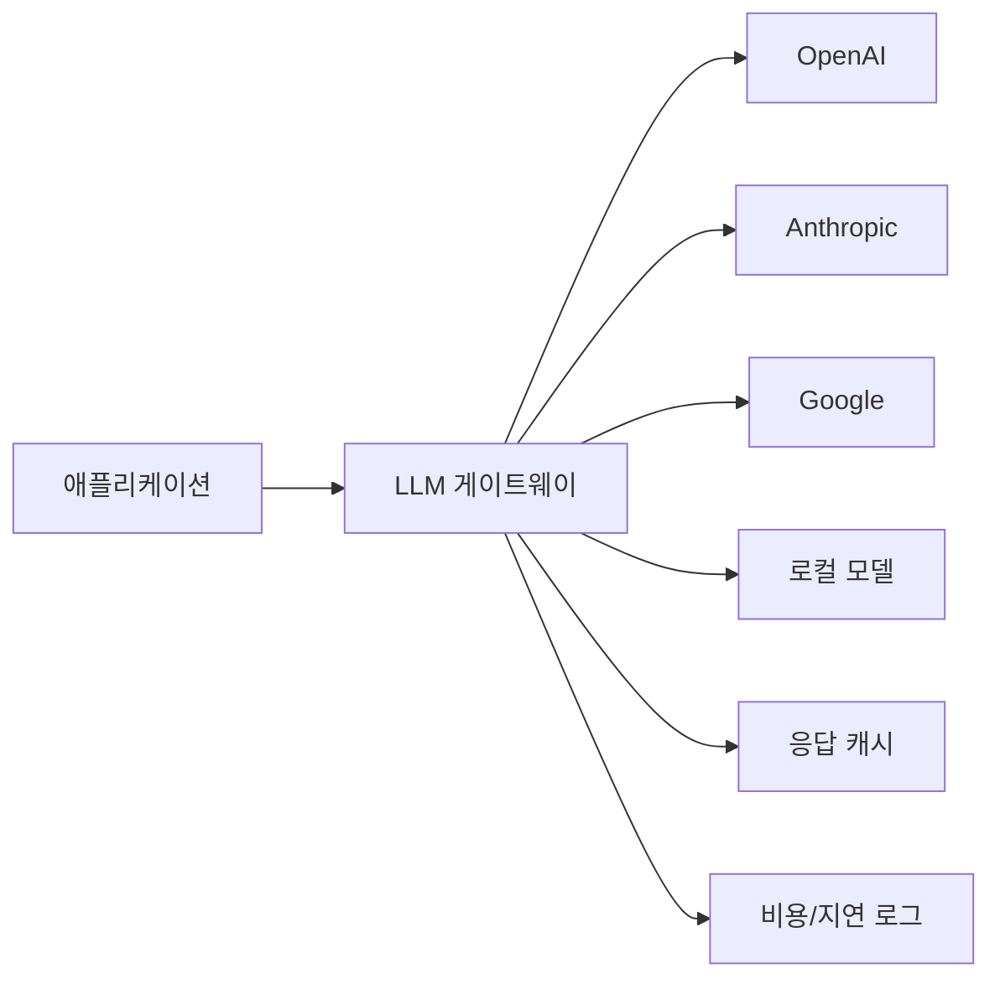

# LLM 게이트웨이

여러 LLM 프로바이더(OpenAI, Anthropic, Google 등)를 **단일 API로 통합**하고, failover, 비용 최적화, 관측성을 제공하는 인프라 계층. [[llm-router|LLM 라우터]]가 쿼리를 최적 모델에 배정한다면, 게이트웨이는 그 밑단의 **네트워크 인프라**다.

## 핵심 기능

| 기능 | 설명 |
|------|------|
| **통합 API** | OpenAI 호환 형식으로 모든 프로바이더 접근 |
| **Failover** | 프로바이더 장애 시 자동 대체 |
| **로드밸런싱** | 여러 API 키/엔드포인트 간 분산 |
| **비용 추적** | 프로바이더/모델별 토큰 사용량, 비용 대시보드 |
| **레이트 리밋** | 팀/프로젝트별 사용량 제한 |
| **캐싱** | 동일 쿼리 응답 재사용 |

## 주요 도구

- [[litellm|LiteLLM]]: 200+ 프로바이더, 오픈소스
- [[portkey|Portkey]]: 엔터프라이즈, 가드레일 내장
- [[openrouter|OpenRouter]]: 마켓플레이스 방식
- [[helicone|Helicone]]: 프록시 방식 관측성

## 관련 문서

- [[llm-router]] -- LLM 라우터 (쿼리 수준 라우팅)
- [[litellm]] -- LiteLLM
- [[portkey]] -- Portkey
- [[model-serving]] -- 모델 서빙
