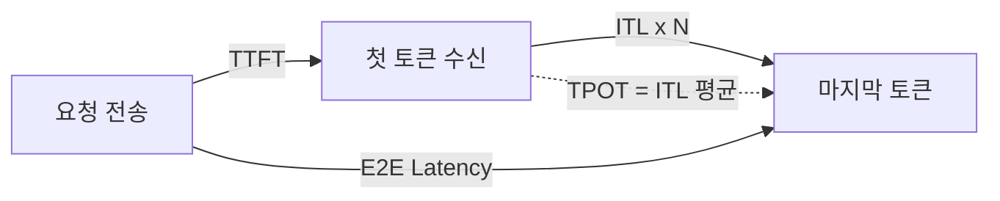

# LLM 추론 메트릭

LLM 서빙 시스템의 성능을 측정하는 핵심 지표들. 사용자 경험(지연시간)과 시스템 효율(처리량)을 균형 있게 평가하기 위한 표준 메트릭 체계다.

## 핵심 지연시간 메트릭

| 메트릭 | 정의 | 영향 요소 |
|--------|------|----------|
| **TTFT** (Time to First Token) | 요청 전송 -> 첫 토큰 수신 | 프리필 시간, 큐 대기, 프리픽스 캐시 |
| **TPOT** (Time Per Output Token) | 출력 토큰당 평균 생성 시간 | 디코딩 속도, 배치 크기, KV 캐시 |
| **ITL** (Inter-Token Latency) | 연속 토큰 간 간격 | 배치 간섭, 프리필 끼어들기 |
| **E2E Latency** | 전체 요청 지연시간 | TTFT + (출력 길이 x TPOT) |

## 처리량 메트릭

| 메트릭 | 단위 | 의미 |
|--------|------|------|
| **Throughput** | tokens/s | 시스템 전체 초당 생성 토큰 수 |
| **QPS** | req/s | 초당 처리 요청 수 |
| **Concurrent Users** | - | 동시 서비스 가능 사용자 수 |

## SLA 설계 기준

프로덕션 서비스에서 일반적으로 사용하는 기준:

- TTFT P50 < 500ms, P99 < 2s (대화형)
- ITL P99 < 100ms (스트리밍 체감)
- E2E P99 < 10s (짧은 응답 기준)

[[latency-throughput-tradeoff|지연-처리량 트레이드오프]]에서 배치 크기를 키우면 처리량은 증가하지만 ITL이 악화된다.

## 관련 문서

- [[model-serving]] -- 모델 서빙
- [[latency-throughput-tradeoff]] -- 지연-처리량 트레이드오프
- [[inference-benchmarking]] -- 추론 벤치마킹
- [[prefix-caching]] -- Prefix Caching (TTFT 개선)
