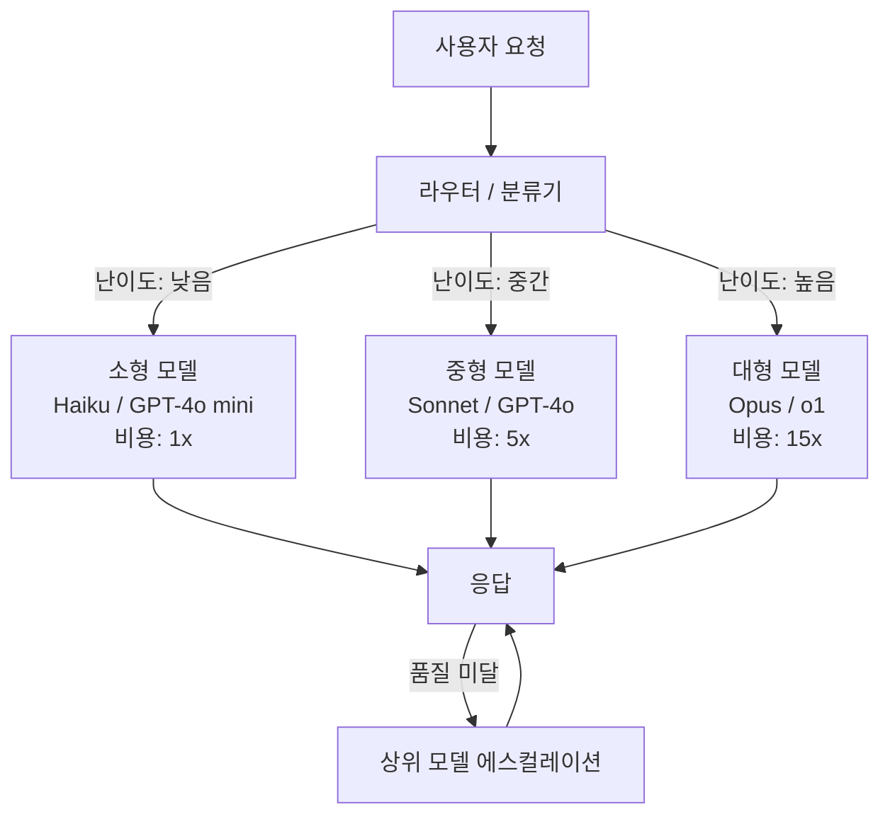
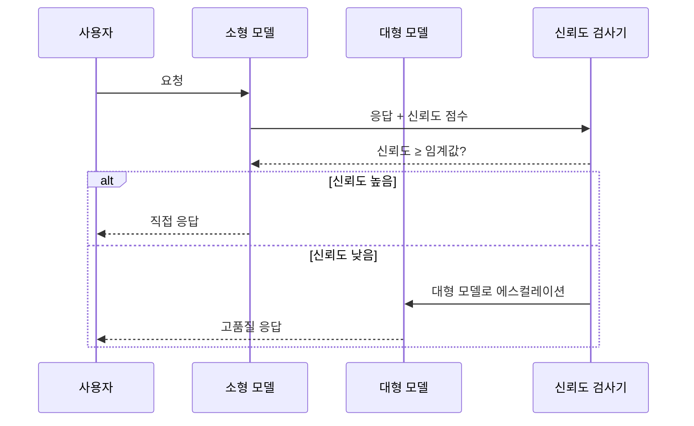

# LLM 라우터 (난이도 기반 모델 선택)

## 개요

**LLM 라우터(LLM Router)**는 사용자 요청의 **난이도 또는 특성을 사전 판단**하여, 해당 요청을 처리할 최적의 모델(크기 또는 역량)로 동적으로 라우팅하는 시스템이다. 핵심 통찰은 "모든 요청이 최강 모델을 필요로 하지 않는다"는 것이다. 간단한 질문은 소형 모델로 처리하고, 복잡한 추론이 필요한 요청만 대형 모델로 전달하면 **품질을 유지하면서 최대 85%의 비용을 절감**할 수 있다.

## 핵심 원리

라우터는 세 가지 정보를 기반으로 라우팅 결정을 내린다:

1. **요청 난이도 추정**: 질문의 복잡성, 도메인, 추론 깊이 필요 여부
2. **모델 풀 구성**: 비용/성능 계층별로 구성된 여러 모델 옵션
3. **라우팅 정책**: 비용 예산, SLA, 품질 임계값에 따른 결정 규칙



위 흐름은 라우터가 난이도 판단에 따라 요청을 분기하고, 필요시 상위 모델로 에스컬레이션하는 구조를 나타낸다.

## 라우터 구현 방식

### 1. 분류기 기반 라우터

소형 분류 모델(BERT 계열, 수십MB)이 요청의 난이도를 예측한다. 응답 시간이 매우 짧고(10-50ms) 추가 비용이 거의 없다.

- **RouteLLM**: 스탠퍼드 연구팀이 개발한 오픈소스 라우터. GPT-4와 GPT-3.5를 대상으로 MMLU 등 벤치마크에서 40-85% 비용 절감 달성.
- **입력 특성**: 길이, 특수 단어(수학 기호, 코드 블록), 질문 유형, 도메인 키워드 등을 피처로 사용.

### 2. LLM as Judge 라우터

소형 LLM이 요청을 읽고 난이도를 판단한다. 정확도가 높지만 추가 추론 비용이 발생한다.

### 3. 임베딩 유사도 라우터

요청 임베딩을 사전 구축된 난이도 클러스터와 비교한다. 새로운 도메인 적응이 빠르다.

### 4. 카스케이드(Cascade) 방식

소형 모델로 먼저 시도하고 신뢰도(confidence)가 낮으면 대형 모델로 재시도한다. 두 번 추론하는 비용이 있지만 품질 보장이 쉽다.



## 85% 비용 절감의 현실

"85% 비용 절감"은 최적 조건에서의 수치다. 현실적 기대치:

| 요청 유형 | 소형 모델 처리 비율 | 실제 비용 절감 |
|-----------|---------------------|---------------|
| 고객 지원 FAQ | 70-80% | 60-75% |
| 코드 완성 | 50-65% | 40-55% |
| 일반 챗봇 | 60-75% | 50-65% |
| 복잡한 추론 작업 | 20-30% | 15-25% |
| 혼합 워크로드 | 55-70% | 45-60% |

비용 절감률은 소형/대형 모델의 가격 비율과 실제 라우팅 분포에 따라 달라진다.

## 실용적 구현 예시

```python
from routellm.controller import Controller

# RouteLLM 컨트롤러 초기화
client = Controller(
    routers=["mf"],       # 행렬 분해 기반 라우터
    strong_model="gpt-4o",
    weak_model="gpt-4o-mini",
    config={"mf": {"threshold": 0.11856}},  # 라우팅 임계값
)

response = client.chat.completions.create(
    model="router-mf-0.11856",
    messages=[{"role": "user", "content": "지구의 자전 주기는?"}],
)
# 단순 질문 -> gpt-4o-mini로 자동 라우팅
```

## 라우터 품질 보장 전략

비용 절감이 품질 저하를 유발하지 않도록 여러 안전장치를 사용한다:

1. **Golden Set 평가**: 정답이 알려진 테스트 셋을 라우터 정확도 측정에 사용
2. **품질 모니터링**: 라우팅된 요청의 사용자 피드백 또는 자동 품질 측정
3. **보수적 임계값 시작**: 처음에는 임계값을 낮게(대형 모델 비율 높게) 설정 후 점진적 조정
4. **Fallback 정책**: 특정 도메인(의료, 법률 등)은 항상 강력한 모델로 라우팅

## [[model-cascading|모델 캐스케이딩]]과의 관계

라우터와 캐스케이딩은 유사하지만 구별된다:

- **라우터**: 요청을 사전에 분류하여 단일 모델로 전달. 추론 1회.
- **캐스케이딩**: 소형 모델로 시도 후 결과에 따라 대형 모델로 에스컬레이션. 추론 1-2회.

라우터가 비용 효율적이고, 캐스케이딩이 품질 보장에 더 안전하다.

## 관련 문서

- [[model-serving]] - 라우터가 통합되는 서빙 인프라
- [[model-cascading]] - 캐스케이딩 기반 모델 선택 전략
- [[inference-distribution-tiers]] - 비용/성능 계층별 모델 배포 구조
- [[request-scheduling]] - 서빙 시스템의 요청 스케줄링 전략
