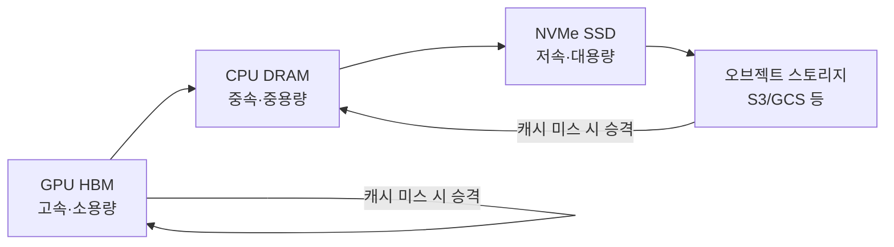
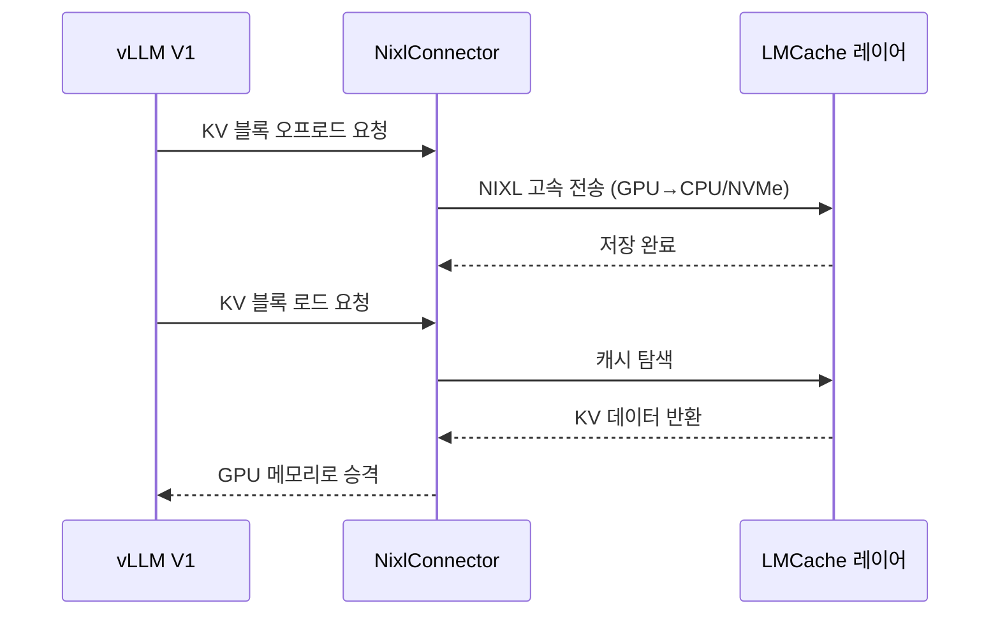

# LMCache-Based Distributed KV Cache Offloading

GPU 외부(CPU/디스크/S3)로 KV 캐시(KV cache)를 오프로드하고 크로스 엔진(cross-engine) 재사용하는 계층. 엔터프라이즈 규모 LLM 추론에서 GPU 메모리 절감과 응답 지연 감소를 동시에 달성한다.

## 제품 정체성

LMCache는 vLLM V1과 긴밀히 통합된 KV 캐시 오프로딩·재사용 라이브러리다. NixlConnector를 통해 NIXL(NVIDIA Inference Xfer Library) 기반 고속 GPU↔CPU 전송을 지원하며, llm-d KV-Cache Manager와 함께 분산 KV 캐시 인프라를 구성한다.

## 왜 중요한가

2025년 말 vLLM V1 + LMCache 조합이 멀티 라운드 QA·RAG에서 **3-10배 지연 절감**을 기록했고, llm-d의 KV-Cache Aware Routing과 함께 2026년 초 엔터프라이즈 표준 스택으로 부상했다.

## KV 캐시 오프로딩 계층 구조



요청이 들어오면 LMCache는 HBM → CPU → NVMe → 원격 스토리지 순으로 캐시를 탐색하고, 히트 시 해당 계층에서 GPU로 KV를 승격(promote)한다.

## 크로스 엔진 KV 재사용

단일 서버 내 캐시 재사용을 넘어, **여러 vLLM 인스턴스** 간에 KV를 공유한다.

```
vLLM 인스턴스 A: [시스템 프롬프트] → KV 계산 후 LMCache에 저장
vLLM 인스턴스 B: 동일 [시스템 프롬프트] → LMCache 히트 → 재계산 없음
```

이를 통해 수십 대의 서빙 서버가 동일 KV 캐시를 공유해 전체 클러스터 효율이 극적으로 개선된다.

## NixlConnector 역할



NIXL은 NVIDIA의 인프라로, PCIe/NVLink를 통해 GPU↔CPU 전송을 RDMA 수준 효율로 수행한다.

## llm-d KV-Cache Aware Routing 연동

llm-d의 스마트 라우터는 **어떤 vLLM 인스턴스가 특정 접두사의 KV 캐시를 보유하는지** 실시간 추적한다. 새 요청이 들어오면 캐시 히트율이 가장 높은 인스턴스로 라우팅해 LMCache 오프로딩 없이도 HBM에서 바로 서빙 가능.

## 실무 효과 (보고 수치)

| 워크로드 | 성능 향상 |
|--------|---------|
| 멀티 라운드 대화 | TTFT 3-10배 감소 |
| RAG (공통 문서 재사용) | KV 재계산 80-90% 절감 |
| 에이전트 (공통 시스템 프롬프트) | GPU 메모리 20-30% 절약 |

## 실무 적용 관점

- **도입 기준**: 동일 접두사가 반복되는 워크로드(멀티 턴, RAG, 배치 추론)에서 효과 극대화
- **CPU DRAM 요구량**: GPU HBM의 2-4배 CPU 메모리를 확보해야 효과적인 오프로딩 가능
- **NixlConnector 설정**: vLLM V1 `--kv-connector NixlConnector`로 활성화. NIXL 라이브러리 별도 설치 필요
- **모니터링**: LMCache 제공 히트율(hit rate) 메트릭으로 캐시 정책 지속 튜닝

## 대표 레퍼런스

- [LMCache: An Efficient KV Cache Layer for Enterprise-Scale LLM Inference (arxiv)](https://arxiv.org/abs/2510.09665)
- [LMCache/LMCache GitHub repository](https://github.com/LMCache/LMCache)
- [llm-d KV Cache Architecture documentation](https://llm-d.ai/docs/architecture/Components/kv-cache)
- [llm-d/llm-d-kv-cache-manager repository](https://github.com/llm-d/llm-d-kv-cache-manager)
- [NixlConnector Usage Guide (vLLM)](https://docs.vllm.ai/en/stable/features/nixl_connector_usage/)

## 관련 문서

- [[ai-hot-topics-2026-04|2026년 4월 AI 개발 핫토픽 100선]]
- [[lmcache|LMCache + Mooncake KV Cache Layer]]
- [[llm-d|llm-d & Gateway API Inference Extension]]
- [[vllm-v1-engine|vLLM V1 Engine on Blackwell]]
- [[flashinfer|FlashInfer Kernel Library for LLM Serving]]
- [[deepseek-sparse-attention|DeepSeek Sparse Attention (DSA) for Long Context]]
