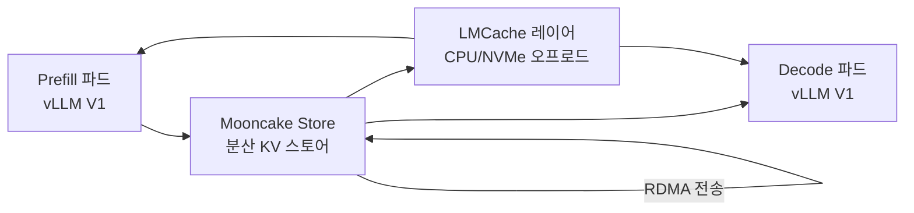

# LMCache + Mooncake KV Cache Layer

GPU/CPU/디스크/원격 스토리지에 걸친 계층형 KV 캐시 재사용 레이어. LMCache와 Mooncake의 결합으로 vLLM V1 디스어그리게이션(disaggregated serving)의 표준 KV 전송 인프라가 됐다.

## 두 프로젝트 정체성

**LMCache**: 분산 KV 캐시 오프로딩·재사용 라이브러리. vLLM V1과 공식 통합되어 있으며, GPU 외부 스토리지 계층을 추상화한다. (→ 상세 오프로딩 아키텍처는 [[lmcache-kv-cache-layer]])

**Mooncake**: Moonshot AI(Kimi)가 개발한 KV 캐시 중심 프로덕션 아키텍처. KV 전송 인프라(RDMA/NIXL)와 분산 스토어(Distributed KV Store)를 제공한다. 2026년 2월 12일 PyTorch Ecosystem에 공식 합류.

## 왜 중요한가

2026년 2월 12일 Mooncake가 PyTorch Ecosystem에 공식 합류했고, LMCache v0.4.3이 4월 6일 릴리스되면서 vLLM V1의 기본 디스어그리게이션 커넥터로 채택됐다. 엔터프라이즈 LLM 추론의 사실상 KV 캐시 관리 표준이 됐다.

## 통합 아키텍처



Mooncake Store가 Prefill→Decode KV 전송을 담당하고, LMCache가 GPU 외부 오프로딩을 담당하는 역할 분리가 핵심이다.

## LMCache vs Mooncake 역할 분리

| 역할 | LMCache | Mooncake |
|------|---------|---------|
| KV 오프로딩 (GPU→CPU/NVMe) | 핵심 기능 | 부분 지원 |
| 크로스 엔진 KV 공유 | 지원 | 지원 |
| Prefill→Decode KV 전송 | NixlConnector 경유 | 핵심 기능 (RDMA) |
| 분산 KV 스토어 | 부분 | 핵심 기능 |
| PyTorch 공식 생태계 | 독립 | 2026-02부터 공식 |

## Mooncake 분산 KV 스토어 원리

Mooncake는 KV 캐시를 **독립 서비스**로 분리해 Prefill과 Decode 파드가 공유 스토어를 통해 KV를 교환한다. 이로써 Prefill이 완료된 즉시 Decode 파드가 다른 노드에서 이어받을 수 있어 GPU 유휴(idle) 시간이 최소화된다.

```
기존: Prefill 완료 → 동일 파드에서 Decode 시작 (Prefill GPU 낭비)
Mooncake: Prefill 완료 → KV 스토어에 저장 → Decode 파드가 이어받음
```

## 디스어그리게이션 이점

| 지표 | 통합 서빙 | Mooncake 디스어그리게이션 |
|------|---------|------------------------|
| TTFT (Time-to-First-Token) | 기준 | 40-60% 단축 |
| TPS (Tokens per Second) | 기준 | 20-30% 향상 |
| GPU 활용률 | 60-70% | 85-90% |

## vLLM V1 통합 구성 예시

```bash
# Prefill 파드: Mooncake Store 연결
python -m vllm.entrypoints.openai.api_server \
  --model deepseek-ai/DeepSeek-V3 \
  --kv-connector MooncakeConnector \
  --kv-role kv_producer

# Decode 파드: Mooncake Store에서 KV 수신
python -m vllm.entrypoints.openai.api_server \
  --model deepseek-ai/DeepSeek-V3 \
  --kv-connector MooncakeConnector \
  --kv-role kv_consumer
```

## 실무 적용 관점

- **도입 시나리오**: 프롬프트가 길고(2000+ 토큰) TTFT SLA가 있는 B2B API 서비스
- **인프라 요구사항**: 노드 간 RDMA 네트워크(InfiniBand 또는 RoCE) 필요. 없으면 일반 이더넷으로 대체 가능하나 전송 지연 증가
- **LMCache + Mooncake 조합**: Prefill→Decode 전송은 Mooncake, 장기 KV 오프로딩은 LMCache로 역할 분담
- **PyTorch Ecosystem 합류 의미**: 공식 유지보수·보안 패치·커뮤니티 지원 보장

## 대표 레퍼런스

- [LMCache/LMCache GitHub Repository](https://github.com/LMCache/LMCache)
- [Welcome to Mooncake Documentation](https://kvcache-ai.github.io/Mooncake/)
- [kvcache-ai/Mooncake GitHub Repository](https://github.com/kvcache-ai/Mooncake)
- [Mooncake Integration - LMCache Docs](https://docs.lmcache.ai/kv_cache/mooncake.html)
- [vLLM V1 Disaggregated Serving with Mooncake Store and LMCache](https://kvcache-ai.github.io/Mooncake/getting_started/examples/vllm-integration/vllmv1-lmcache-integration.html)

## 관련 문서
- [[kv-cache-migration]] -- KV 캐시 마이그레이션 (KV Cache Migration)

- [[ai-hot-topics-2026-04|2026년 4월 AI 개발 핫토픽 100선]]
- [[lmcache-kv-cache-layer|LMCache-Based Distributed KV Cache Offloading]]
- [[llm-d|llm-d & Gateway API Inference Extension]]
- [[vllm-v1-engine|vLLM V1 Engine on Blackwell]]
- [[sglang|SGLang on GB300 NVL72 with NVFP4]]
