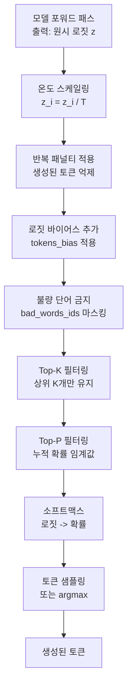

# Logits 프로세서 내부 구조 (Logits Processor Internals)

## 개요

Logits 프로세서(Logits Processor)는 LLM이 다음 토큰 확률 분포를 계산한 직후, 실제 샘플링 직전에 로짓(logit) 값을 수정하는 후처리(post-processing) 파이프라인이다. 온도(temperature) 조정, [[repetition-penalty-logit-bias|반복 패널티]], top-k/top-p 필터링 등 다양한 디코딩 전략이 이 파이프라인을 통해 구현된다. HuggingFace Transformers의 `LogitsProcessor` API와 vLLM의 `SamplingParams`가 대표적 구현이다.

## 로짓 처리 파이프라인 전체 흐름



각 프로세서는 이전 프로세서의 출력 로짓을 입력으로 받아 수정된 로짓을 반환한다. **순서가 중요**하다.

## HuggingFace LogitsProcessor API

HuggingFace Transformers에서 로짓 프로세서는 `LogitsProcessor` 추상 기반 클래스를 상속하여 구현한다:

```python
from transformers import LogitsProcessor
import torch

class MyCustomLogitsProcessor(LogitsProcessor):
    def __call__(
        self,
        input_ids: torch.LongTensor,      # 현재까지 생성된 토큰 [batch, seq_len]
        scores: torch.FloatTensor          # 원시 로짓 [batch, vocab_size]
    ) -> torch.FloatTensor:
        # scores를 수정하여 반환
        # 예: 특정 토큰 금지
        scores[:, forbidden_token_id] = float('-inf')
        return scores
```

`LogitsProcessorList`로 여러 프로세서를 순서대로 체이닝한다:

```python
from transformers import LogitsProcessorList, TemperatureLogitsWarper, TopPLogitsWarper

processors = LogitsProcessorList([
    TemperatureLogitsWarper(temperature=0.7),
    TopPLogitsWarper(top_p=0.9),
])

# generate 시 주입
outputs = model.generate(
    inputs,
    logits_processor=processors,
)
```

## 핵심 프로세서 상세

### 1. 온도 스케일링 (Temperature Scaling)

$$z_i' = \frac{z_i}{T}$$

- $T < 1$: 확률 분포를 날카롭게 만들어 고확률 토큰 선택을 강화 (더 결정론적)
- $T = 1$: 원본 분포 유지
- $T > 1$: 분포를 평탄화하여 다양성 증가 (더 창의적)
- $T \to 0$: argmax (greedy decoding)과 동일

**처리 순서 주의**: 온도 스케일링은 소프트맥스 적용 전에 수행해야 한다. 소프트맥스 후 온도를 조정하면 수학적으로 동일하지 않다.

```python
class TemperatureLogitsWarper(LogitsProcessor):
    def __init__(self, temperature: float):
        self.temperature = temperature

    def __call__(self, input_ids, scores):
        scores = scores / self.temperature
        return scores
```

### 2. 반복 패널티 (Repetition Penalty)

이미 생성된 토큰이 다시 선택될 확률을 줄인다:

$$z_i' = \begin{cases} z_i / \theta & \text{if } z_i > 0 \text{ and } i \in \text{생성된 토큰} \\ z_i \cdot \theta & \text{if } z_i \leq 0 \text{ and } i \in \text{생성된 토큰} \\ z_i & \text{otherwise} \end{cases}$$

여기서 $\theta > 1$이면 반복 억제, $\theta < 1$이면 반복 촉진이다.

```python
class RepetitionPenaltyLogitsProcessor(LogitsProcessor):
    def __init__(self, penalty: float):
        self.penalty = penalty

    def __call__(self, input_ids, scores):
        # 현재까지 생성된 토큰 인덱스
        score = torch.gather(scores, 1, input_ids)
        # 양수는 줄이고, 음수는 키움 (절댓값 감소 효과)
        score = torch.where(score < 0, score * self.penalty, score / self.penalty)
        scores.scatter_(1, input_ids, score)
        return scores
```

이 패널티는 **어휘 공간 전체**에 적용되므로, 최근 컨텍스트만 보는 [[repetition-penalty-logit-bias|로짓 바이어스]]와 다르다.

### 3. 존재/빈도 패널티 (Presence / Frequency Penalty)

OpenAI API에서 사용하는 방식으로, 반복 패널티의 변형이다:

$$z_i' = z_i - p \cdot \mathbf{1}[i \in \text{생성된 토큰}] - f \cdot \text{count}(i, \text{생성된 토큰})$$

- **Presence Penalty** ($p$): 이미 등장한 토큰이면 일정량을 차감 (등장 횟수 무관)
- **Frequency Penalty** ($f$): 등장 횟수에 비례하여 차감

### 4. Min-P 샘플링

[[nucleus-top-p-sampling|Top-P 샘플링]]의 변형으로, 최고 확률 토큰의 $p$% 미만인 토큰을 필터링한다:

```python
class MinPLogitsWarper(LogitsProcessor):
    def __init__(self, min_p: float):
        self.min_p = min_p

    def __call__(self, input_ids, scores):
        probs = torch.softmax(scores, dim=-1)
        top_prob = probs.max(dim=-1, keepdim=True).values
        # 최고 확률의 min_p 비율 미만 토큰 제거
        threshold = top_prob * self.min_p
        scores_filtered = scores.masked_fill(probs < threshold, float('-inf'))
        return scores_filtered
```

### 5. 로짓 바이어스 (Logits Bias)

특정 토큰에 고정 편향값을 더하여 확률을 높이거나 낮춘다:

```python
# 특정 토큰 완전 금지: -inf 추가
# 특정 토큰 강제 유도: +100 추가
logit_bias = {
    50256: float('-inf'),   # <|endoftext|> 금지
    1234: 5.0,              # 토큰 1234 확률 높임
}
```

로짓 바이어스는 반복 패널티 전에 적용해야 패널티가 바이어스된 값에 일관되게 작용한다.

## 처리 순서의 중요성

프로세서 적용 순서는 최종 분포에 큰 영향을 미친다. HuggingFace의 권장 순서:

```
1. 강제 제약 (force_words, bad_words) - 절대적 제약 먼저
2. 반복/존재/빈도 패널티 - 컨텍스트 기반 조정
3. 로짓 바이어스 - 사용자 지정 바이어스
4. 온도 스케일링 - 전체적 날카로움 조정
5. Top-K 필터링 - 후보 수 제한
6. Top-P 필터링 - 누적 확률 기반 제한
7. Min-P 필터링 - 최저 확률 기반 제한
8. (소프트맥스 + 샘플링)
```

**잘못된 순서 예시**: Top-P를 온도 스케일링 전에 적용하면, 온도 조정 후 실제 분포가 달라져 의도한 Top-P 동작이 일어나지 않는다.

## vLLM의 로짓 처리

[[vllm-v1-engine]]은 `SamplingParams`를 통해 로짓 처리 설정을 받고, 내부적으로 CUDA 커널로 구현된 효율적인 로짓 처리를 수행한다:

```python
from vllm import LLM, SamplingParams

sampling_params = SamplingParams(
    temperature=0.7,
    top_p=0.9,
    top_k=50,
    presence_penalty=0.1,
    frequency_penalty=0.0,
    repetition_penalty=1.1,
    logit_bias={50256: -100},  # 토큰 ID -> 바이어스 값
)
```

vLLM은 배치 내 모든 요청에 대해 로짓 처리를 GPU에서 병렬로 수행하여 오버헤드를 최소화한다.

## 구조화된 출력과의 통합

[[decoding-strategies|구조화된 출력(structured output)]] 생성 시, 로짓 프로세서가 문법 제약(grammar constraint)을 적용한다:

- **JSON 스키마 강제**: 현재 파싱 상태에서 허용되지 않는 토큰을 `-inf`로 마스킹
- **정규 표현식 강제**: FSM(유한 상태 머신) 기반으로 허용 토큰 집합 동적 계산
- **CFG(컨텍스트 자유 문법)**: 파서 상태에 따라 다음 허용 토큰 동적 결정

Outlines, Guidance, LMQL 등 라이브러리가 로짓 프로세서 API를 통해 이 기능을 구현한다.

## 주의: 소프트맥스 이전 vs 이후

모든 로짓 처리는 소프트맥스 **이전**에 수행해야 한다. 소프트맥스 이후에는:
- 확률 값이 [0, 1] 범위로 정규화됨
- 일부 토큰을 `-inf`로 마스킹하면 확률 합이 1이 되지 않음
- 재정규화가 필요하여 복잡도 증가

HuggingFace의 `LogitsWarper` 계열은 소프트맥스 이전 로짓에서 동작하도록 설계되어 있다.

## 관련 문서

- [[nucleus-top-p-sampling]] - Top-P 샘플링 상세
- [[repetition-penalty-logit-bias]] - 반복 패널티와 로짓 바이어스
- [[decoding-strategies]] - 디코딩 전략 개요
- [[temperature-sampling]] - 온도 샘플링 개념
- [[beam-search-decoding]] - 빔 서치 디코딩
- [[vllm-v1-engine]] - vLLM 로짓 처리 구현
- [[sglang]] - SGLang 샘플링 파라미터
