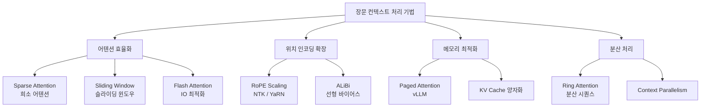

# 장문 컨텍스트 LLM (Long-Context LLM)

## 정의

장문 컨텍스트 LLM은 수만 토큰에서 수백만 토큰에 이르는 긴 입력을 단일 포워드 패스(forward pass) 내에서 처리할 수 있는 언어 모델을 말한다. GPT-4의 초기 버전이 8K 토큰을 지원했다면, 2024~2025년 모델들은 128K(Claude 3), 1M(Gemini 1.5), 2M(Gemini 1.5 Pro 확장) 수준으로 확장됐다.

장문 컨텍스트 능력은 긴 문서 요약, 코드베이스 전체 분석, 다중 문서 추론, 장기 대화 유지 등 다양한 고가치 사용 사례를 열어준다.

## 핵심 도전 과제

**2차 복잡도(Quadratic Attention)**
표준 셀프 어텐션의 연산 비용은 시퀀스 길이 $n$에 대해 $O(n^2)$이다. 1M 토큰 처리 시 표준 어텐션은 사실상 불가능하며, 메모리 요구량도 $O(n^2)$로 급증한다.

**KV 캐시 메모리**
추론 시 각 레이어의 키(K)·값(V) 텐서를 캐싱해야 하며, 컨텍스트가 길수록 GPU 메모리를 선형적으로 잠식한다. 100K 토큰은 대형 모델에서 수십 GB의 KV 캐시를 요구한다.

**위치 외삽(Positional Extrapolation)**
RoPE(Rotary Position Embedding) 등 학습 시 본 최대 위치를 벗어난 토큰을 처리할 때 성능이 급격히 저하된다. 학습 길이보다 긴 컨텍스트를 처리하려면 별도의 외삽 기법이 필요하다.

**중간 소실(Lost in the Middle)**
컨텍스트가 길어질수록 모델은 중간 부분의 정보를 잘 활용하지 못하는 경향이 있다. 시작과 끝의 정보에 편중되는 현상이 실험적으로 확인됐다.

## 주요 기법

위 다이어그램은 장문 컨텍스트 처리를 위한 4가지 접근 축(어텐션 효율화 / 위치 인코딩 확장 / 메모리 최적화 / 분산 처리)과 대표 기법들을 보여준다.

### 희소 어텐션 (Sparse Attention)

전체 토큰 쌍 대신 일부만 어텐션을 계산해 복잡도를 $O(n \sqrt{n})$ 또는 $O(n \log n)$으로 줄인다.

- **슬라이딩 윈도우 어텐션**: 각 토큰이 인접한 $w$개 토큰에만 어텐션 수행 ([[longformer-bigbird]] 참조)
- **[[architectures/sparse-attention-patterns|패턴 기반 희소 어텐션]]**: 로컬 + 글로벌 토큰 조합 (BigBird 등)
- **[[deepseek-sparse-attention|DeepSeek Sparse Attention]]**: 청크(chunk) 단위 희소화

### RoPE 스케일링 (RoPE Scaling)

[[rope-scaling-ntk-yarn|NTK-Aware Scaling 및 YaRN]]은 RoPE의 주파수 스케일을 조정해 학습 시 보지 못한 긴 위치를 외삽한다.

- **선형 스케일링**: $\theta_i \leftarrow \theta_i / s$ (단순하지만 성능 저하 큼)
- **NTK-Aware Scaling**: 고주파 성분은 유지, 저주파 성분만 스케일링
- **YaRN**: 주파수별 차등 스케일링 + 어텐션 온도 조정으로 2M 토큰까지 확장 가능

### Flash Attention

[[flash-attention-fundamentals|Flash Attention]]은 GPU HBM과 SRAM 사이의 메모리 접근을 타일링(tiling)으로 최적화해, 어텐션 계산의 IO 복잡도를 $O(n^2/M)$으로 줄인다 ($M$: SRAM 크기). 수학적으로 동일한 결과를 더 빠르고 적은 메모리로 계산한다. [[flashattention-3]] 및 [[flashattention-4]] 참조.

### Ring Attention

[[ring-attention|Ring Attention]]은 여러 디바이스에 시퀀스를 분할해 분산 어텐션을 수행한다. 각 디바이스는 로컬 KV를 링(ring) 방식으로 순환시켜 전체 어텐션을 근사한다. 단일 디바이스 메모리 한계를 넘어 수백만 토큰 처리가 가능해진다. [[context-parallelism]] 참조.

### Paged Attention

[[paged-attention|Paged Attention]](vLLM)은 OS의 가상 메모리 페이징을 KV 캐시에 적용한다. 연속적 메모리 블록 대신 비연속 페이지로 KV를 관리해 메모리 단편화를 제거하고, 배치 내 가변 길이 시퀀스를 효율적으로 처리한다.

## 평가 방법

**Needle-in-a-Haystack (NIAH)**
긴 문서 중간에 삽입한 "바늘(needle)" 정보를 모델이 얼마나 정확히 검색하는지 측정한다. 컨텍스트 길이 × 위치 2D 히트맵으로 시각화한다.

**RULER**
NIAH를 확장해 다중 키, 단어 검색, 집계 등 다양한 장문 컨텍스트 능력을 체계적으로 평가하는 벤치마크다.

**[[llm-long-context-faithfulness|LLM 장문 컨텍스트 충실도]]**
모델이 컨텍스트 내 정보를 사실적으로 반영하는지(hallucination 없이) 평가한다.

## 실무 트레이드오프: Long Context vs RAG

장문 컨텍스트와 [[rag|RAG(Retrieval-Augmented Generation)]]는 상호 보완적이지만 설계 선택이 다르다.

| 기준 | Long Context | RAG |
|------|-------------|-----|
| 정보 접근 | 전체 문서를 컨텍스트에 직접 | 검색 후 관련 청크만 |
| 지연(Latency) | 긴 프리필(prefill) 비용 | 검색 왕복 지연 |
| 정확도 | 전체 맥락 보존 유리 | 검색 실패 시 정보 소실 |
| 비용 | 토큰 수 비례 선형 증가 | 임베딩+검색+소량 토큰 |
| 업데이트 | 정적 - 재실행 필요 | 인덱스 갱신으로 실시간 가능 |
| 적합 사례 | 코드베이스 전체 분석, 긴 계약서 | 대규모 지식베이스 Q&A |

2025년 기준 실용적 권고: 문서 개수가 적고($\leq$ 수십 개) 전체 맥락이 중요하면 Long Context, 지식베이스 규모가 크고 실시간 업데이트가 필요하면 RAG를 우선 고려한다.

## 왜 중요한가

장문 컨텍스트는 에이전트 시스템에서 특히 중요하다. [[agents/context-folding|Context Folding]] 등 에이전트 메모리 관리 기법과 결합하면, 장기 작업에서 컨텍스트 손실 없이 복잡한 계획·실행 사이클을 유지할 수 있다. 또한 [[in-context-learning|In-Context Learning]]의 효과는 컨텍스트 내 예시 수에 비례하므로, 더 긴 컨텍스트는 더 나은 few-shot 성능으로 이어진다.

## 관련 문서

- [[flash-attention-fundamentals]] - IO 인식 어텐션 최적화
- [[flashattention-3]] / [[flashattention-4]] - 최신 Flash Attention 버전
- [[rope-scaling-ntk-yarn]] - RoPE 외삽 기법 상세
- [[paged-attention]] - KV 캐시 페이징 (vLLM)
- [[ring-attention]] - 분산 시퀀스 어텐션
- [[context-parallelism]] - 컨텍스트 병렬 처리
- [[longformer-bigbird]] - 희소 어텐션 아키텍처
- [[sparse-attention-patterns]] - 패턴 기반 희소 어텐션
- [[long-context-training]] - 장문 컨텍스트 학습 기법
- [[long-context-scaling]] - 컨텍스트 길이 스케일링 연구
- [[context-window]] - 컨텍스트 윈도우 개념
- [[in-context-learning]] - 인컨텍스트 학습
- [[context-folding]] - 에이전트 컨텍스트 압축 기법
- [[llm-long-context-faithfulness]] - 장문 컨텍스트 충실도 평가
