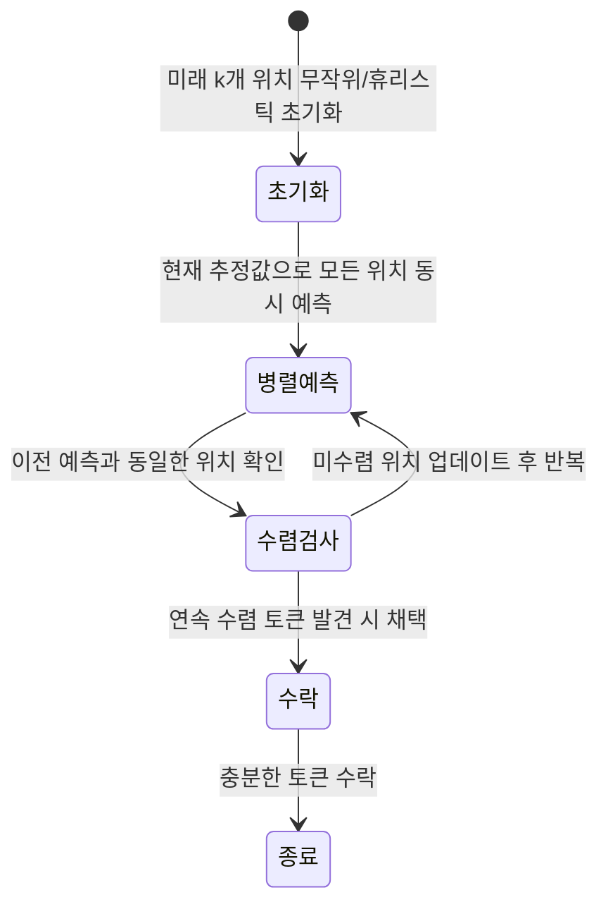
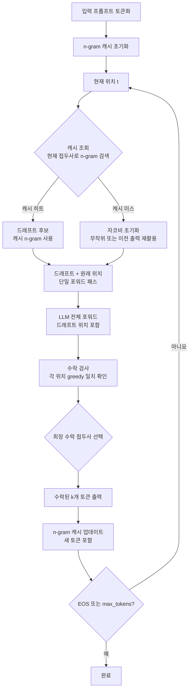
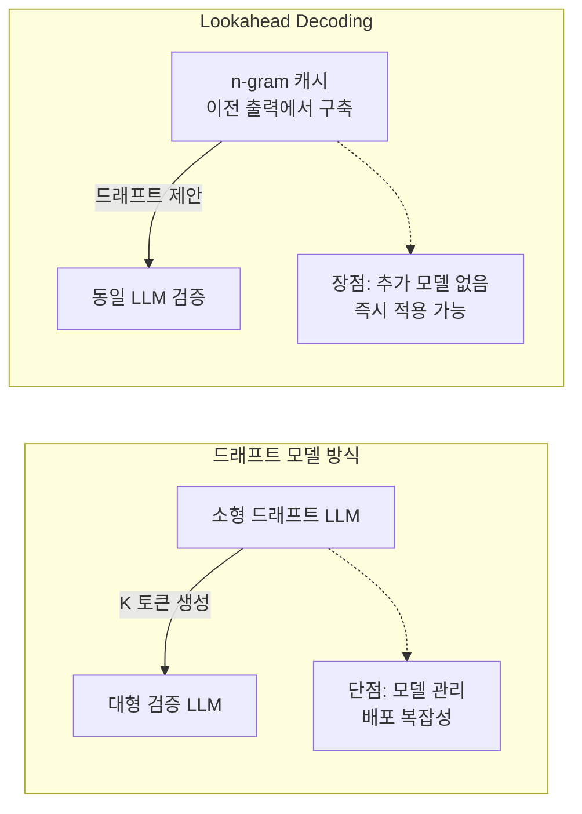

# Lookahead Decoding - n-gram 룩어헤드 가속

## 개요

Lookahead Decoding은 **드래프트 모델 없이, 추가 학습 없이** LLM 자기회귀 디코딩을 가속하는 방식이다. 핵심 아이디어는 두 가지다.

1. **자코비 반복(Jacobi Iteration)**: 여러 위치의 토큰을 동시에 예측하고 반복 수렴
2. **n-gram 캐시(n-gram Cache)**: 이전 생성에서 등장한 n-gram 패턴을 저장해 드래프트로 재사용

두 기법을 결합해 토큰을 하나씩 생성하는 자기회귀 방식보다 1.5-2.0배 빠른 처리량을 달성한다. 2023년 Fu et al.이 제안했으며, 별도 모델 관리 없이 적용 가능한 점이 실용적 강점이다.

## 자코비 반복 기반 병렬 디코딩

일반 자기회귀 디코딩은 토큰을 순차적으로 생성한다. 자코비 반복은 모든 미래 위치를 동시에 예측하고, 이를 반복해 수렴을 유도한다.



**수식 표현**

위치 $t$에서 $t+W$ (윈도우 크기 W)까지 동시에 예측:

$$\hat{x}_{t+1}, ..., \hat{x}_{t+W} = f_\theta(x_1, ..., x_t, \hat{x}_{t+1}, ..., \hat{x}_{t+W-1})$$

예측한 $\hat{x}_{t+j}$가 이전 반복과 동일해지면 해당 위치를 수렴으로 간주해 수락한다.

## n-gram 캐시 활용

자코비 반복만으로는 실용적 가속이 제한적이다. Lookahead Decoding은 이전에 생성한 텍스트에서 n-gram 패턴을 추출해 드래프트로 활용한다.

```mermaid
flowchart LR
    subgraph n-gram 캐시 구성
        G1[생성된 텍스트\n"the cat sat on the mat"]
        G2["2-gram: (the,cat), (cat,sat), (sat,on) ..."]
        G3["3-gram: (the,cat,sat), (cat,sat,on) ..."]
        G1 --> G2 --> Cache[(n-gram 캐시)]
        G1 --> G3 --> Cache
    end

    subgraph 드래프트 생성
        Current[현재 토큰: "the"]
        Cache -->|"the" 로 시작하는 패턴 검색| Draft["드래프트: cat, sat, on"]
        Current --> Cache
        Draft --> V[LLM 검증 포워드 패스]
        V --> Accept[수락된 토큰 채택]
    end
```

**캐시 관리 전략**

```python
# n-gram 캐시 구조 (개념적)
from collections import defaultdict

class NGramCache:
    def __init__(self, n: int = 3):
        self.n = n
        # prefix -> 가능한 후속 토큰 목록
        self.cache = defaultdict(list)

    def update(self, token_ids: list[int]):
        """생성된 토큰에서 n-gram 추출하여 캐시 갱신"""
        for i in range(len(token_ids) - self.n + 1):
            prefix = tuple(token_ids[i:i + self.n - 1])
            next_token = token_ids[i + self.n - 1]
            if next_token not in self.cache[prefix]:
                self.cache[prefix].append(next_token)

    def lookup(self, prefix: tuple[int, ...]) -> list[int]:
        """prefix로 시작하는 후속 토큰 후보 반환"""
        return self.cache.get(prefix, [])
```

## 전체 알고리즘 흐름



## 성능 특성

### 가속 비율 (다양한 작업별)

| 작업 | 반복 패턴 | Lookahead 가속 |
|------|----------|---------------|
| 코드 생성 | 높음 | 1.8-2.2x |
| 지식 집약 QA | 중간 | 1.5-1.7x |
| 창의적 글쓰기 | 낮음 | 1.2-1.4x |
| 요약 | 중간 | 1.5-1.8x |

반복 패턴이 많은 작업일수록 n-gram 캐시 히트율이 높아 가속이 극대화된다. 코드 생성(for/while 루프, 유사 패턴)에서 특히 효과적이다.

### 하이퍼파라미터 영향

| 파라미터 | 설명 | 권장값 | 효과 |
|---------|------|--------|------|
| 윈도우 크기 W | 자코비 반복 위치 수 | 5-10 | 클수록 가속 ↑, 오버헤드 ↑ |
| n-gram 크기 n | 캐시 패턴 길이 | 3-5 | 클수록 정밀도 ↑, 히트율 ↓ |
| guess 수 G | 검증할 후보 수 | 5-10 | 클수록 히트율 ↑, 메모리 ↑ |

## 드래프트 모델 기반 방식과 비교



| 항목 | Lookahead | [[speculative-decoding\|표준 추측 디코딩]] | [[medusa-multi-head-decoding\|Medusa]] |
|------|----------|------------------------|-------|
| 추가 모델 | 없음 | 필요 | 없음 (헤드만) |
| 추가 학습 | 없음 | 없음 | 필요 (헤드 학습) |
| 평균 수락률 | 60-70% | 70-90% | 75-85% |
| 최대 가속 | ~2x | ~3x | ~3x |
| 적용 난이도 | 매우 낮음 | 중간 | 중간 |

## 구현 코드 예시

```python
# Lookahead Decoding 추론 루프 (단순화)
def lookahead_generate(
    model,
    input_ids: torch.Tensor,
    max_new_tokens: int = 512,
    window_size: int = 7,
    n_gram: int = 3,
) -> torch.Tensor:
    cache = NGramCache(n=n_gram)
    generated = input_ids.tolist()[0]

    while len(generated) - len(input_ids[0]) < max_new_tokens:
        current_prefix = tuple(generated[-(n_gram - 1):])

        # n-gram 캐시에서 드래프트 후보 가져오기
        draft_candidates = cache.lookup(current_prefix)

        if draft_candidates:
            # 캐시 히트: 드래프트로 n-gram 사용
            draft = draft_candidates[:window_size]
        else:
            # 캐시 미스: 최근 토큰 재활용 (자코비 초기화)
            draft = generated[-window_size:]

        # 현재 컨텍스트 + 드래프트를 붙여 단일 포워드 패스
        full_sequence = torch.tensor([generated + draft]).to(model.device)
        logits = model(full_sequence).logits

        # 각 위치에서 greedy 예측값 확인
        predictions = logits.argmax(dim=-1)[0]

        # 수락 검사: 연속으로 일치하는 토큰 찾기
        accepted = 0
        for i, (pred, actual) in enumerate(
            zip(predictions[len(generated)-1:], draft)
        ):
            if pred.item() == actual:
                accepted += 1
            else:
                break

        # 최소 1개는 새로 생성 (원래 위치 예측)
        new_tokens_count = max(1, accepted)
        new_token_ids = predictions[len(generated)-1:len(generated)-1+new_tokens_count].tolist()
        generated.extend(new_token_ids)

        # n-gram 캐시 업데이트
        cache.update(generated[-n_gram * 2:])

        if generated[-1] == model.config.eos_token_id:
            break

    return torch.tensor([generated])
```

## 실무 적용 및 통합

**vLLM 통합**

vLLM은 Lookahead Decoding을 `SpecDecodeWorker`의 한 백엔드로 통합 지원한다.

```python
from vllm import LLM, SamplingParams

llm = LLM(
    model="meta-llama/Llama-2-7b-hf",
    speculative_model="ngram",          # Lookahead/n-gram 드래프트
    speculative_max_model_len=8192,
    num_speculative_tokens=5,           # 드래프트 토큰 수
    speculative_draft_tensor_parallel_size=1,
    ngram_prompt_lookup_min=1,
    ngram_prompt_lookup_max=5,
)
```

**적합한 시나리오**
- 즉시 배포가 필요하고 추가 학습/모델 관리가 어려운 환경
- 코드 생성, 문서 요약 등 반복 패턴이 많은 작업
- 다양한 모델에 단일 코드베이스로 가속 적용이 필요한 경우

**부적합한 시나리오**
- 창의적 글쓰기 등 새로운 패턴이 많아 n-gram 히트율이 낮은 경우
- 첫 요청부터 빠른 TTFT(Time to First Token)가 중요한 경우

## 관련 문서

- [[parallel-decoding-jacobi]] - Lookahead의 이론적 기반, 자코비 반복 원리 (같은 큐)
- [[speculative-decoding]] - 추측 디코딩 일반 원리
- [[medusa-multi-head-decoding]] - 다중 헤드 추측 디코딩 (같은 큐)
- [[eagle-3-speculative-decoding]] - 특징 기반 고수락률 추측 디코딩
- [[mirror-speculative-decoding]] - 거울 추측 디코딩
- [[vllm-v1-engine]] - vLLM 서빙 엔진 (Lookahead 통합)
- [[flash-decoding]] - 디코딩 GPU 최적화 기법
- [[sglang]] - 고성능 LLM 서빙 프레임워크
