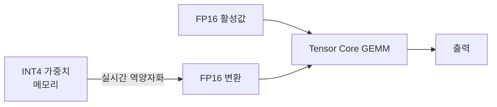

# Marlin 커널

[[awq-quantization|AWQ]] 4-bit 가중치에 최적화된 CUDA 행렬곱 커널. Dequantize-on-the-fly 방식으로 FP16 활성값과 INT4 가중치를 혼합 연산하여, 기존 GPTQ/AWQ 커널 대비 **최고 처리량(tokens/s)**을 달성한다.

## 핵심 최적화

- **비동기 역양자화**: 가중치 로드와 역양자화를 GEMM 파이프라인에 오버랩
- **Tensor Core 활용**: FP16 GEMM을 Tensor Core에서 실행하면서 INT4 로드는 메모리 파이프라인에서 처리
- **AWQ + Marlin = 최강 조합**: AWQ의 정확도 + Marlin의 속도

## 성능 비교

| 커널 | 포맷 | 처리량 (상대) |
|------|------|-------------|
| GPTQ 기본 | GPTQ INT4 | 1x |
| AutoAWQ | AWQ INT4 | 1.3x |
| ExLlamaV2 | EXL2 혼합 | 1.5x |
| **Marlin** | **AWQ INT4** | **1.8-2x** |

## 관련 문서

- [[awq-quantization]] -- AWQ 양자화
- [[gptq-quantization]] -- GPTQ 양자화
- [[model-serving]] -- 모델 서빙
- [[quantization-model-compression]] -- 양자화 일반
