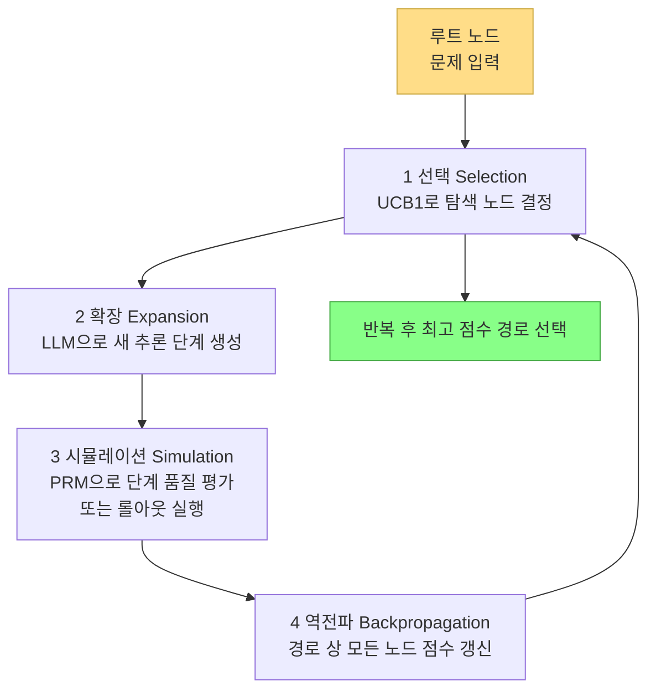
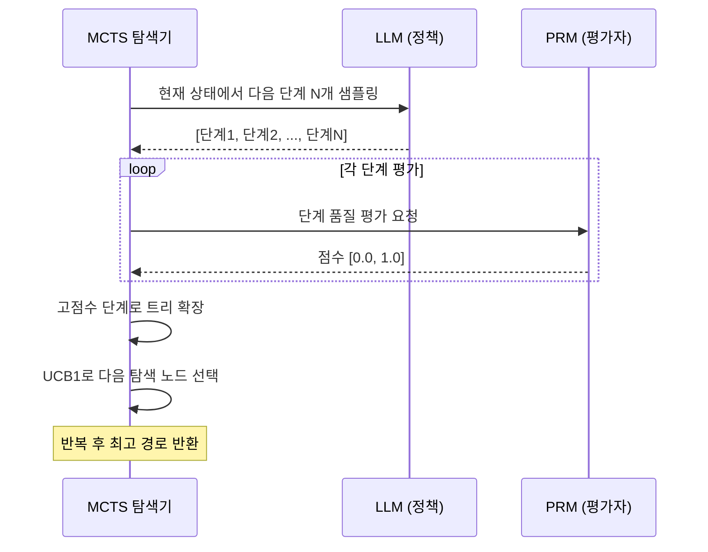

# MCTS 기반 LLM 추론 (Monte Carlo Tree Search + PRM)

## 개요

MCTS 기반 LLM 추론은 Monte Carlo Tree Search(몬테카를로 트리 탐색)를 LLM의 추론 과정에 적용하여, 단일 경로로 greedy하게 답을 생성하는 대신 **여러 추론 경로를 트리 형태로 탐색하고 최적 경로를 선택**하는 기법이다. [[test-time-compute-scaling]] 전략의 핵심 구성 요소로, 추론 시 더 많은 연산을 투입할수록 정확도가 향상되는 원리를 실현한다.

PRM([[process-reward-model-detail]], 과정 보상 모델)은 MCTS에서 각 중간 추론 단계의 품질을 평가하는 신호로 사용된다.

## MCTS 기본 구조

MCTS는 원래 체스, 바둑 등 게임 AI에서 개발된 알고리즘이다. LLM 추론에 적용할 때 다음과 같이 매핑된다.

| 게임 AI | LLM 추론 |
|---------|---------|
| 게임 상태 (state) | 현재까지의 추론 단계들 |
| 행동 (action) | 다음 추론 단계 생성 |
| 보상 (reward) | PRM 점수 또는 최종 답 정확도 |
| 정책 (policy) | LLM 생성 분포 |
| 가치 함수 (value) | 현재 상태에서 최종 정답 확률 |

## MCTS 4단계 사이클

각 단계의 역할:

1. **Selection**: UCB1(Upper Confidence Bound) 공식으로 탐색(exploration)과 활용(exploitation)을 균형 있게 노드를 선택한다.
   $$UCB1 = \bar{v} + c\sqrt{\frac{\ln N}{n}}$$
   - $\bar{v}$: 노드 평균 가치, $N$: 부모 방문 수, $n$: 노드 방문 수, $c$: 탐험 계수

2. **Expansion**: 선택된 리프 노드에서 LLM으로 새로운 추론 단계를 생성 (여러 개 샘플링 가능)

3. **Simulation**: PRM으로 새 단계의 품질 점수를 즉시 계산하거나, 롤아웃(rollout)으로 시뮬레이션

4. **Backpropagation**: 얻은 점수를 루트까지의 모든 조상 노드에 전파하여 통계 갱신

## PRM과의 결합

[[process-reward-model-detail]](과정 보상 모델)은 MCTS의 시뮬레이션 단계에서 중간 추론 단계의 신뢰도를 평가한다.

PRM 없이 ORM(결과 보상 모델)만 사용하면 최종 답에서만 보상을 받으므로 트리가 깊어질수록 신호가 희박해진다. PRM은 각 중간 단계에 즉각 피드백을 주어 탐색을 효율화한다.

## 주요 구현 및 연구

### OpenAI o1 / o3
- 내부적으로 MCTS와 유사한 트리 탐색을 "thinking" 과정에 적용
- 구체적 구현은 비공개이나 테스트 타임 연산 스케일링의 대표 사례

### AlphaCode 2 (DeepMind)
- 코드 생성에 MCTS 적용, PRM으로 중간 코드 단계 평가
- SWE-bench 류 벤치마크에서 기존 best-of-N 대비 큰 향상

### rStar / rStar-Math (Microsoft)
- 수학 문제에 MCTS + 소형 LLM + PRM 결합
- 7B 모델이 70B 모델 수준 성능 달성 사례 보고

### LLaMA-Berry
- LLaMA 계열에 MCTS 적용, MATH/GSM8k 등 수학 벤치마크 개선

## Best-of-N과의 비교

[[test-time-compute-scaling]]에서 가장 단순한 전략은 Best-of-N(N개 생성 후 최고 선택)이다.

| 항목 | Best-of-N | MCTS |
|------|-----------|------|
| 탐색 방식 | 평행한 독립 샘플 | 트리 탐색 (상호 정보 활용) |
| 연산 효율 | 낮음 (중복 탐색) | 높음 (좋은 경로 집중) |
| 구현 복잡도 | 매우 낮음 | 높음 |
| PRM 필요 여부 | ORM으로도 가능 | PRM이 핵심 |
| 적합 문제 유형 | 창의적 생성 | 수학, 코딩, 논리 추론 |

동일한 연산량에서 MCTS는 Best-of-N 대비 10-30% 정확도 향상이 보고된다(수학 벤치마크 기준).

## 한계와 도전 과제

- **PRM 훈련 비용**: 단계별 정답 레이블링은 수동 작업이 많아 고비용
- **추론 속도**: 트리 탐색으로 추론 시간이 수십 배 증가 (latency-sensitive 환경 부적합)
- **깊이 한계**: 너무 깊은 트리는 메모리와 시간이 폭발적으로 증가
- **도메인 의존성**: PRM 훈련 도메인 밖 문제에서 신뢰도 저하
- **탐색 파라미터 민감도**: $c$(탐험 계수), 롤아웃 수 등 하이퍼파라미터 튜닝 필요

## 실용적 적용 가이드

MCTS 기반 추론이 적합한 상황:
- 수학 증명, 경쟁 수학 문제
- 복잡한 코딩 작업 (알고리즘 설계)
- 다단계 논리 추론
- 지연 허용도가 높은 오프라인 배치 추론

적합하지 않은 상황:
- 실시간 대화 응답 (높은 latency)
- 창의적 글쓰기 (Best-of-N이 더 다양성 확보)
- 단순 사실 조회

## 관련 문서

- [[test-time-compute-scaling]] - 테스트 타임 연산 스케일링 전략 전반
- [[process-reward-model-detail]] - PRM 설계 및 훈련 방법
- [[best-of-n-sampling]] - 가장 단순한 테스트 타임 계산 전략
- [[beam-search-decoding]] - 결정론적 트리 탐색 기법
- [[speculative-decoding]] - 추론 속도 향상의 다른 접근
