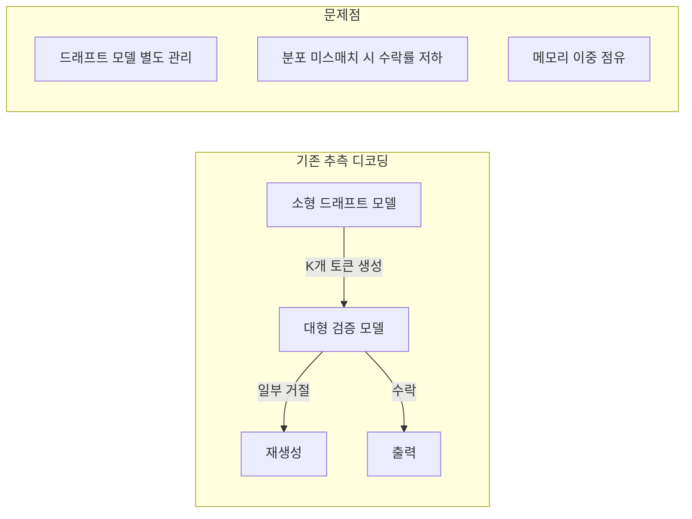
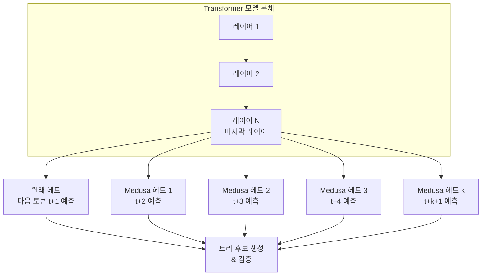
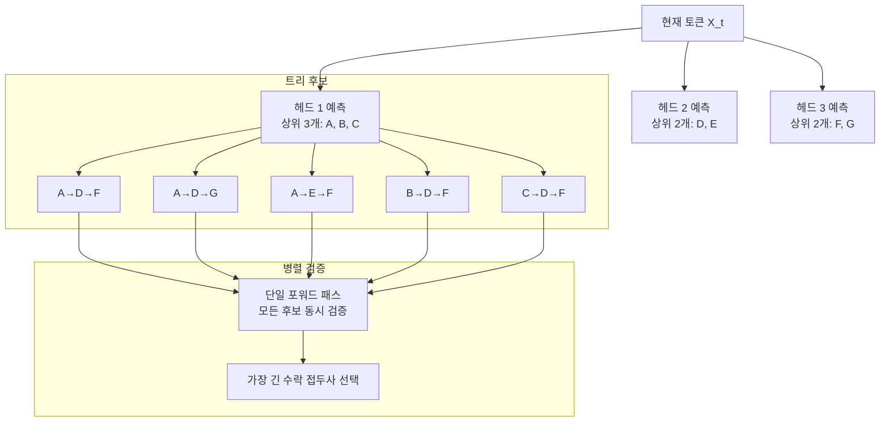
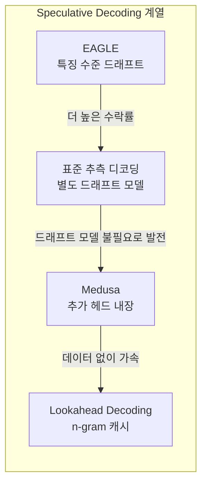

# Medusa - 다중 헤드 추측 디코딩

## 개요

Medusa는 LLM 자기회귀 디코딩 속도를 높이기 위한 **다중 헤드 추측 디코딩(Multi-Head Speculative Decoding)** 프레임워크다. 기존 [[speculative-decoding|추측 디코딩(Speculative Decoding)]]이 별도의 드래프트(draft) 모델을 필요로 하는 것과 달리, Medusa는 원래 LLM에 **추가 디코딩 헤드(Medusa heads)**를 붙여 미래 토큰을 병렬로 예측한다.

드래프트 모델 유지, 두 모델 간 분포 일치 문제 없이 2-3배의 디코딩 가속을 달성한다. 2023년 Tianle Cai 등이 제안했으며 LLM 서빙 최적화의 실용적 방법으로 주목받았다.

## 기존 추측 디코딩의 한계



별도 드래프트 모델 접근법의 문제:
- 드래프트/검증 모델 크기 미스매치 → 수락률 하락
- 도메인 특화 작업에서 범용 드래프트 모델 성능 저하
- GPU 메모리에 두 모델 동시 로드 필요

## Medusa의 핵심 아이디어

원래 LLM의 마지막 레이어 위에 경량 추가 헤드(Medusa heads)를 붙인다. 각 헤드는 현재 위치에서 $k$번째 미래 토큰을 독립적으로 예측한다.



**Medusa 헤드 구조**

각 Medusa 헤드는 단순한 소형 FFN (Feed-Forward Network)이다.

```python
class MedusaHead(torch.nn.Module):
    """Medusa 추가 헤드 - 미래 k번째 토큰 예측"""
    def __init__(self, hidden_size: int, vocab_size: int):
        super().__init__()
        # 단순 2-레이어 FFN
        self.layers = torch.nn.Sequential(
            torch.nn.Linear(hidden_size, hidden_size),
            torch.nn.SiLU(),
            torch.nn.Linear(hidden_size, vocab_size),
        )

    def forward(self, hidden_states: torch.Tensor):
        return self.layers(hidden_states)

# 원래 모델에 헤드 추가
class MedusaLLM(OriginalLLM):
    def __init__(self, config, num_heads=4, **kwargs):
        super().__init__(config, **kwargs)
        self.medusa_heads = torch.nn.ModuleList([
            MedusaHead(config.hidden_size, config.vocab_size)
            for _ in range(num_heads)
        ])
```

## 트리 기반 후보 생성 및 검증

각 Medusa 헤드가 상위 $s$개 후보를 생성하면, 이를 조합해 트리 구조의 후보 시퀀스를 만든다.



**트리 어텐션 마스크**

트리 구조 검증 시 각 후보 경로가 서로 독립적으로 어텐션을 수행하도록 마스크를 설계한다. 이렇게 하면 단일 포워드 패스로 모든 후보 경로를 병렬 검증할 수 있다.

```python
def build_tree_attention_mask(tree_candidates):
    """트리 후보를 위한 어텐션 마스크 생성"""
    # 각 후보 노드는 자신의 조상 노드(같은 경로 상위)만 볼 수 있음
    # 다른 경로의 노드는 보이지 않아야 함 (독립 검증 보장)
    ...
```

## 학습 방식

### Medusa-1: 모델 고정 + 헤드만 학습

원래 LLM 파라미터를 고정(freeze)하고 Medusa 헤드만 학습한다.

- **장점**: 원래 모델 성능 완전 보존, 학습 비용 최소
- **단점**: 헤드 예측 정확도에 한계

### Medusa-2: 전체 공동 파인튜닝

Medusa 헤드와 원래 LLM을 함께 파인튜닝한다.

- **장점**: 헤드 예측 정확도 향상, 수락률 증가
- **단점**: 원래 모델 약간 변형, 학습 비용 증가

```python
# Medusa 헤드 학습 손실
def medusa_training_loss(logits, medusa_logits, input_ids):
    """원래 LLM 손실 + 각 헤드의 다음 토큰 예측 손실"""
    loss = cross_entropy(logits, input_ids[:, 1:])   # 원래 LLM

    for k, head_logits in enumerate(medusa_logits):
        # k번째 헤드는 k+2번째 미래 토큰 예측
        target = input_ids[:, k+2:]
        loss += 0.1 * cross_entropy(head_logits[:, :-k-2], target)

    return loss
```

## 성능 수치

### 가속 비율 (Vicuna-7B/13B 기준)

| 헤드 수 | 상위 후보 수 | 수락률 | 속도 향상 |
|---------|------------|--------|----------|
| 3 | 3 | 75% | 1.8x |
| 4 | 5 | 80% | 2.2x |
| 5 | 5 | 82% | 2.5x |
| 5 | 10 | 85% | 2.8x |

헤드 수와 후보 수를 늘릴수록 가속은 증가하지만, 검증 오버헤드도 증가한다. 실용적 선택은 헤드 4-5개, 상위 5개 후보다.

### 모델 크기별 비교

| 모델 | 기본 디코딩 | Medusa (4헤드) | 가속 |
|------|-----------|---------------|------|
| Vicuna-7B | 50 tok/s | 110 tok/s | 2.2x |
| Vicuna-13B | 35 tok/s | 77 tok/s | 2.2x |
| Vicuna-33B | 15 tok/s | 36 tok/s | 2.4x |

## [[speculative-decoding|추측 디코딩]] 계열과 비교



| 방식 | 드래프트 모델 | 추가 학습 | 설치 난이도 | 속도 향상 |
|------|------------|----------|-----------|----------|
| 표준 추측 디코딩 | 필요 | 불필요 | 높음 | 2-3x |
| Medusa | 불필요 | 필요 (헤드 학습) | 중간 | 2-3x |
| [[lookahead-decoding]] | 불필요 | 불필요 | 낮음 | 1.5-2x |
| [[eagle-3-speculative-decoding\|EAGLE-3]] | 특징 헤드 | 필요 | 중간 | 3-4x |

## 실무 적용

```python
# Medusa 서빙 예시 (llama.cpp 또는 vLLM 통합)
from medusa import MedusaModel

model = MedusaModel.from_pretrained(
    "FasterDecoding/medusa-vicuna-7b-v1.3",
    medusa_num_heads=4,
    medusa_num_layers=1,
)

# 일반 generate와 동일 인터페이스, 내부적으로 트리 디코딩
output = model.generate(
    input_ids,
    max_new_tokens=512,
    medusa_choices=[[0], [0, 0], [1], [0, 1], [2]],  # 트리 구조 정의
)
```

**운영 환경 고려사항**
- 헤드 학습: 모델당 한 번, 수백 GPU 시간 불필요 (수 시간 수준)
- vLLM 통합: 공식 지원 (SpecDecodeWorker에 Medusa 백엔드 포함)
- 배치 처리: 트리 어텐션 마스크가 배치 내 시퀀스별로 다를 수 있어 패딩 관리 중요

## 한계

- 짧은 생성(생성 토큰 < 10개)에서 가속 효과 미미 - 트리 검증 오버헤드
- 모델 특화 학습 필요 - 동일 아키텍처 다른 파인튜닝 버전에 재사용 불가
- 매우 낮은 온도(greedy 디코딩)에서 수락률 높지만, 높은 온도에서 하락

## 관련 문서

- [[speculative-decoding]] - 추측 디코딩 원리
- [[eagle-3-speculative-decoding]] - 더 높은 수락률의 특징 기반 드래프트
- [[lookahead-decoding]] - 드래프트 모델 없는 n-gram 가속 (같은 큐)
- [[parallel-decoding-jacobi]] - 자코비 병렬 디코딩 (같은 큐)
- [[mirror-speculative-decoding]] - 거울 추측 디코딩
- [[vllm-v1-engine]] - vLLM 서빙 엔진 (Medusa 통합)
- [[flash-decoding]] - 디코딩 최적화 기법
