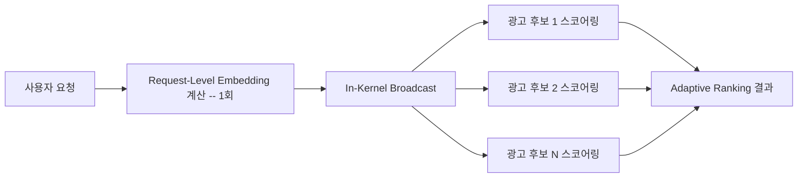

# Meta Adaptive Ranking Model

광고 추천(Ad Ranking)에서 LLM 규모 모델을 O(100ms) 지연 시간 안에 서빙하기 위한 Meta의 추론 최적화 아키텍처. 중복 계산 제거와 서브리니어(Sublinear) 스케일링으로 추론 비용 곡선 자체를 구부린다.

## 개요

LLM 규모의 파라미터(O(1T) 임베딩 테이블 포함)를 광고 랭킹 모델에 적용하면 정확도는 올라가지만 추론 비용이 선형으로 폭증한다. Meta Adaptive Ranking Model은 이 "추론 삼중 딜레마(Inference Trilemma)" -- 모델 복잡도, 지연 제약, 비용 효율 -- 을 동시에 해결하기 위해 설계됐다.

2025년 Q4 Instagram 광고에 배포된 이후 **광고 전환율(Conversions) +3%**, **클릭율(CTR) +5%** 개선을 달성했다.

## 핵심 개념

### 1. 요청 기반 최적화 (Request-Oriented Optimization)
사용자 시그널을 광고 후보마다 반복 계산하지 않고, 요청(Request) 단위로 한 번만 계산한 뒤 재사용한다. **In-Kernel Broadcast Optimization**을 통해 GPU 커널 내부에서 요청 수준 임베딩을 후보들에게 직접 브로드캐스트하여 스케일링 비용을 선형에서 서브리니어로 전환한다.

### 2. 추론 효율적 모델 스케일링
토큰당 연산량을 O(10 GFLOPs)으로 유지하면서 O(100ms) 이내 응답을 보장한다. 일반적인 LLM 추론 대비 10배 빠른 수준이다.

### 3. 모델-시스템 공동 설계 (Model-System Co-Design)
- 선택적 FP8 양자화(Selective FP8 Quantization)
- 하드웨어 인식 커널 특화(Hardware-Aware Kernel Specialization)
- 그래프 퓨전(Graph Fusion)으로 소규모 연산을 고밀도 커널로 통합
- 이를 통해 이종 하드웨어에서 **35% MFU(Model FLOPs Utilization)** 달성

## 기술 상세

### Wukong Turbo 아키텍처

이전 Wukong 아키텍처를 기반으로 깊은 모델 스케일링 시 수치적 불안정성을 해결한 개선 버전이다:

- **No-Bias 접근법**: 불안정한 바이어스 항을 제거하여 FLOP 또는 파라미터 증가 없이 처리량 향상
- **파라미터 위임(Delegation)**: FSDP(Fully Sharded Data Parallel)에서 DDP(Distributed Data Parallel)로 일부 파라미터를 이동하여 네트워크/메모리 오버헤드 감소
- **희소성 기반 단순화**: 선형층의 중복 구성요소를 제거하여 모델 복잡도를 낮추면서 정확도 유지

### 인프라 구성

- **멀티 GPU 카드 샤딩**: O(1T) 파라미터 임베딩 테이블을 단일 디바이스 메모리 한계 너머로 분산
- **임베딩 최적화**: 특성 희소성에 기반한 동적 해시 크기 할당, 미사용 임베딩 자동 제거, 다중 특성이 단일 임베딩 테이블을 공유하여 메모리 발자국 감소
- **가속 모델 로딩**: 멀티스트림 다운로딩과 원격 캐싱으로 10분 이내 초기화
- **오토스케일링**: 스트리밍 멀티프로세서 활용률(SM Utilization) 기반 규칙으로 트래픽 변동 대응

### 하드웨어-시스템 공동 설계 상세

**선택적 FP8 양자화**: 마이크로 벤치마크 기반 선택 메커니즘으로, 정밀도 손실 내성이 높은 계층에만 FP8을 적용한다. 추천 품질에 무시할 수 있는 영향으로 처리량을 향상시킨다.

**그래프 및 커널 최적화**:
- 입력을 공유하는 연산자들을 융합하여 고대역폭 메모리(HBM)와 온칩 SRAM 간 데이터 이동 최소화
- 그룹화된 일반 행렬 곱(Grouped GEMM) 및 수평 융합으로 수천 개의 소규모 연산을 계산 집약적 커널로 통합

**지연시간 최적화 계층**:
1. 요청 수준 신호의 1회 계산으로 후보별 중복 계산 제거
2. Top-K 복잡도를 O(N log N)에서 O(N)으로 감소 (GPU 네이티브 커널)
3. CPU에서 GPU로 특성 전처리 오프로딩하여 클라이언트 메모리 압력 해소

### 성능 요약

| 지표 | 값 |
|------|-----|
| 파라미터 규모 | O(1T) 임베딩 테이블 |
| 토큰당 연산 | O(10 GFLOPs) |
| 응답 지연 | O(100ms) 이내 |
| MFU | 35% (이종 하드웨어) |
| 모델 로딩 | 10분 이내 |
| 광고 전환율 개선 | +3% |
| 광고 클릭율 개선 | +5% |

### 향후 방향

Meta는 에이전트 최적화 프레임워크(KernelEvolve)를 통해 자동 커널 성능 최적화를 탐색하고 있다. 새로운 하드웨어나 모델 아키텍처가 도입될 때 자동으로 최적 커널 구성을 발견하는 것이 목표다.

## 추론 삼중 딜레마(Inference Trilemma)의 해소

광고 랭킹 모델에서 LLM 규모 파라미터를 사용하면 세 가지 제약이 동시에 충돌한다:

1. **모델 복잡도**: O(1T) 파라미터로 정확도를 높이려는 요구
2. **지연 제약**: O(100ms) 이내에 응답해야 하는 실시간 서빙 요구
3. **비용 효율**: 추론 비용이 광고 수익을 초과하지 않아야 하는 경제적 요구

Meta의 접근법은 이 삼중 딜레마를 "스케일링 곡선 자체를 구부리는" 방식으로 해결한다. 핵심은 모델 크기를 줄이는 것이 아니라, **동일 모델 크기에서 추론 비용 곡선의 기울기를 선형에서 서브리니어로 전환**하는 것이다. 이는 요청 수준 신호 재사용, 선택적 양자화, 커널 융합의 조합으로 달성된다.

## 관련 문서

- [[nvfp4-quantization]] -- FP8/FP4 양자화 기법
- [[ai-inference-quantization-2026]] -- INT4/NF4 양자화 트렌드
- [[nvidia-dynamo]] -- 분산 추론 OS
- [Meta Engineering Blog: Adaptive Ranking Model](https://engineering.fb.com/2026/03/31/ml-applications/meta-adaptive-ranking-model-bending-the-inference-scaling-curve-to-serve-llm-scale-models-for-ads/)
- [KernelEvolve: Meta's Ranking Engineer Agent](https://engineering.fb.com/2026/04/02/developer-tools/kernelevolve-how-metas-ranking-engineer-agent-optimizes-ai-infrastructure/)
