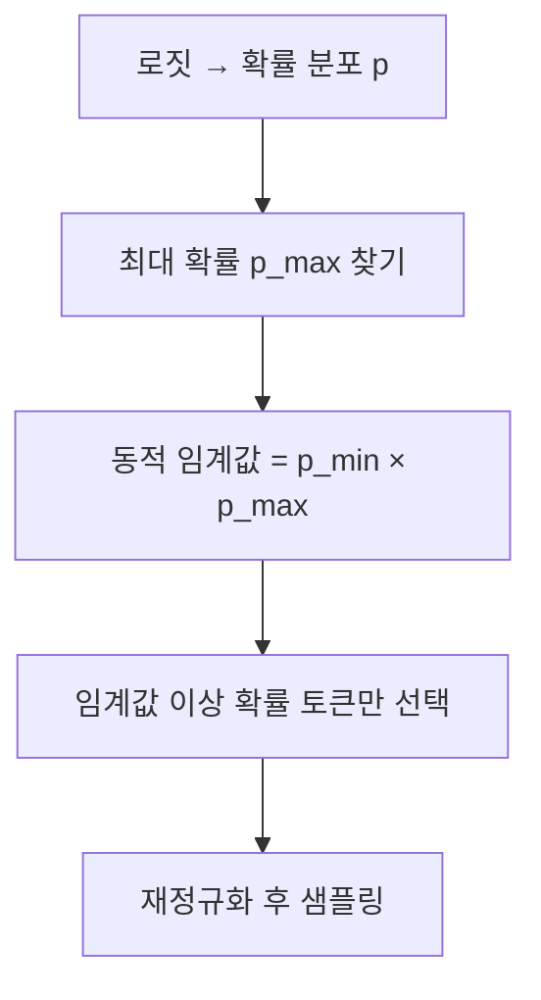
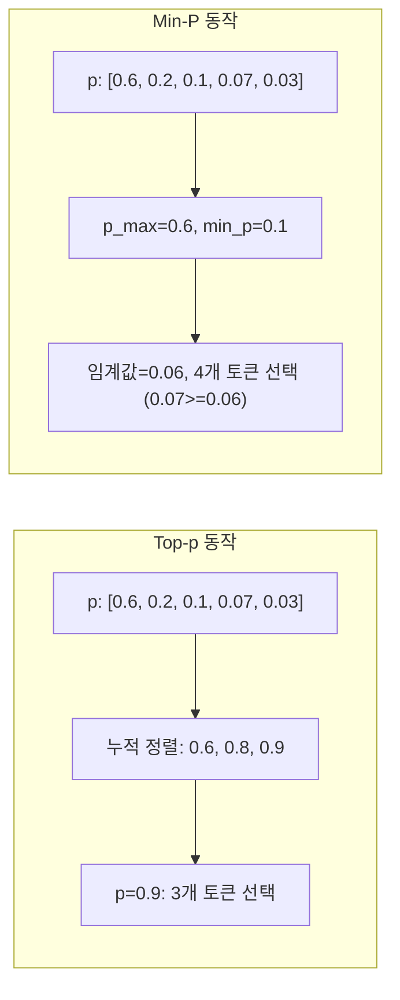

# Min-P 샘플링

## 배경과 문제 의식

Top-p (Nucleus) 샘플링은 가장 많이 쓰이는 샘플링 기법이지만 두 가지 체계적 약점이 있다.

**문제 1: 과도한 포함 (Over-inclusion)**
분포가 평탄할 때(모델이 불확실할 때) Top-p=0.9는 수백 개의 토큰을 포함한다. 이 중 상당수는 맥락상 완전히 부적절한 토큰이다.

**문제 2: 과도한 배제 (Over-exclusion)**
분포가 집중될 때(모델이 확신할 때) Top-p=0.9는 1-2개 토큰만 남겨 다양성이 사라진다.

Min-P의 핵심 아이디어: **고정된 절대 임계값이 아니라, 가장 높은 확률 토큰에 비례하는 상대적 임계값을 사용한다.**

최고 확률 토큰이 0.9라면 임계값은 높아지고, 최고 확률이 0.3이라면 임계값은 낮아진다. 분포의 "피크 높이"에 자동으로 적응하는 방식이다.

## 핵심 수식

$$\text{임계값} = p_{\min} \times p_{\max}$$

여기서:
- $p_{\max}$: 가장 높은 확률을 가진 토큰의 확률
- $p_{\min}$: 사용자 설정 비율 하이퍼파라미터 (예: 0.1)

**후보 집합**: $p(x) \geq p_{\min} \times p_{\max}$인 모든 토큰

예시:
- $p_{\max} = 0.9$, $p_{\min} = 0.1$ → 임계값 = 0.09 (엄격)
- $p_{\max} = 0.2$, $p_{\min} = 0.1$ → 임계값 = 0.02 (느슨)



## Top-p와의 결정적 차이



**핵심 차이**: Top-p는 "누적 확률 기준"으로 자르고, Min-P는 "최대 확률과의 비율 기준"으로 자른다. 분포가 극단적으로 집중되거나 평탄해질 때 두 방법의 행동이 크게 달라진다.

## 알고리즘 예시

| 시나리오 | $p_{\max}$ | 임계값 (min_p=0.1) | Top-p=0.95 포함 수 | Min-P 포함 수 |
|----------|----------|-------------------|--------------------|---------------|
| 모델 확신 높음 | 0.95 | 0.095 | ~2개 | ~1개 (엄격) |
| 모델 중간 확신 | 0.4 | 0.040 | ~5개 | ~3개 |
| 모델 불확실 | 0.15 | 0.015 | ~30개+ | ~8개 (필터) |

불확실한 상황에서 Min-P가 Top-p보다 훨씬 보수적으로 동작하여 무의미한 토큰을 걸러낸다.

## 코드 예시

```python
import torch
import torch.nn.functional as F

def min_p_sampling(
    logits: torch.Tensor,
    min_p: float = 0.05,
    temperature: float = 1.0,
) -> int:
    """
    Min-P 샘플링 구현.

    Args:
        logits: 모델 출력 로짓 (vocab_size,)
        min_p: 최대 확률 대비 최소 비율 (0 < min_p < 1)
        temperature: 샘플링 온도

    Returns:
        선택된 토큰 ID
    """
    # 온도 적용
    logits = logits / temperature
    probs = F.softmax(logits, dim=-1)

    # 최대 확률 토큰 찾기
    p_max = probs.max().item()

    # 동적 임계값 계산
    threshold = min_p * p_max

    # 임계값 이상의 토큰만 선택
    mask = probs >= threshold
    if not mask.any():
        mask[probs.argmax()] = True  # 최소 1개 보장

    # 재정규화 후 샘플링
    filtered_probs = probs * mask.float()
    filtered_probs = filtered_probs / filtered_probs.sum()

    return torch.multinomial(filtered_probs, num_samples=1).item()


def min_p_sampling_batch(
    logits: torch.Tensor,
    min_p: float = 0.05,
    temperature: float = 1.0,
) -> torch.Tensor:
    """
    배치 처리용 Min-P 샘플링.

    Args:
        logits: (batch_size, vocab_size)
        min_p: 최소 비율 임계값
        temperature: 샘플링 온도

    Returns:
        선택된 토큰 ID (batch_size,)
    """
    logits = logits / temperature
    probs = F.softmax(logits, dim=-1)

    # 배치 내 각 위치의 최대 확률
    p_max = probs.max(dim=-1, keepdim=True).values  # (batch, 1)
    threshold = min_p * p_max  # (batch, 1)

    # 마스킹 및 재정규화
    mask = probs >= threshold
    # 최소 1개 보장
    max_indices = probs.argmax(dim=-1, keepdim=True)
    mask.scatter_(1, max_indices, True)

    filtered_probs = probs * mask.float()
    filtered_probs = filtered_probs / filtered_probs.sum(dim=-1, keepdim=True)

    return torch.multinomial(filtered_probs, num_samples=1).squeeze(-1)


# HuggingFace LogitsProcessor 방식
from transformers import LogitsProcessor

class MinPLogitsProcessor(LogitsProcessor):
    def __init__(self, min_p: float = 0.05):
        self.min_p = min_p

    def __call__(self, input_ids: torch.LongTensor, scores: torch.FloatTensor) -> torch.FloatTensor:
        probs = F.softmax(scores, dim=-1)
        p_max = probs.max(dim=-1, keepdim=True).values
        threshold = self.min_p * p_max

        # 임계값 미만 토큰을 -inf로 마스킹
        filter_mask = probs < threshold
        scores = scores.masked_fill(filter_mask, float('-inf'))
        return scores
```

## 다른 샘플링 방법과 비교

| 방법 | 임계값 기준 | 분포 적응 | 구현 복잡도 |
|------|------------|----------|------------|
| Top-k | 상위 k개 (절대) | 없음 | 매우 낮음 |
| Top-p | 누적 확률 (절대) | 없음 | 낮음 |
| Min-P | 최대 확률 비율 (상대) | 자동 | 낮음 |
| Eta Sampling | 엔트로피 연동 | 자동 | 중간 |
| Typical Sampling | 엔트로피 거리 | 자동 | 중간 |
| Mirostat | 퍼플렉시티 피드백 | 연속 | 높음 |

Min-P의 강점은 **구현이 간단하면서도 Top-p의 핵심 약점을 효과적으로 해결**한다는 점이다. 특히 불확실한 상황에서 쓰레기 토큰을 걸러내는 효과가 뚜렷하다.

## 하이퍼파라미터 가이드

| min_p 값 | 효과 | 적합한 용도 |
|----------|------|-------------|
| 0.01 | 매우 느슨, 거의 모든 토큰 포함 | 최대 다양성 |
| 0.05 | 권장 기본값, 균형 | 일반 대화, 창의적 글쓰기 |
| 0.1 | 중간 엄격 | 품질 우선 생성 |
| 0.2 | 엄격, 소수 토큰만 | 사실 기반 응답, 코드 |

일반적으로 Temperature와 함께 사용한다. `temperature=0.8, min_p=0.05` 조합이 많이 사용된다.

## 지원 환경

- `llama.cpp`: `--min-p` 파라미터
- `ollama`: Modelfile에서 `PARAMETER min_p`
- `text-generation-webui`: min_p 파라미터
- HuggingFace Transformers: `LogitsProcessor`로 구현 또는 `min_p` 파라미터 (최신 버전)
- vLLM: SamplingParams에서 지원

## 관련 문서

- [[nucleus-top-p-sampling]] - 개선 대상인 기본 샘플링 방법
- [[typical-sampling]] - 정보이론 기반 전형성 샘플링
- [[eta-sampling-locally]] - 엔트로피 연동 동적 임계값
- [[mirostat-perplexity]] - 퍼플렉시티 피드백 제어 샘플링
- [[temperature-sampling]] - 온도 기반 분포 조정
- [[repetition-penalty-logit-bias]] - 반복 억제 보완
- [[decoding-strategies]] - 디코딩 전략 전체 개요
- [[logits-processor-internals]] - 로짓 프로세서 구현 패턴
