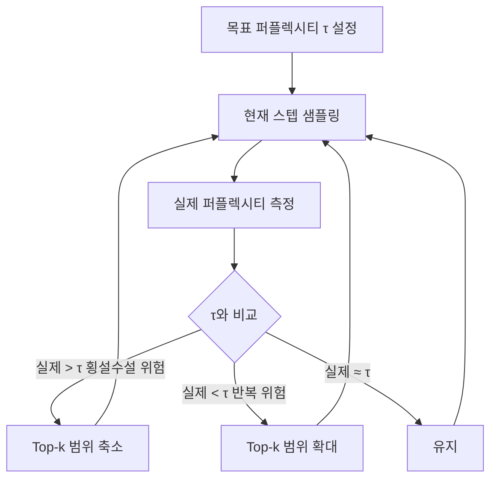

# Mirostat - 퍼플렉시티 제어 샘플링

## 배경과 문제 의식

언어 모델 텍스트 생성의 오래된 딜레마:

- **반복(boredom)**: 낮은 온도/Top-k → 같은 단어/구절이 반복됨
- **횡설수설(confusion)**: 높은 온도/넓은 Top-p → 맥락 없는 엉뚱한 단어 등장

기존 방법들(Top-k, Top-p, Temperature)은 고정된 하이퍼파라미터로 분포를 자른다. 문제는 텍스트 생성 도중 **모델의 퍼플렉시티(perplexity)**가 시시각각 달라진다는 것이다. 따라서 고정된 임계값은 어떤 순간에는 너무 보수적이고, 다른 순간에는 너무 자유롭다.

**Mirostat**은 제어이론의 피드백 루프(feedback loop)를 샘플링에 적용한다. 목표 퍼플렉시티를 설정하고, 실제 퍼플렉시티가 그 목표에 수렴하도록 샘플링 파라미터를 동적으로 조정한다.

## 핵심 개념: 퍼플렉시티와 피드백 제어

**퍼플렉시티(perplexity)**는 모델이 텍스트에 얼마나 "놀라는가"의 척도다:

$$\text{PPL} = e^H = e^{-\frac{1}{N}\sum \log p(x_i)}$$

- 퍼플렉시티가 낮으면: 모델이 확신, 텍스트가 예측 가능 → 반복 위험
- 퍼플렉시티가 높으면: 모델이 불확실, 텍스트가 비일관적 → 횡설수설 위험

Mirostat의 목표: **생성 전체에 걸쳐 퍼플렉시티를 목표값 $\tau$에 유지한다.**



## Mirostat v1과 v2

### Mirostat v1

전체 어휘에 Zipf 법칙을 가정하고, Top-k 크기 $k$를 수학적으로 계산한다.

**핵심 가정**: 정렬된 토큰 확률은 Zipf 분포를 따른다.

$$p(x_i) \approx \frac{C}{i^s}$$

이를 바탕으로 목표 퍼플렉시티 $\tau$에 해당하는 $k$값을 해석적으로 유도한다.

**한계**: Zipf 가정이 항상 성립하지 않아 실제 퍼플렉시티 제어가 불완전할 수 있다.

### Mirostat v2 (실무 권장)

피드백 오차를 직접 추적하는 적응형 방식. 수식이 단순하고 실제 성능이 우수하다.

**상태 변수**: $\hat{\mu}_t$ - 현재 스텝에서 허용되는 토큰의 "정보량 상한"

**초기값**: $\hat{\mu}_0 = 2\tau$ (목표 퍼플렉시티의 두 배)

**업데이트 규칙**: 매 스텝마다 실제 선택된 토큰의 정보량 $I(x_t) = -\log_2 p(x_t)$를 측정하고:

$$\hat{\mu}_{t+1} = \hat{\mu}_t - \eta \cdot (I(x_t) - \tau)$$

- $\eta$: 학습률 (기본값 0.1)
- $I(x_t) > \tau$: 너무 놀라운 토큰 → 다음 스텝에서 $\hat{\mu}$ 감소 (더 보수적으로)
- $I(x_t) < \tau$: 너무 자명한 토큰 → 다음 스텝에서 $\hat{\mu}$ 증가 (더 자유롭게)

**후보 선택**: 정보량 $I(x) \leq \hat{\mu}_t$인 토큰만 후보로 삼아 샘플링

## 코드 예시

```python
import torch
import torch.nn.functional as F
import math

def mirostat_v2_sampling(
    logits: torch.Tensor,
    mu: float,          # 현재 상태 변수 (외부에서 유지)
    tau: float = 5.0,   # 목표 퍼플렉시티 (비트 단위)
    eta: float = 0.1,   # 학습률
    temperature: float = 1.0,
) -> tuple[int, float]:
    """
    Mirostat v2 샘플링 - 한 스텝 실행.

    Args:
        logits: 모델 출력 로짓
        mu: 현재 상태 변수 (정보량 상한)
        tau: 목표 퍼플렉시티 (비트 단위, 일반적으로 3-8)
        eta: 학습률 (0.1 권장)
        temperature: 샘플링 온도

    Returns:
        (선택된 토큰 ID, 업데이트된 mu)
    """
    # 온도 적용
    logits = logits / temperature
    probs = F.softmax(logits, dim=-1)

    # 정보량 계산 (비트 단위: log2)
    log2_probs = torch.log2(probs + 1e-10)
    neg_log2_probs = -log2_probs  # I(x) = -log2 p(x)

    # mu 이하의 정보량을 가진 토큰만 선택
    mask = neg_log2_probs <= mu
    if not mask.any():
        mask[probs.argmax()] = True  # 최소 1개 보장

    # 선택된 토큰에서 샘플링
    filtered_probs = probs * mask.float()
    filtered_probs = filtered_probs / filtered_probs.sum()
    token_id = torch.multinomial(filtered_probs, num_samples=1).item()

    # mu 업데이트 (피드백)
    selected_info = neg_log2_probs[token_id].item()
    mu_new = mu - eta * (selected_info - tau)

    return token_id, mu_new


class MirostatGenerator:
    """Mirostat v2 상태를 유지하는 생성기"""

    def __init__(self, tau: float = 5.0, eta: float = 0.1, temperature: float = 1.0):
        self.tau = tau
        self.eta = eta
        self.temperature = temperature
        self.mu = 2 * tau  # 초기값

    def reset(self):
        self.mu = 2 * self.tau

    def sample(self, logits: torch.Tensor) -> int:
        token_id, self.mu = mirostat_v2_sampling(
            logits, self.mu, self.tau, self.eta, self.temperature
        )
        return token_id


# 사용 예시
def demo_mirostat():
    generator = MirostatGenerator(tau=5.0, eta=0.1)

    # 생성 루프 (실제 모델 연동 시)
    # for each step:
    #   logits = model.forward(...)
    #   token = generator.sample(logits[:, -1, :][0])
    #   print(f"mu: {generator.mu:.2f}, token: {token}")

    print(f"초기 mu: {generator.mu}")
    print(f"목표 perplexity: {generator.tau} 비트")
```

## 하이퍼파라미터 해설

| 파라미터 | 기본값 | 효과 |
|----------|--------|------|
| tau | 5.0 | 목표 퍼플렉시티 (비트). 낮으면 보수적, 높으면 다양성 |
| eta | 0.1 | 학습률. 높으면 빠른 적응, 낮으면 안정적 |
| temperature | 1.0 | 분포 선명도 조정 (Mirostat과 별개로 작용) |

**tau 값 가이드**:
- `tau=3`: 매우 일관성 있음, 사실 기반 질답, 코드 생성
- `tau=5`: 균형점, 일반 대화
- `tau=7`: 창의적, 소설 쓰기, 브레인스토밍
- `tau=10+`: 매우 다양하고 실험적

## 기존 방법과의 비교

| 방법 | 파라미터 고정 여부 | 반복 문제 | 횡설수설 문제 | 퍼플렉시티 안정성 |
|------|-------------------|-----------|---------------|------------------|
| Greedy | - | 심각 | 없음 | 매우 낮음 |
| Temperature | 고정 | 보통 | 높은 온도시 심각 | 불안정 |
| Top-k | 고정 | 보통 | 있음 | 불안정 |
| Top-p | 고정 | 보통 | 가끔 | 중간 |
| Mirostat v1 | 동적 (Zipf 가정) | 낮음 | 낮음 | 높음 |
| Mirostat v2 | 동적 (피드백) | 낮음 | 낮음 | 매우 높음 |

## 지원 환경 및 실무 팁

**지원 환경**:
- `llama.cpp`: `--mirostat 2` (v2 권장), `--mirostat-tau`, `--mirostat-ent`
- `ollama`: Modelfile에서 `PARAMETER mirostat 2`
- `text-generation-webui`: Mirostat 모드 지원
- KoboldCpp, LM Studio 등 로컬 추론 도구 대부분 지원

**실무 팁**:
- 장문 생성(소설, 보고서)에서 반복 억제 효과가 특히 두드러진다
- `eta`를 너무 높이면 오히려 불안정해질 수 있다 (0.05-0.2 범위 권장)
- Mirostat + Temperature 조합이 가능하며, Temperature는 후보 분포 조정에만 영향

## 관련 문서

- [[nucleus-top-p-sampling]] - 기존 대표 샘플링 방법
- [[typical-sampling]] - 정보량 기반 전형성 샘플링
- [[eta-sampling-locally]] - 엔트로피 연동 동적 임계값
- [[min-p-sampling]] - 확률 비율 기반 임계값
- [[temperature-sampling]] - 온도 기반 분포 조정
- [[repetition-penalty-logit-bias]] - 반복 억제 보완 기법
- [[decoding-strategies]] - 디코딩 전략 전체 개요
