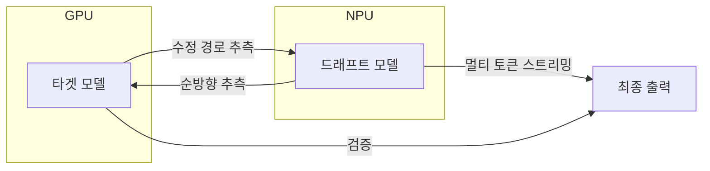
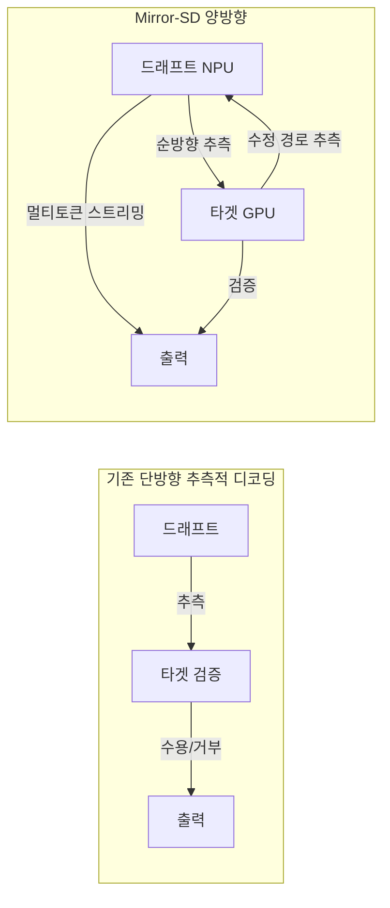

# Apple Mirror 추측적 디코딩 (Mirror-SD)

## 개요

Mirror-SD는 Apple이 발표한 양방향 추측적 디코딩(bidirectional speculative decoding) 기법이다. 기존 방식에서 드래프트 모델만 추측하는 단방향 구조와 달리, 드래프트와 타겟 모델이 동시에 상대방의 출력을 추측하는 양방향 파이프라인을 구성한다. GPU와 NPU를 동시에 활용하는 이기종 가속기(heterogeneous accelerator) 병렬화를 통해 14B-66B 모델에서 2.8-5.8배 가속을 달성하며, 출력 품질은 무손실이다.

## 핵심 개념

### 양방향 추측 파이프라인

Mirror-SD의 핵심 혁신은 추측의 방향을 양방향으로 확장한 것이다. 드래프트 모델이 타겟의 순방향 연속(forward continuation)을 추측하는 동시에, 타겟 모델이 드래프트의 수정 경로(correction path)를 추측한다. 순차적 추측을 두 개의 상호 보완적인 병렬 실행 파이프라인으로 변환한다.

기존 단방향 추측적 디코딩에서는 드래프트 모델이 후보를 생성하고, 타겟 모델이 순차적으로 검증하는 구조였다. Mirror-SD는 이 순차 의존성을 깨고, 양쪽이 동시에 작업함으로써 파이프라인 유휴 시간을 최소화한다.

### 이기종 가속기 병렬화

GPU와 NPU(Neural Processing Unit) 등 서로 다른 가속기에 연산을 명시적으로 매핑(explicitly map)하여 교차 디바이스 병렬성(cross-device parallelism)을 활용한다.

| 가속기 | 역할 | 특성 |
|--------|------|------|
| GPU | 타겟 모델 실행 + 수정 경로 추측 | 높은 연산 처리량 |
| NPU | 드래프트 모델 실행 + 순방향 추측 | 저전력, 낮은 지연시간 |

단일 가속기 접근법 대비 지연시간을 추가로 감소시키며, Apple Silicon의 통합 아키텍처에서 특히 효과적이다. Early-exit 시그널을 활용하여 타겟 모델 처리와 병렬로 브랜치 완전 롤아웃(branch-complete rollouts)을 실행한다.

### 추측적 스트리밍 (Speculative Streaming)

드래프트 모델이 스텝당 여러 토큰을 방출(emit)하는 멀티 토큰 추측적 스트리밍으로 높은 수용률(acceptance rate)을 유지한다. 수용 시맨틱스(acceptance semantics)를 약화시키지 않으면서 지연시간을 줄이는 것이 핵심이다. 기존 Medusa, Hydra, EAGLE 등에서 문제가 되었던 "수용률 저하 또는 스케일링을 제한하는 오버헤드" 트레이드오프를 해소한다.

## 작동 원리

1. 드래프트 모델(NPU)이 타겟의 다음 토큰 시퀀스를 순방향 추측
2. 타겟 모델(GPU)이 동시에 드래프트의 수정 경로를 역방향 추측
3. 양방향 추측 결과를 교차 검증하여 수용/거부 결정
4. 추측적 스트리밍으로 스텝당 여러 토큰 방출
5. 이기종 가속기 간 파이프라인이 연속적으로 작동하여 유휴 시간 최소화

## 성능/효과

SpecBench에서 14B-66B 파라미터 모델을 대상으로 다양한 태스크(코드 생성, 대화, 요약 등)에서 측정한 결과:

| 항목 | 수치 |
|------|------|
| 벽시계 시간(wall-time) 가속 | 2.8x - 5.8x |
| EAGLE3 대비 평균 상대 개선 | 30% |
| 출력 품질 | 무손실 (lossless) |
| 테스트 모델 범위 | 14B - 66B |

### 베이스라인 비교

| 방법 | 접근 | Mirror-SD 대비 |
|------|------|---------------|
| Medusa | 다중 디코딩 헤드 | 수용률 저하 또는 오버헤드 |
| Hydra | 병렬 초안 생성 | 스케일링 제한 |
| EAGLE | 특징 수준 자기회귀 | 단방향 제약 |
| EAGLE3 | 보조 드래프트 헤드 | Mirror-SD 대비 30% 낮은 성능 |
| **Mirror-SD** | **양방향 파이프라인 + 이기종 병렬** | **기준선** |

Mirror-SD의 핵심 기여는 기존 방법들이 모두 직면했던 "지연시간-수용률 트레이드오프(latency-acceptance tradeoff)"를 깨뜨린 것이다. 이기종 병렬 실행과 멀티 토큰 스트리밍을 결합하여 높은 수용률과 최소 오버헤드를 동시에 달성한다.

### 논문 정보

- **저자**: Nikhil Bhendawade, Kumari Nishu, Arnav Kundu, Chris Bartels, Minsik Cho, Irina Belousova (Apple)
- **발표**: 2025년 12월
- **arXiv**: 2510.13161

## 기존 추측적 디코딩과의 구조적 차이

기존 방식에서는 드래프트 모델이 추측하는 동안 타겟 모델이 유휴 상태로 대기하거나, 그 반대의 상황이 발생한다. Mirror-SD는 양쪽 모델이 동시에 작업하므로 가속기 활용률이 극대화된다. 특히 Apple Silicon처럼 GPU와 NPU가 통합된 칩에서는 두 가속기 간 데이터 전송 지연이 최소화되어 양방향 파이프라인의 효과가 극대화된다.

### Apple 생태계에서의 의미

Mirror-SD는 [[apple-foundation-model]]의 온디바이스 추론 전략과 직접적으로 연결된다. AFM-on-device 3B 모델의 실시간 응답 속도를 높이기 위해 Mirror-SD를 적용하면, 사용자 체감 지연시간을 2.8-5.8배 줄일 수 있다. 이는 Siri의 LLM 전환에서 기존 규칙 기반 시스템 수준의 응답 속도를 유지하는 데 핵심적인 기술이다.

### 추측적 디코딩 기법의 진화

| 세대 | 대표 기법 | 핵심 혁신 | 한계 |
|------|----------|-----------|------|
| 1세대 | 독립 드래프트 모델 | 별도 소형 모델로 초안 생성 | 드래프트 모델 추가 메모리 |
| 2세대 | Medusa, EAGLE | 타겟 모델 내부 헤드 활용 | 수용률-지연시간 트레이드오프 |
| 3세대 | EAGLE3 | 보조 드래프트 헤드 최적화 | 단방향 추측 제약 |
| 4세대 | **Mirror-SD** | 양방향 추측 + 이기종 병렬 | 이기종 가속기 필요 |

Mirror-SD는 이 진화의 최신 단계로, 추측적 디코딩의 패러다임을 "단일 모델의 자기 추측"에서 "이기종 하드웨어 간 협력적 추측"으로 전환했다.

## 관련 문서
- [[mit-training-efficiency]]

- [[speculative-speculative-decoding]] -- 검증 결과 사전 예측 기반 가속
- [[eagle-3-speculative-decoding]] -- 보조 드래프트 헤드 기반 추측적 디코딩
- [[small-language-models]] -- 에지 디바이스 추론과 SLM
- [[kv-cache]] -- 추측적 디코딩의 KV 캐시 관리
- [[apple-foundation-model]] -- Apple의 온디바이스 LLM 전략
