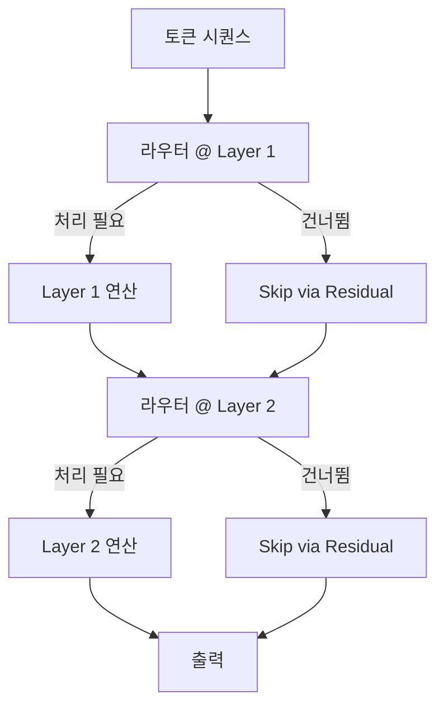
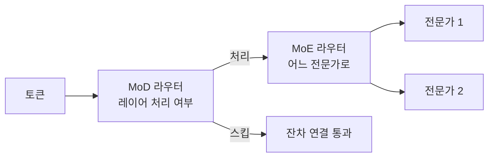

# 깊이의 혼합 (Mixture of Depths)

## 개요

깊이의 혼합(MoD, Mixture of Depths)은 토큰별로 처리할 Transformer 레이어 수를 라우터(router)가 동적으로 결정하는 조건부 계산(Conditional Computation) 기법이다. MoE(Mixture of Experts)가 너비 방향의 희소화라면, MoD는 깊이 방향의 희소화다.

## 핵심 아이디어

표준 Transformer는 모든 토큰이 모든 레이어를 거친다. MoD는 각 레이어마다 "이 토큰이 이 레이어의 처리가 필요한가?"를 라우터가 판단하여 불필요한 계산을 건너뛴다.

건너뛴 레이어는 skip connection(잔차 연결)으로 우회한다. 레이어 연산을 건너뛰지만 잔차 흐름은 유지된다.

## MoD 라우팅 메커니즘

### Top-K Token Routing

각 레이어에서 전체 토큰 중 상위 K개만 처리한다.

1. 라우터 스칼라 점수 계산: $r_t = \text{Linear}(x_t)$
2. 전체 시퀀스에서 상위 K개 점수 토큰 선택
3. 선택된 토큰만 해당 레이어 연산 수행
4. 나머지 토큰은 입력 그대로 잔차 연결

- **캐패시티(capacity)**: 처리할 토큰 비율 (예: 12.5% = 전체의 1/8)
- 배치 전체 기준이 아닌 시퀀스 내에서 경쟁

## MoE와 MoD의 비교

| 항목 | MoE (Mixture of Experts) | MoD (Mixture of Depths) |
|------|--------------------------|-------------------------|
| 희소화 방향 | 너비 (활성 전문가 수) | 깊이 (처리 레이어 수) |
| 라우팅 단위 | 레이어 내 FFN 선택 | 레이어 자체 스킵 |
| 파라미터 수 | 증가 (전문가 다수) | 동일 (레이어 공유) |
| FLOP 감소 | 활성 파라미터 감소 | 처리 토큰 수 감소 |
| 메모리 | 모든 전문가 로드 필요 | 전체 레이어 유지 |

## MoE + MoD 결합

두 기법은 직교적이므로 결합 가능하다.

MoE가 각 레이어 내에서 전문가를 선택하고, MoD가 레이어 자체를 스킵할지 결정한다.

## 논문: Raposo et al. (2024)

Google DeepMind의 "Mixture of Depths: Dynamically Allocating Compute in Transformer Language Models".

핵심 결과:
- 동일 FLOPs 예산 하에서 표준 Transformer와 동등하거나 우월한 성능
- 최적 캐패시티: 레이어별 12.5% 토큰만 처리 (isoFLOP 기준)
- 훈련 시 불안정성 존재: 라우터 붕괴(router collapse) 방지 보조 손실 필요

## 학습 안정성 도전

- **라우터 붕괴**: 라우터가 특정 토큰만 계속 선택하거나 전혀 선택 안 함
- **보조 손실(Auxiliary Loss)**: 균등 분배를 유도하는 정규화 항 필요
- **MoE와 동일한 문제**: load balancing loss 유사 처리
- 학습 초반 불안정 → warm-up 단계 중요

## 추론 효율

이론:
- 50% 레이어 스킵 → 약 2배 속도 향상 (이론)

실제:
- 하드웨어 최적화 없이는 실제 속도 향상이 이론보다 낮음
- Sparse 패턴 처리를 위한 커스텀 CUDA 커널 필요
- 현재 대부분 연구 단계, 프로덕션 배포는 제한적

## 관련 문서

- [[early-exit-adaptive-computation]] - 깊이 적응의 또 다른 접근
- [[deepseek-sparse-attention]] - 희소 어텐션 관련 최신 동향
- [[model-pruning-inference]] - 정적 레이어 제거와의 차이
