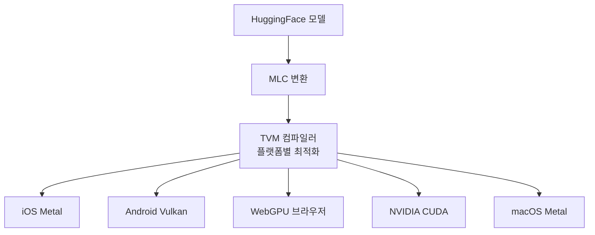

# MLC-LLM

TVM(Apache) 기반 **범용 LLM 배포 프레임워크**. 단일 코드베이스에서 iOS, Android, WebGPU, CUDA, Metal, Vulkan 등 다양한 플랫폼에 LLM을 컴파일하여 배포할 수 있다.

## 핵심 아키텍처

## [[llama-cpp|llama.cpp]]와의 비교

| 측면 | llama.cpp | MLC-LLM |
|------|----------|---------|
| 언어 | C/C++ | Python + TVM |
| 양자화 | GGUF 포맷 | TVM 자체 양자화 |
| 모바일 | 수동 빌드 | **네이티브 iOS/Android SDK** |
| 브라우저 | 제한적 | **WebGPU 네이티브** |
| 최적화 | 수작업 커널 | **컴파일러 자동 최적화** |
| 생태계 | 거대 (Ollama 등) | 성장 중 |

MLC-LLM의 강점은 **컴파일러 기반 자동 최적화**로, 새 하드웨어가 등장해도 TVM 백엔드 추가만으로 지원 가능하다는 점. [[webgpu-webllm|WebLLM]]은 MLC-LLM의 브라우저 배포 프론트엔드.

## 관련 문서

- [[llama-cpp]] -- llama.cpp
- [[webgpu-webllm]] -- WebGPU/WebLLM
- [[model-serving]] -- 모델 서빙
- [[ai-on-device-inference]] -- 온디바이스 AI 추론
