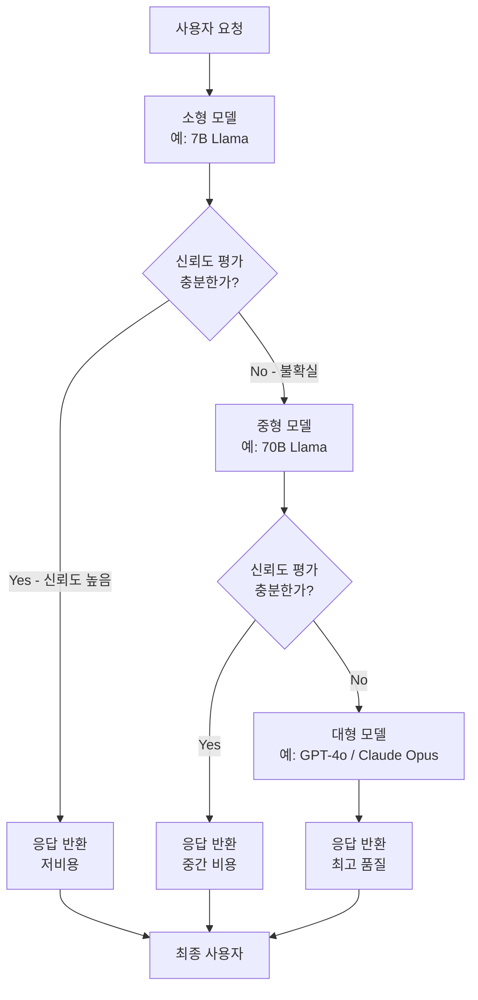

# 모델 캐스케이딩 (Model Cascading)

## 개요

**모델 캐스케이딩(Model Cascading)**은 요청을 가장 작고 저렴한 모델부터 순차적으로 시도하고, 해당 모델이 충분히 처리하지 못할 때만 더 크고 비싼 모델로 에스컬레이션(escalation)하는 추론 전략이다. 모든 요청에 동일한 대형 모델을 사용하는 대신, 쉬운 질문은 소형 모델이 빠르고 저렴하게 처리하도록 하여 비용과 지연시간을 동시에 최적화한다.

이 개념은 [[llm-router|LLM 라우터]]와 밀접하게 연관되지만, 라우터가 요청을 사전에 분류하여 적절한 모델로 단방향 배정하는 데 비해, 캐스케이딩은 결과를 보고 사후에 에스컬레이션 여부를 판단한다는 점에서 차이가 있다.

## 핵심 아이디어

실제 요청 분포를 분석해보면, 대부분의 쿼리는 단순하다. "오늘 날씨는?", "이 코드의 오류를 찾아줘" 같은 요청은 7B 파라미터 모델로도 충분히 처리된다. Pareto 법칙이 적용되어, 전체 요청의 80%는 소형 모델로 해결 가능하고 나머지 20%만 대형 모델이 필요하다. 이 20%에만 대형 모델 비용을 지불하면 전체 추론 비용을 대폭 절감할 수 있다.

## 캐스케이드 파이프라인

## 에스컬레이션 판단 기준

소형 모델의 응답이 충분한지 판단하는 방법은 여러 가지다:

**1. 신뢰도 점수 기반**
- 모델의 로그 확률(log probability) 평균값이 임계값 이상이면 수락
- 퍼플렉시티(perplexity)가 낮을수록 모델이 확신을 가지고 응답한다고 간주

**2. 자기 평가(Self-Evaluation)**
- 소형 모델에게 "이 응답에 확신이 있는가?"를 추가로 질문
- 예/아니오 분류로 에스컬레이션 여부 결정
- 추가 호출이 필요하지만 정확도가 높음

**3. 검증 모델**
- 별도의 경량 분류 모델이 응답의 품질을 점수화
- 생성 모델과 검증 모델을 분리하여 편향 감소

**4. 규칙 기반 라우팅**
- 특정 키워드(법률, 의료, 금융)는 사전에 대형 모델로 강제 라우팅
- 프롬프트 길이, 복잡도 지표를 사전 분류에 활용

## 비용-품질 트레이드오프 분석

| 전략 | 평균 비용 | 평균 지연시간 | 품질 |
|------|----------|-------------|------|
| 대형 모델 단독 | 100% | 기준값 | 최고 |
| 소형 모델 단독 | 5-10% | 0.3x | 낮음 |
| 2단계 캐스케이드 | 20-40% | 1.1-1.5x | 대형과 유사 |
| 3단계 캐스케이드 | 25-50% | 1.2-2x | 대형과 유사 |

캐스케이드의 비용은 에스컬레이션율에 따라 결정된다. 소형 모델 통과율이 70%라면 전체 비용은 크게 절감되지만, 에스컬레이션 시 지연시간이 두 모델의 합산이 되므로 SLA 설계가 중요하다.

## LLM 라우터와의 관계

[[llm-router|LLM 라우터]]는 요청이 들어오면 먼저 분류하여 적절한 모델로 보내는 **사전 라우팅** 방식이다. 캐스케이딩은 결과를 보고 판단하는 **사후 에스컬레이션** 방식이다. 실제 시스템에서는 두 접근을 결합한다: 라우터가 명백히 복잡한 요청은 바로 대형 모델로 보내고, 나머지는 캐스케이드 파이프라인을 거친다.

실제 서빙 인프라에서의 구현은 [[model-serving]] 참조한다.

## 관련 문서

- [[llm-router]] - 요청 사전 분류 기반 라우팅 (보완 전략)
- [[model-serving]] - 서빙 인프라와 캐스케이드 통합
- [[early-exit-adaptive-computation]] - 레이어 단위 조기 종료 (관련 개념)
- [[latency-throughput-tradeoff]] - 지연시간과 처리량의 트레이드오프
