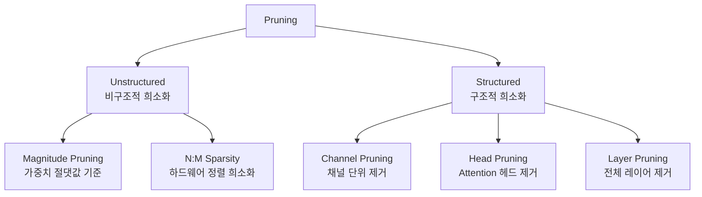

# 추론용 모델 프루닝 (Model Pruning)

## 개요

모델 프루닝(Model Pruning)은 신경망의 가중치 중 중요도가 낮은 것을 제거(0으로 설정)하여 모델 크기를 줄이고 추론 속도를 높이는 기법이다. 양자화(Quantization)와 함께 경량화의 양대 축이다.

## 프루닝 분류 체계

## Unstructured vs Structured 비교

| 항목 | Unstructured | Structured |
|------|-------------|------------|
| 단위 | 개별 가중치 | 채널/헤드/레이어 |
| 정확도 손실 | 적음 | 많음 |
| 실제 속도 향상 | 어려움 (희소 커널 필요) | 즉각적 (밀집 연산 유지) |
| 하드웨어 지원 | NVIDIA A100+ (N:M) | 범용 |
| 사용 사례 | 엣지, 전용 HW | 프로덕션 서버, 모바일 |

## Magnitude Pruning

가장 단순한 방식. 절댓값이 작은 가중치를 제거한다.

$$\text{mask}_{ij} = \begin{cases} 0 & \text{if } |w_{ij}| < \text{threshold} \\ 1 & \text{otherwise} \end{cases}$$

- 전역(global) 임계값 또는 레이어별 임계값 적용 가능
- 파인튜닝 없이 적용 시 정확도 손실 큼
- Iterative Pruning + Fine-tuning 사이클로 완화

## N:M Sparsity (2:4 NVIDIA)

N개 중 M개를 남기는 구조화된 비구조적 희소화. NVIDIA Ampere 이후(A100, H100)에서 하드웨어 레벨 가속 지원.

- 2:4 sparsity: 4개 연속 가중치 중 2개만 유지
- 이론적으로 2배 메모리, 2배 처리량 향상
- 희소 인덱스를 별도 메타데이터로 저장 (오버헤드 존재)
- ASP(Automatic SParsity): NVIDIA 제공 툴킷으로 2:4 sparsity 자동 적용

## SparseGPT

Frantar & Alistarh (2023). LLM을 재학습 없이 고효율로 프루닝하는 기법.

- Hessian 정보 기반 가중치 재구성(weight reconstruction)
- 레이어별 순차적 OBS(Optimal Brain Surgeon) 적용
- 175B GPT 모델을 단일 GPU에서 수 시간 내 50% 이상 희소화

## Wanda (Pruning without Any Data)

Sun et al. (2023). 캘리브레이션 데이터 없이 프루닝하는 방법.

$$\text{score}_{ij} = |w_{ij}| \cdot \|x_j\|_2$$

가중치 절댓값에 입력 활성화(activation) 크기를 곱한 중요도 점수로 프루닝. SparseGPT보다 빠르고 데이터 없이도 유사한 성능.

## Structured Pruning 방법

### Channel Pruning
컨볼루션/MLP의 채널 단위 제거. 제거 후 행렬이 더 작아져 실제 연산량 감소.

### Attention Head Pruning
Multi-head Attention에서 중요도 낮은 헤드 제거.

### Layer Pruning (레이어 삭제)
전체 Transformer 블록 제거. ShortGPT, LaCo 등에서 연구. 극단적 압축.

## Pruning + Quantization 결합

두 기법은 보완적이다.

- 프루닝 후 양자화 순서가 일반적
- SpQR(Sparse Quantized Representation): 희소성 + 양자화 공동 최적화 연구

## 실무 권장

- 빠른 실험: Wanda (데이터 불필요, 구현 간단)
- 최고 품질: SparseGPT (Hessian 기반)
- NVIDIA GPU 프로덕션: 2:4 sparsity + ASP
- 모바일/엣지: Structured pruning + 양자화 조합

## 관련 문서

- [[on-device-inference-stack]] - 엣지 배포 런타임
- [[ai-inference-quantization-2026]] - 양자화 기법
- [[early-exit-adaptive-computation]] - 동적 계산량 조절의 다른 접근
