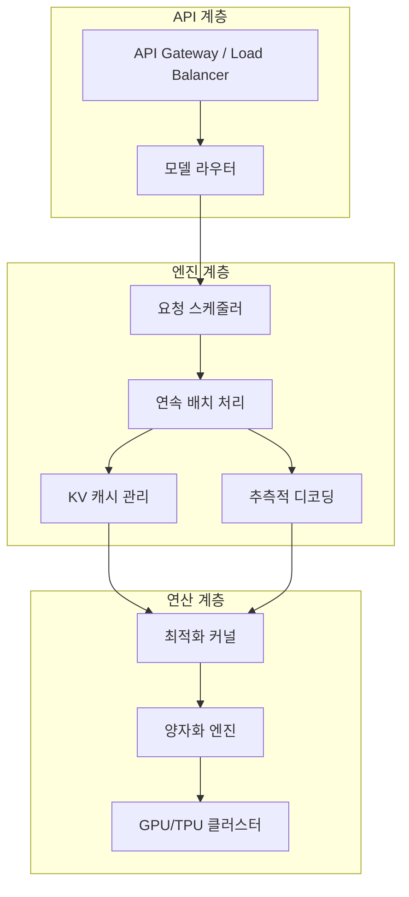

# 모델 서빙 (Model Serving & Inference Infrastructure)

## 정의

**모델 서빙(Model Serving)**은 학습된 LLM을 프로덕션 환경에서 사용자 요청에 대해 실시간으로 추론을 수행하도록 배포하고 운영하는 인프라 스택이다. 단순히 모델을 로드하여 `model.generate()`를 호출하는 것을 넘어서, 수천 건의 동시 요청을 낮은 지연 시간과 높은 처리량으로 처리하기 위한 복잡한 시스템 엔지니어링이 필요하다.

## 서빙 스택 개요

LLM 서빙 시스템은 크게 3계층으로 구성된다.

이 다이어그램은 LLM 서빙의 3계층 아키텍처를 보여준다. API 계층이 요청을 수신하고, 엔진 계층이 스케줄링과 최적화를 수행하며, 연산 계층이 실제 GPU 연산을 실행한다.

## 주요 서빙 엔진

### vLLM

[[vllm-semantic-router|vLLM]]은 2023년 UC Berkeley에서 시작된 오픈소스 LLM 서빙 엔진이다. **PagedAttention**을 최초로 도입하여 KV 캐시 메모리 낭비를 제거했고, 2026년 현재 가장 널리 사용되는 서빙 엔진이다.

- **PagedAttention**: OS의 가상 메모리 페이징에서 영감. KV 캐시를 고정 블록으로 분할하여 비연속 메모리에 저장
- **연속 배치 처리(Continuous Batching)**: iteration 레벨 스케줄링으로 GPU 유휴 시간 최소화
- **Prefix Caching**: 공통 시스템 프롬프트의 KV 캐시를 요청 간 공유
- V1 엔진은 Blackwell GPU(GB200/GB300)에서 FP4 네이티브 추론을 지원

### SGLang

[[sglang|SGLang]]은 Stanford에서 개발한 LLM 서빙 프레임워크로, 프로그래밍 언어 수준의 추론 제어를 제공한다.

- **RadixAttention**: 래딕스 트리 기반 KV 캐시 재사용으로 다중 턴/브랜칭 시나리오 최적화
- **구조화 출력**: JSON, 정규식 등 출력 형식 제약을 엔진 레벨에서 효율적으로 처리
- **Data Parallelism + Expert Parallelism**: MoE 모델의 효율적 분산 서빙

### TensorRT-LLM

NVIDIA의 프로덕션 추론 엔진이다. TensorRT의 그래프 최적화와 LLM 특화 커널을 결합한다.

- **In-flight Batching**: 연속 배치 처리의 NVIDIA 구현
- **커널 퓨전**: 여러 연산을 단일 GPU 커널로 결합하여 메모리 대역폭 절약
- **FP8/FP4 지원**: Blackwell GPU의 저정밀 연산 네이티브 지원

### llama.cpp / ollama

CPU 및 소비자용 GPU에서의 로컬 추론을 위한 경량 솔루션이다.

- **GGUF 양자화**: 2-8비트 다양한 양자화 스킴 지원
- **Metal/CUDA/Vulkan**: 멀티플랫폼 GPU 가속
- 개인용/개발용에 최적화, 대규모 프로덕션에는 부적합

## 핵심 최적화 기법

### 연속 배치 처리 (Continuous Batching)

전통적 정적 배치(static batching)에서는 배치 내 가장 긴 시퀀스가 끝날 때까지 모든 요청이 대기한다. [[continuous-batching|연속 배치 처리]]는 토큰 생성 iteration 단위로 스케줄링하여, 완료된 요청을 즉시 제거하고 새 요청을 삽입한다. 이로써 GPU 활용률이 2-5배 향상된다.

### PagedAttention과 KV 캐시 관리

[[kv-cache-inference|KV 캐시]]는 LLM 추론에서 가장 큰 메모리 소비원이다. 128K 컨텍스트 + 대형 모델에서는 단일 요청의 KV 캐시가 수십 GB에 달할 수 있다.

- **PagedAttention**: 고정 크기 블록(보통 16토큰)으로 분할, 비연속 할당 허용
- **Prefix Caching**: 동일 시스템 프롬프트를 사용하는 요청 간 KV 캐시 공유
- **KV 캐시 양자화**: INT8/FP8로 캐시를 압축하여 메모리 절약

### 추측적 디코딩 (Speculative Decoding)

[[eagle-3-speculative-decoding|추측적 디코딩]]은 작은 드래프트 모델이 여러 토큰을 빠르게 예측하고, 큰 타겟 모델이 한 번의 포워드 패스로 이를 검증하는 기법이다. 검증을 통과한 토큰은 모두 수용되므로 출력 품질 저하 없이 생성 속도를 2-5배 가속할 수 있다.

### 양자화 (Quantization)

모델 가중치와 활성값의 수치 정밀도를 낮춰 메모리와 연산을 절약한다.

| 정밀도 | 가중치당 바이트 | 메모리 절감 | 품질 영향 |
|---|---|---|---|
| FP16/BF16 | 2 | 기준선 | 없음 |
| INT8/FP8 | 1 | 50% | 최소 |
| INT4/NF4 | 0.5 | 75% | 약간 |
| FP4 (NVFP4) | 0.5 | 75% | 최소 (Blackwell 최적화) |

## 배포 패턴

### 단일 노드 서빙

단일 GPU 또는 단일 서버의 멀티 GPU에서 서빙하는 가장 단순한 패턴이다. 7B-70B 모델에 적합하며, 텐서 병렬화(Tensor Parallelism)로 GPU 간 모델을 분할한다.

### 분산 서빙

수백~수천 GPU에 걸쳐 서빙하는 대규모 패턴이다.

- **Prefill/Decode 분리**: Prefill(프롬프트 처리)과 Decode(토큰 생성)를 별도 GPU 풀에 배정하여 각 단계에 최적화된 배치 전략을 적용
- **파이프라인 병렬화**: 모델 레이어를 여러 GPU에 순차 배치
- **Expert 병렬화**: MoE 모델에서 전문가를 GPU별로 분산 배치

### 엣지/온디바이스

모바일, 노트북 등 제한된 환경에서의 서빙이다. llama.cpp, ExecuTorch, LiteRT-LM 등이 이 영역을 담당한다. 4비트 양자화 + 작은 모델(1-8B)이 주력이다.

## 모니터링 메트릭

프로덕션 서빙에서 추적해야 할 핵심 메트릭:

- **TTFT (Time To First Token)**: 요청 수신부터 첫 토큰 생성까지의 시간
- **TPS (Tokens Per Second)**: 초당 생성 토큰 수 (사용자 체감 속도)
- **처리량 (Throughput)**: 초당 처리 요청 수 (시스템 효율)
- **GPU 활용률**: 실제 연산 시간 / 전체 시간
- **KV 캐시 적중률**: Prefix Caching의 효과 측정
- **큐 대기 시간**: 요청이 처리 시작까지 대기하는 시간

## 관련 문서
- [[feast]] -- Feast (Feature Store)
- [[bentoml]] -- BentoML (ML 모델 마이크로서비스 배포)

- [[vllm-semantic-router]] -- vLLM 엔진 상세
- [[sglang]] -- SGLang 서빙 프레임워크
- [[kv-cache-inference]] -- KV 캐시 추론 최적화
- [[eagle-3-speculative-decoding]] -- EAGLE-3 추측적 디코딩
- [[continuous-batching]] -- 연속 배치 처리 상세
- [[disaggregated-serving]] -- Prefill/Decode 분리 서빙
- [[on-device-inference-stack]] -- 온디바이스 추론 스택
