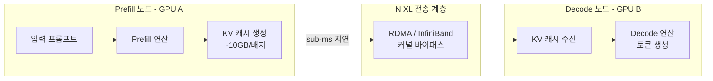
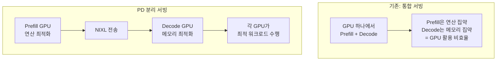

## 개요

NIXL은 Prefill-Decode(PD) 분리 아키텍처에서 **GPU 간 KV 캐시를 sub-millisecond 지연으로 전송**하기 위한 RDMA 기반 메커니즘이다. 2026년 기준 vLLM과 NVIDIA Dynamo 모두에서 KV 캐시 전송의 **표준 메커니즘**으로 채택되었다.

PD disaggregation에서 Prefill 노드가 생성한 KV 캐시를 Decode 노드로 빠르게 전송하는 것이 핵심 병목이다. 예를 들어 Llama 3.1 70B (FP8, 8k 컨텍스트, 배치 8)에서 배치당 약 10GB의 KV 캐시 전송이 필요하며, 기존 TCP/IP로는 지연 시간이 과도하다.

## 왜 중요한가

- **PD 분리의 병목 해소**: Prefill(연산 집약)과 Decode(메모리 집약)를 다른 GPU에서 처리하면 효율이 극대화되나, KV 캐시 전송이 병목
- **Sub-millisecond 지연**: RDMA를 통해 커널 바이패스로 CPU 오버헤드 최소화
- **규모 확장성**: 대규모 서빙 클러스터에서 GPU 활용률 향상의 핵심 인프라
- 2026년 추론 최적화의 핵심 축 -- 모델 크기가 커질수록 KV 캐시 전송 효율이 더욱 중요

## 핵심 메커니즘

NIXL의 핵심 흐름: Prefill 노드에서 생성된 KV 캐시가 RDMA를 통해 sub-millisecond 지연으로 Decode 노드에 전달된다.

### PD Disaggregation이 필요한 이유

Prefill과 Decode의 하드웨어 요구사항이 다르므로, 분리하여 각각 최적화된 GPU에서 실행하면 전체 효율이 향상된다.

### RDMA 기술 상세

| 특성 | 설명 |
|------|------|
| 커널 바이패스 | OS 커널을 거치지 않고 NIC에서 직접 메모리 접근 -> CPU 오버헤드 최소화 |
| 제로 카피 | 메모리 복사 없이 GPU 메모리 -> NIC -> 원격 GPU 메모리 직접 전송 |
| 인터커넥트 | InfiniBand(주류) 또는 RoCE(RDMA over Converged Ethernet) |
| 같은 노드 내 | NVLink를 활용한 GPU 간 직접 전송 |

### 생태계 (2026)

| 프레임워크 | PD Disaggregation 지원 현황 |
|-----------|---------------------------|
| **vLLM** | 실험적 지원, NIXL 기반 |
| **NVIDIA Dynamo** | 프로덕션급 PD disaggregation |
| **SGLang** | 독립적 PD disaggregation 구현 |
| **llm-d** | Kubernetes 네이티브 PD disaggregation |

## 요구사항

- 같은 로컬 네트워크의 워커 노드
- 고속 인터커넥트: InfiniBand 또는 NVLink 이상
- RDMA 지원 NIC (Network Interface Card)
- 기존 TCP/IP 기반 인프라에서는 즉시 활용 불가 -- 하드웨어 투자 필요

## 실무 적용

- 대규모 LLM 서빙 시 PD disaggregation 도입을 검토할 때 NIXL 기반 전송을 표준으로 고려
- 소규모 배포에서는 PD 분리 없이 통합 서빙이 더 효율적일 수 있음 -- 규모에 따른 판단 필요
- 클라우드 환경에서 InfiniBand 지원 인스턴스(예: AWS p5, GCP A3) 선택이 전제
- vLLM 사용 시 disaggregated prefill 옵션 활성화로 실험 가능

## 관련 문서

- [[vllm-v1-engine]] -- vLLM 엔진 아키텍처
- [[sglang]] -- SGLang 추론 프레임워크
- [[tensorrt-llm]] -- TensorRT-LLM 최적화
- [[deepseek-sparse-attention]] -- 희소 어텐션 기반 추론 최적화
- [[batch-inference-caching]] -- 배치 추론 캐싱 패턴
