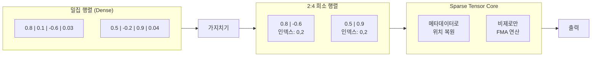
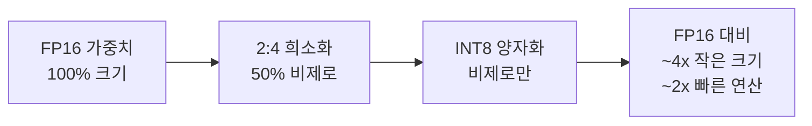
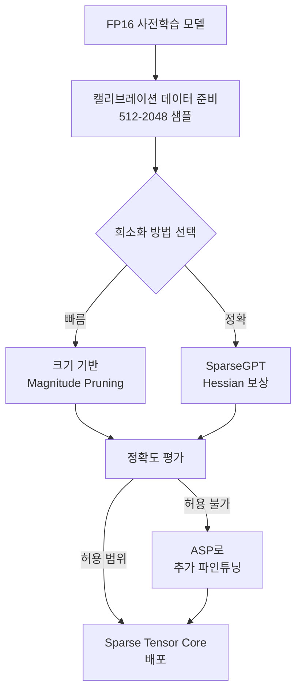

# N:M 희소성 (N:M Structured Sparsity)

## 개요

N:M 희소성(N:M Structured Sparsity)은 가중치 행렬에서 연속된 M개의 값 중 정확히 N개만 0이 아닌 값을 유지하고 나머지를 0으로 만드는 구조적 가중치 가지치기([[structured-pruning-theory]]) 기법이다. 가장 널리 사용되는 형태는 **2:4 희소성**으로, 4개 중 2개를 유지(50% 희소율)하며 NVIDIA Ampere 아키텍처(A100, RTX 30 시리즈) 이후부터 하드웨어 레벨의 가속을 제공한다.

## 핵심 원리

### 패턴 정의

연속된 M개의 원소 블록에서 N개만 살아남는 규칙을 적용한다.

```
원본 가중치 (M=4 블록):
[0.8, 0.1, -0.6, 0.03, 0.5, -0.2, 0.9, 0.04]

2:4 희소성 적용 후 (블록당 2개 유지):
[0.8,  0,  -0.6,  0,   0.5,  0,   0.9,  0  ]
```

각 4-원소 블록에서 절댓값이 큰 상위 2개만 살아남고 나머지는 0이 된다.

### 압축 저장 형식

0인 값들을 실제로 저장하지 않고 **비제로 값 + 인덱스 메타데이터**로 압축한다.

```
원본 (4 x FP16 = 8 bytes):
[0.8, 0, -0.6, 0] → 비제로: [0.8, -0.6] + 인덱스: [0, 2]
저장: 2x FP16 + 2bit x 2 = 4 + 0.5 bytes → ~56% 메모리 절약
```



## NVIDIA Ampere Sparse Tensor Core

NVIDIA는 Ampere(A100, RTX 30 시리즈) 아키텍처부터 2:4 희소성을 **하드웨어 단에서 직접 지원**한다. 이를 Sparse Tensor Core라고 부른다.

### 성능 이점

| 항목 | Dense GEMM | 2:4 Sparse GEMM |
|------|-----------|----------------|
| FP16 연산량 | 기준 (1x) | **최대 2x** |
| 메모리 대역폭 | 기준 | ~1.5x 절약 |
| 정확도 손실 | 없음 | 경미 (1-2%) |
| 하드웨어 요구 | 모든 NVIDIA | Ampere 이상 |

이론적으로 2x 처리량 증가가 가능하며, 실제로는 메모리 대역폭 등 다른 병목으로 1.3-1.7x 향상이 일반적이다.

### 지원 데이터 타입 (Ampere 기준)

- FP16, BF16 (주력)
- INT8
- TF32
- FP64 (부분 지원)

## 희소화 방법

### 크기 기반 가지치기 (Magnitude Pruning)

가장 단순한 방법. 각 M-블록 내에서 절댓값이 작은 N개를 제거한다. 빠르지만 정확도 손실이 클 수 있다.

### SparseGPT

[[quantization-model-compression]]의 GPTQ와 유사한 Hessian 기반 접근. 가지치기 후 남은 가중치를 오류 보상(error compensation)으로 조정하여 손실을 최소화한다.

```python
# SparseGPT를 통한 2:4 희소화 (의사코드)
for layer in model.layers:
    W = layer.weight
    H = compute_hessian(calibration_data, layer)

    for col_block in W.T.split(4):  # 4개씩 블록
        # Hessian 오류를 최소화하는 2개 선택
        selected_mask = select_optimal_2_of_4(col_block, H)
        col_block *= selected_mask

        # 제거된 가중치의 오류를 남은 열들로 보상
        compensate_remaining(col_block, H, selected_mask)
```

### ASP (Automatic SParsity, NVIDIA)

NVIDIA의 공식 도구로 PyTorch 훈련 루프에 통합하여 훈련 중에 2:4 희소성을 점진적으로 부과한다. 파인튜닝이나 처음부터 희소 훈련 시 사용.

## [[structured-pruning-theory]]과의 관계

N:M 희소성은 구조적 가지치기([[structured-pruning-theory]])의 특수한 형태이지만, 전통적인 채널 가지치기와 차이가 있다.

| 항목 | 채널 가지치기 | N:M 희소성 |
|------|------------|-----------|
| 구조 단위 | 필터/채널 전체 제거 | M개 내 N개 제로화 |
| 하드웨어 가속 | CPU 친화적 | Ampere Sparse TC |
| 희소율 | 유연 (10-90%) | 고정 (N/M) |
| 정확도 손실 | 높음 (큰 구조 제거) | 낮음 (미세한 패턴) |
| 적용 모델 | CNN 중심 | LLM 포함 범용 |

## 양자화와의 조합

N:M 희소성과 [[quantization-model-compression]]을 결합하면 더 큰 효율을 얻을 수 있다.



NVIDIA Hopper(H100)에서는 FP8 + 2:4 희소성 조합으로 A100 대비 최대 4x 처리량 향상이 가능하다.

## 현실적 성능 및 한계

- **모델 크기 의존**: 대형 모델(70B+)일수록 희소화 후 회복력이 좋음. 소형 모델(7B 이하)에서 정확도 저하 더 큼
- **태스크 민감도**: 지식 집약적 태스크(QA, 코딩)는 수학/창의적 글쓰기보다 희소화에 민감
- **추론 전용**: 훈련에 Sparse Tensor Core 활용은 제한적 (그래디언트 구조가 달라짐)
- **AMD 미지원**: AMD GPU에는 동등한 N:M 하드웨어 가속이 없음 (2024 기준)

## 실무 적용 워크플로우



## 관련 문서

- [[structured-pruning-theory]] - 구조적 가지치기 전반 개요
- [[quantization-model-compression]] - 양자화와의 결합 전략
- [[smoothquant]] - 활성값 포함 양자화 기법
- [[gptq-quantization]] - Hessian 기반 PTQ (SparseGPT와 유사한 방식)
- [[model-pruning-inference]] - 추론 최적화를 위한 가지치기 전략
