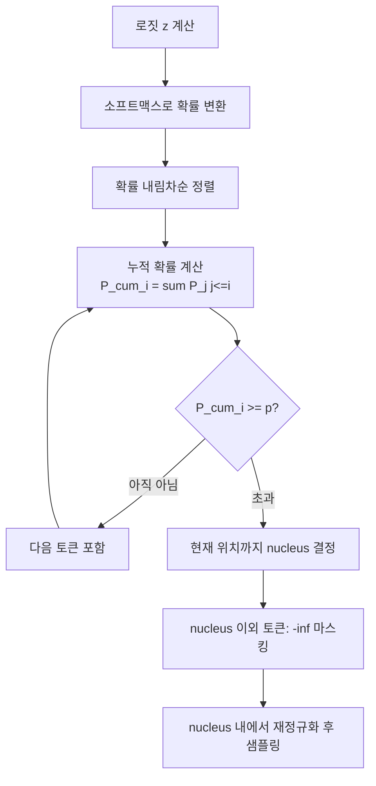

# Top-p (Nucleus) 샘플링

## 개요

Top-p 샘플링(Nucleus Sampling)은 Holtzman et al. (2019, "The Curious Case of Neural Text Degeneration")에서 제안된 텍스트 생성 디코딩 전략이다. 고정된 후보 수를 사용하는 [[beam-search-decoding|빔 서치]]나 Top-k 샘플링과 달리, **누적 확률(cumulative probability)이 임계값 $p$에 도달할 때까지의 최소 토큰 집합(nucleus)**에서만 샘플링한다. 이로 인해 후보 토큰 수가 컨텍스트에 따라 동적으로 결정된다.

## 핵심 아이디어

언어 모델의 다음 토큰 확률 분포는 컨텍스트에 따라 크게 달라진다:

- **분포가 날카로울 때**: 소수의 토큰이 대부분의 확률 질량을 차지 (예: "파리는 프랑스의 ___" - "수도" 압도적)
- **분포가 평탄할 때**: 많은 토큰이 비슷한 확률을 가짐 (예: "그는 ___ 것을 좋아한다" - 다양한 가능성)

Top-k 샘플링(항상 상위 $k$개)은 이 변동성을 무시한다. 날카로운 분포에서 $k$가 너무 크면 저품질 토큰을 포함하고, 평탄한 분포에서 $k$가 너무 작으면 다양성이 부족해진다.

Top-p는 이를 해결: 누적 확률 $p$ 기준으로 동적으로 후보 수를 결정한다.

## 알고리즘



### 단계별 구현

```python
import torch
import torch.nn.functional as F

def nucleus_sampling(logits: torch.Tensor, p: float = 0.9) -> int:
    """
    logits: [vocab_size] 크기의 로짓 텐서
    p: 누적 확률 임계값 (0 < p <= 1)
    반환값: 선택된 토큰 ID
    """
    # 1. 소프트맥스 변환
    probs = F.softmax(logits, dim=-1)

    # 2. 내림차순 정렬
    sorted_probs, sorted_indices = torch.sort(probs, descending=True)

    # 3. 누적 확률 계산
    cumulative_probs = torch.cumsum(sorted_probs, dim=-1)

    # 4. nucleus 결정: 누적 확률이 p를 초과하기 직전까지
    # 첫 번째 토큰은 항상 포함 (이미 p > 0이므로)
    sorted_indices_to_remove = cumulative_probs - sorted_probs > p

    # 5. nucleus 이외 토큰 마스킹
    sorted_probs[sorted_indices_to_remove] = 0.0

    # 6. 재정규화
    sorted_probs /= sorted_probs.sum()

    # 7. 샘플링
    next_token = sorted_indices[torch.multinomial(sorted_probs, num_samples=1)]
    return next_token.item()
```

## 수학적 정의

어휘 $V$에서 확률 분포 $P$가 주어질 때, nucleus $V^{(p)}$는:

$$V^{(p)} = \arg\min_{V' \subseteq V} \left\{ |V'| : \sum_{x \in V'} P(x) \geq p \right\}$$

즉, 합이 $p$ 이상이 되는 가장 작은 고확률 토큰 집합이다.

최종 샘플링 분포는 이 집합에 대해 재정규화된다:

$$P'(x) = \begin{cases} P(x) / \sum_{y \in V^{(p)}} P(y) & \text{if } x \in V^{(p)} \\ 0 & \text{otherwise} \end{cases}$$

## Top-k와의 비교

| 항목 | Top-k | Top-p (Nucleus) |
|------|-------|----------------|
| 후보 토큰 수 | 항상 $k$개 | 컨텍스트에 따라 동적 |
| 날카로운 분포 | 저품질 토큰 포함 위험 | 자동으로 좁아짐 |
| 평탄한 분포 | 다양성 부족 위험 | 자동으로 넓어짐 |
| 구현 단순성 | 매우 단순 | 단순 (정렬 + 누적합 필요) |
| 하이퍼파라미터 | $k$ (고정 정수) | $p$ (0-1 사이 실수) |

## 온도와의 상호작용

Top-p는 일반적으로 온도(temperature) 스케일링과 함께 사용된다. 처리 순서([[logits-processor-internals]] 참조):

```
원시 로짓 -> 온도 나눔 -> [소프트맥스] -> Top-p 필터링 -> 재정규화 -> 샘플링
```

온도와 Top-p의 효과 결합:
- $T = 0.7$, $p = 0.9$: 더 집중된 분포에서 안전한 샘플링
- $T = 1.2$, $p = 0.95$: 다양성과 품질의 균형
- $T = 0.3$, $p = 1.0$: 거의 greedy에 가까운 생성

## 실무 권장 값

용도에 따른 대표적 설정값:

| 용도 | 온도 | Top-p | 설명 |
|------|------|-------|------|
| 코드 생성 | 0.2-0.4 | 0.95 | 정확성 우선 |
| 일반 대화 | 0.7-0.8 | 0.9 | 자연스러움 + 안정성 |
| 창의적 글쓰기 | 0.9-1.1 | 0.95 | 다양성 허용 |
| 요약/번역 | 0.3-0.5 | 0.9 | 충실도 우선 |
| 브레인스토밍 | 1.0-1.3 | 0.98 | 최대 다양성 |

## 텍스트 퇴화와의 관계

Holtzman et al.의 원논문은 **텍스트 퇴화(text degeneration)** 문제를 분석했다. 빔 서치나 greedy 디코딩으로 생성된 텍스트는 종종 반복적이고 단조로워진다 - 이를 "텍스트 퇴화"라 부른다.

원인 분석: LLM의 확률 분포 꼬리(tail)에는 놀라울 정도로 많은 저확률 토큰이 포함되며, 빔 서치는 이 꼬리를 적절히 처리하지 못한다. Top-p는 꼬리를 잘라내어 고품질 토큰만 후보로 남긴다.

Nucleus 명칭의 유래: 통계물리에서 "핵(nucleus)"은 주요 질량이 집중된 코어 영역을 의미한다. 확률 분포의 "핵"이 바로 $V^{(p)}$다.

## Top-p vs 다른 샘플링 변형들

Top-p의 등장 이후 다양한 변형이 제안되었다:

| 기법 | 핵심 차이 | 장점 |
|------|----------|------|
| Top-p | 누적 확률 임계값 | 범용, 균형 |
| [[nucleus-top-p-sampling|Min-P]] | 최대 확률의 비율 임계값 | 적응적, 안정적 |
| Typical Sampling | 정보량 기준 선택 | 자연스러운 텍스트 |
| Eta Sampling | 엔트로피 기반 동적 임계값 | 분포 감도 높음 |
| Mirostat | 목표 퍼플렉시티 제어 | 반복/혼란 균형 |
| XTC | 최고 확률 의도적 제외 | 창의성 극대화 |

## 한계

Top-p의 잘 알려진 한계:

1. **오버컷(overcut) 문제**: 분포가 극단적으로 평탄할 때 $p = 0.9$라도 수천 개의 토큰이 포함될 수 있다
2. **언더컷(undercut) 문제**: 분포가 극단적으로 날카롭고 상위 1개 토큰 확률이 이미 0.95 이상이면 nucleus가 매우 작아져 거의 greedy와 동일

이를 보완하기 위해 top-p와 top-k를 동시에 적용하는 경우가 많다 (`min(top_k, top_p)`):

```python
# 두 조건 모두 적용: 더 보수적인 쪽 선택
filtered = apply_top_k(logits, k=50)
filtered = apply_top_p(filtered, p=0.9)
```

## 구현별 미묘한 차이

HuggingFace와 vLLM에서 Top-p 구현의 경계 처리:

```python
# HuggingFace: 누적합이 p를 초과하는 첫 토큰을 포함
# 즉 nucleus의 합이 반드시 p 이상임을 보장
sorted_indices_to_remove = cumulative_probs - sorted_probs > p

# 일부 구현: 누적합이 p를 초과하는 시점부터 제외
# 즉 nucleus의 합이 p 미만일 수 있음
sorted_indices_to_remove = cumulative_probs > p
```

두 구현은 엣지 케이스에서 다른 결과를 낸다. 재현 가능한 실험을 위해 구현 세부사항을 명시해야 한다.

## 관련 문서

- [[logits-processor-internals]] - Logits 프로세서 파이프라인 전체 구조
- [[temperature-sampling]] - 온도 샘플링
- [[repetition-penalty-logit-bias]] - 반복 패널티와 로짓 바이어스
- [[decoding-strategies]] - 디코딩 전략 비교 개요
- [[beam-search-decoding]] - 빔 서치 디코딩
- [[flash-decoding]] - 어텐션 가속 (샘플링과 독립)
- [[vllm-v1-engine]] - vLLM에서의 Top-p 구현
