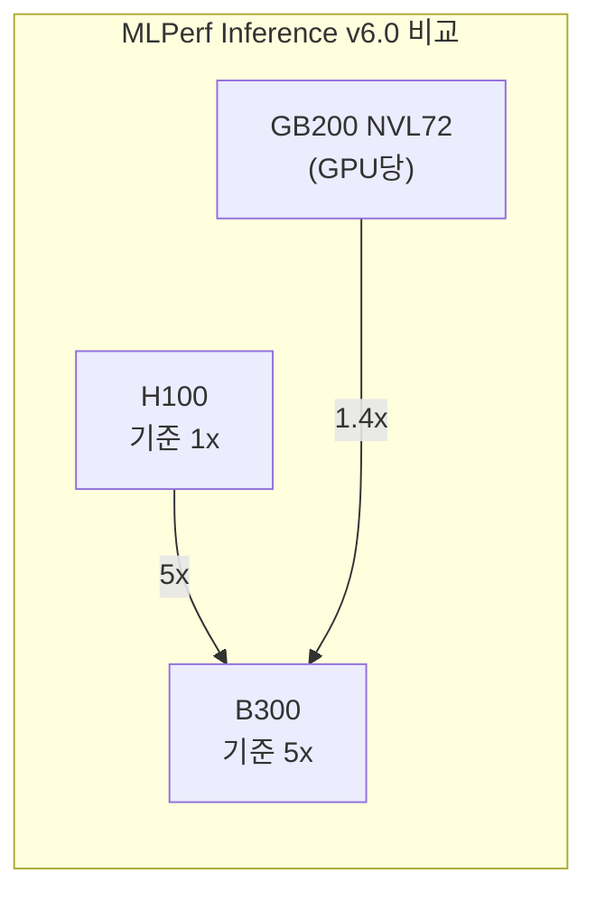
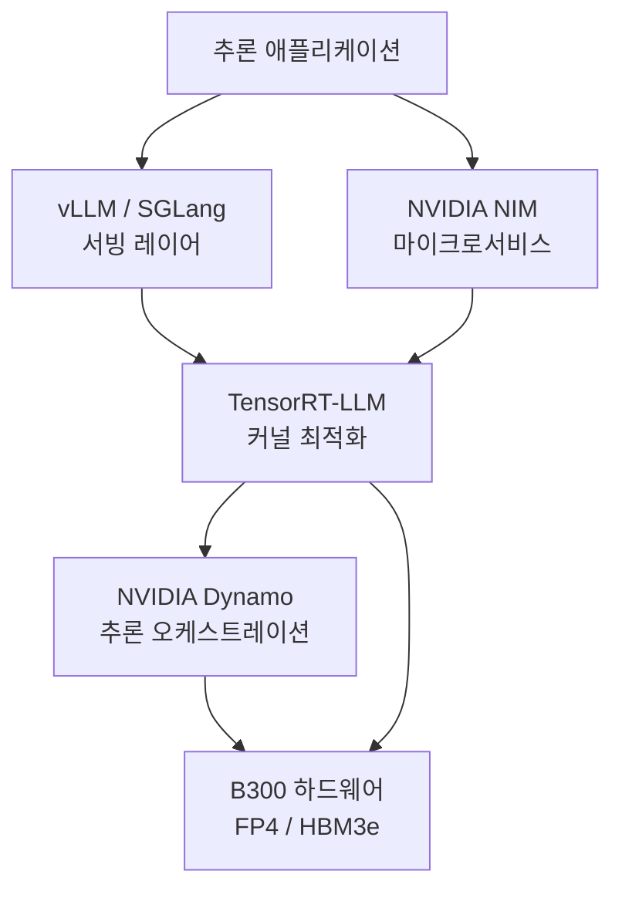
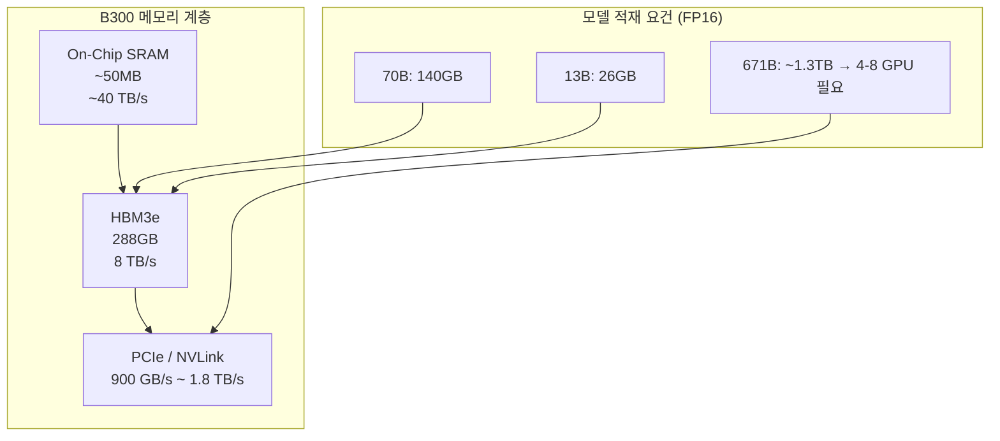

# NVIDIA Blackwell Ultra B300 추론 성능 분석

NVIDIA Blackwell Ultra B300은 2026년 1월 출하된 현세대 최고 성능 데이터센터 GPU로, HBM3e 288GB, 8 TB/s 대역폭, FP4 밀집 연산 15 페타플롭스를 제공한다. MLPerf Inference v6.0 디뷰에서 GB200 NVL72 대비 GPU당 1.4배, Hopper 기반 시스템 대비 5배 처리량을 달성했다. 후속 세대인 [[nvidia-vera-rubin-nvl72|Vera Rubin NVL72]]가 H2 2026 출시 예정이나, B300은 2026년 현재 데이터센터 추론 워크로드의 실질적 주력 하드웨어다.

## 왜 중요한가

B300은 단순한 B200의 업그레이드가 아니라, 추론 시대의 새로운 기준점을 설정한다.

- **288GB HBM3e**: 70B 모델을 FP16으로 단일 GPU에서 구동 가능. 양자화 없는 고품질 추론이 현실적으로 가능해짐
- **FP4 15 PFLOPS**: DeepSeek-R1-671B 같은 초대형 MoE 모델을 소수의 GPU로 서빙 가능
- **GPU당 1,000 토큰/초**: DeepSeek-R1-671B 기준으로 이전 세대의 현실적 한계를 돌파한 수치
- **$0.24/백만 토큰**: SemiAnalysis InferenceX 분석 기준, 경쟁 하드웨어 대비 가격 경쟁력 확보

## 핵심 사양

### B300 vs 이전 세대 비교

| 항목 | B300 (Blackwell Ultra) | B200 (Blackwell) | H200 (Hopper) | H100 (Hopper) |
|------|----------------------|------------------|---------------|---------------|
| 출시 | 2026년 1월 | 2025년 초 | 2024년 | 2022년 |
| HBM 세대 | HBM3e | HBM3e | HBM3e | HBM3 |
| HBM 용량 | 288 GB | 192 GB | 141 GB | 80 GB |
| 메모리 대역폭 | 8 TB/s | 8 TB/s | 4.8 TB/s | 3.35 TB/s |
| FP4 성능 | 15 PFLOPS | 9 PFLOPS | N/A | N/A |
| FP8 성능 | 7.5 PFLOPS | 4.5 PFLOPS | ~2 PFLOPS | ~1 PFLOPS |
| FP16/BF16 | 3.75 PFLOPS | 2.25 PFLOPS | ~1 PFLOPS | ~0.5 PFLOPS |
| NVLink | NVLink 5 | NVLink 5 | NVLink 4 | NVLink 4 |
| TDP | ~1,000W | 1,000W | 700W | 700W |

> B300과 B200은 동일한 NVLink 5를 사용하지만, B300은 HBM3e 용량이 50% 더 많고 FP4 컴퓨트가 ~67% 높다. 이 차이가 대형 모델 추론에서 결정적 차별점이 된다.

### DGX B300 시스템 사양

DGX B300은 B300 GPU 8개를 NVLink 5로 연결한 표준 서버 시스템이다.

| 항목 | DGX B300 |
|------|----------|
| GPU 수 | 8x B300 |
| 총 HBM | 2,304 GB (2.3 TB) |
| FP4 성능 | 144 PFLOPS |
| 메모리 대역폭 | 64 TB/s |
| NVLink 대역폭 | 14.4 TB/s |

## MLPerf Inference v6.0 결과

B300은 MLPerf Inference v6.0에서 공식 데뷔하며 다수의 추론 기록을 경신했다.

### 성능 비교 (상대적 수치)

B300은 Hopper 기반 H100 대비 GPU당 5배, 직전 플래그십 GB200(NVL72 구성 기준 GPU당) 대비 1.4배 처리량을 달성했다. MLPerf는 조건이 엄격해 실제 운영 환경에서는 차이가 더 클 수 있다.

### 주요 태스크별 성능

| 태스크 | 모델 | B300 성능 | 비고 |
|--------|------|-----------|------|
| LLM 추론 | DeepSeek-R1-671B | 1,000 토큰/초/GPU | FP4 추론 |
| LLM 추론 | Llama 3.1 405B | ~2,000 토큰/초/GPU | FP4 추론 |
| 이미지 분류 | ResNet-50 | - | [교차검증 필요] |

## 소프트웨어 스택

B300의 하드웨어 성능을 최대화하려면 호환 소프트웨어 스택이 필수다.

### TensorRT-LLM

B300은 TensorRT-LLM의 FP4 커널을 통해 최대 성능을 달성한다. FP4 GeMM 커널은 NVFP4 포맷을 직접 지원하며, Attention을 위한 FlashAttention-3 변형이 내장됐다.

### NVIDIA Dynamo

[[nvidia-dynamo|NVIDIA Dynamo]]는 B300의 KV-cache 마이그레이션, 분리된 프리필-디코드(disaggregated prefill-decode), 동적 배치 스케줄링을 오케스트레이션한다. Dynamo 없이 B300을 사용하면 하드웨어 성능의 60-70%만 활용하는 것으로 알려져 있다.

### NVIDIA NIM과 연계

[[nvidia-nim-2026|NVIDIA NIM]] 마이크로서비스는 B300에 최적화된 컨테이너 이미지를 제공한다. DeepSeek-R1, Llama 3.x, Nemotron 3 등 주요 모델의 TensorRT-LLM 컴파일 가중치를 사전 패키징해 배포 시간을 대폭 단축한다.

## 비용 효율성 분석

### $0.24/백만 토큰의 의미

SemiAnalysis InferenceX 분석(2026년 Q1 기준)에 따르면 B300 기반 클러스터에서 DeepSeek-R1-671B를 서빙할 때 백만 토큰당 약 $0.24의 비용이 발생한다. 이는 다음을 의미한다.

| 비교 대상 | 토큰 비용 | B300 대비 |
|-----------|----------|----------|
| B300 (DeepSeek-R1-671B) | ~$0.24/M | 기준 |
| GPT-4o (OpenAI 공개 요금) | $5.00/M 출력 | ~20x 비쌈 |
| Claude 3.5 Sonnet (공개) | $3.00/M 출력 | ~12x 비쌈 |
| H100 기반 동일 모델 | ~$1.20/M (추정) | ~5x 비쌈 |

*위 비교는 하드웨어 비용 기준이며, 운영·소프트웨어·네트워크 비용은 제외. 공개 API 요금과 직접 비교는 어렵다.*

## 메모리 계층 구조와 대역폭

288GB HBM3e가 왜 중요한지 이해하려면 메모리 대역폭과 모델 크기의 관계를 봐야 한다.

288GB HBM3e는 70B 모델을 FP16(비양자화)으로 단일 GPU에 완전 적재한다는 의미다. FP8로는 140B, FP4로는 280B 모델을 단일 GPU에 올릴 수 있다.

## 추론 최적화 기법과 B300

B300은 다음 소프트웨어 최적화 기법들과 함께 사용할 때 최대 효과를 낸다.

### 투기적 디코딩 (Speculative Decoding)

[[speculative-decoding|투기적 디코딩]]은 소형 드래프트 모델이 여러 토큰을 제안하고 B300이 병렬로 검증하는 방식으로 지연 시간을 2-3배 줄인다. B300의 높은 FP4 연산량이 검증 단계를 빠르게 처리해 이 기법의 효과를 극대화한다.

### 연속 배치 (Continuous Batching)

[[continuous-batching|연속 배치]]는 요청이 도착할 때마다 처리 대기열에 동적으로 삽입한다. 288GB HBM3e의 대용량 덕분에 더 많은 동시 요청의 KV-cache를 유지할 수 있어 처리량이 높아진다.

### PagedAttention

[[paged-attention|PagedAttention]]은 KV-cache 메모리를 페이지 단위로 관리해 단편화를 줄인다. B300의 8 TB/s HBM3e 대역폭과 결합하면 메모리 효율성과 처리량 모두 향상된다.

## GB200 NVL72 vs B300 단품 선택 가이드

| 시나리오 | 권장 구성 | 이유 |
|---------|---------|------|
| 70B 이하 모델 단독 서빙 | B300 단품 or DGX B300 | 단일 GPU로 충분, 비용 효율 |
| 671B MoE 모델 서빙 | GB200 NVL72 또는 B300 x4-8 | NVLink 5 대역폭으로 MoE 라우팅 최적화 |
| 최대 처리량이 목표 | GB200 NVL72 | NVLink 스케일업으로 GPU 간 통신 병목 제거 |
| 비용 최소화 | DGX B300 | GPU당 성능/달러 최적 |
| 개인정보 처리 (on-prem) | DGX B300 | 클라우드 불필요, 직접 제어 |

## 경쟁 하드웨어 비교

| 제품 | 제조사 | 메모리 | FP8 성능 | 출시 |
|------|--------|--------|---------|------|
| B300 | NVIDIA | 288GB HBM3e | 7.5 PFLOPS | 2026년 1월 |
| MI300X | AMD | 192GB HBM3 | 5.3 PFLOPS | 2024년 |
| Gaudi 3 | Intel | 128GB HBM2e | 1.8 PFLOPS (BF16) | 2024년 |
| TPU v6e (Trillium) | Google | ~32GB HBM | 클러스터 단위 | 2025년 GA |

NVIDIA B300은 단일 GPU 기준으로 메모리와 성능 모두에서 경쟁 제품을 압도하며, 2026년 현재 데이터센터 추론 시장의 사실상 표준이다.

## 실무 배포 고려사항

### 전력 예산

B300 단품은 최대 ~1,000W TDP로 기존 H100(700W) 대비 전력이 크게 늘었다. 랙당 전력 밀도 계획이 필수다.

### 냉각 방식

DGX B300은 직접 액체 냉각(Direct Liquid Cooling, DLC)을 권장한다. 에어 냉각으로는 지속 최대 성능 유지가 어렵다.

### 드라이버 및 CUDA 버전

B300은 CUDA 12.4 이상, 드라이버 560 이상을 요구한다. PyTorch 2.4+, TensorRT-LLM 0.15+ 버전이 FP4 커널을 완전 지원한다.

## 관련 문서

- [[nvidia-vera-rubin-nvl72]] - B300의 후속 세대, Vera Rubin NVL72 랙 시스템
- [[nvidia-dynamo]] - B300 클러스터 오케스트레이션 소프트웨어
- [[nvfp4-quantization]] - B300이 지원하는 FP4 수치 포맷 상세
- [[speculative-decoding]] - B300 추론 처리량을 극대화하는 기법
- [[continuous-batching]] - 서빙 효율 향상 기법
- [[paged-attention]] - 메모리 효율적 KV-cache 관리
- [[quantization]] - 추론 양자화 전반 개요
