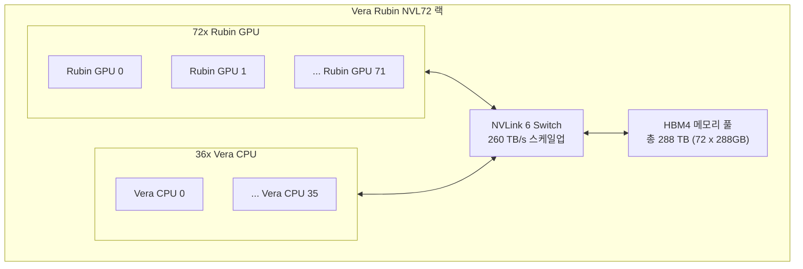
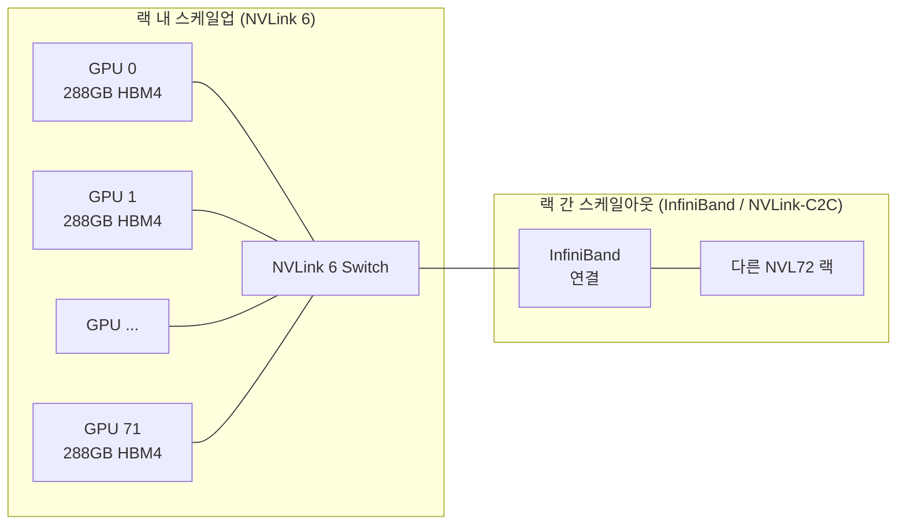
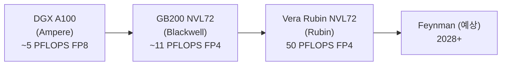
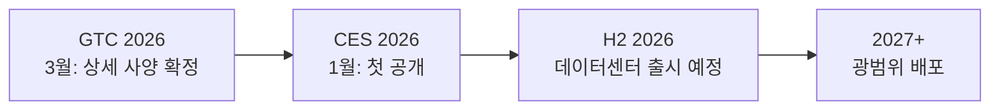

# NVIDIA Vera Rubin NVL72 랙 스케일 시스템

NVIDIA Vera Rubin NVL72는 72개 Rubin GPU와 36개 Vera CPU를 NVLink 6 인터커넥트로 연결한 3세대 랙 스케일 AI 슈퍼컴퓨터다. FP4 기준 50 페타플롭스(이전 세대 [[ai-accelerators|Blackwell]] 대비 5배), 랙 전체 260 TB/s 스케일업 대역폭을 제공하며 H2 2026 데이터센터 출시 예정이다.

## 왜 지금 중요한가

AI 추론 클러스터가 단일 GPU에서 랙 전체로 확장되는 패러다임에서 Vera Rubin NVL72는 세 가지 핵심 과제를 동시에 해결한다.

첫째, 초대형 MoE(Mixture-of-Experts) 모델의 추론이다. 수조 파라미터 규모 모델은 단일 GPU는커녕 단일 노드에도 올라가지 않는다. NVL72는 랙 수준에서 288TB 고대역폭 메모리 풀을 제공해 이를 가능하게 한다.

둘째, 비용 효율성이다. FP4 기준 이전 세대 대비 5배 성능 향상은 동일 전력 예산에서 5배 많은 추론 요청을 처리할 수 있음을 의미하며, 단위 토큰당 비용을 대폭 낮춘다.

셋째, 설치 간소화다. 랙 조립 시간이 100분에서 6분으로 94% 단축되어 데이터센터 운영 효율성이 크게 향상됐다.

## 시스템 구성

### 하드웨어 아키텍처

위 다이어그램은 NVL72 랙 내부에서 Rubin GPU 72개와 Vera CPU 36개가 NVLink 6 패브릭을 통해 단일 메모리 공간으로 연결되는 구조를 보여준다.

### 핵심 사양

| 항목 | Vera Rubin NVL72 | GB200 NVL72 (Blackwell) | 비고 |
|------|-----------------|------------------------|------|
| GPU 종류 | Rubin GPU x72 | B200 x72 | - |
| CPU 종류 | Vera CPU x36 | Grace CPU x36 | - |
| FP4 성능 (랙) | 50 PFLOPS | ~11 PFLOPS | 약 4.5x 향상 |
| HBM 세대 | HBM4 | HBM3e | 차세대 메모리 |
| GPU당 HBM 용량 | 288 GB | 192 GB | +50% |
| 메모리 대역폭 (GPU당) | 22 TB/s | 8 TB/s | +2.75x |
| 스케일업 대역폭 | 260 TB/s | ~130 TB/s | NVLink 6 |
| 인터커넥트 | NVLink 6 | NVLink 5 | - |
| 랙 조립 시간 | 6분 | 100분 | 94% 단축 |
| 출시 일정 | H2 2026 | 출시됨 | - |

### Rubin GPU 단품 사양

| 항목 | 수치 |
|------|------|
| FP4 성능 | ~694 TFLOPS (추정, 50 PFLOPS / 72) |
| HBM4 용량 | 288 GB |
| 메모리 대역폭 | 22 TB/s |
| 트랜지스터 수 | 3,360억 |
| 제조 공정 | 삼성 4nm 추정 ([교차검증 필요]) |

### Vera CPU 사양

| 항목 | 수치 |
|------|------|
| 코어 구성 | 88개 Olympus 코어 |
| 스레드 | 176개 |
| ISA | Arm 호환 |
| 역할 | AI 팩토리 최적화 범용 처리 |

## NVLink 6 인터커넥트

[[nvidia-vera-rubin-nvl72|NVL72]]의 성능을 가능하게 하는 핵심 패브릭은 NVLink 6다. 이전 세대 NVLink 5 대비 약 2배 대역폭을 제공하며, 랙 내 72개 GPU를 완전 연결(full-mesh에 가까운) 논-블로킹 토폴로지로 묶는다.

이 구조는 72개 GPU가 마치 하나의 거대한 GPU처럼 작동하도록 한다. 특히 트랜스포머 어텐션의 KV-cache 공유와 MoE 모델의 라우팅에서 내부 통신 병목이 사라진다.

## 성능 벤치마크 비교

### 세대 간 진화

2020년 A100에서 2026년 Vera Rubin까지 약 6년 만에 동급 랙 시스템 FP4 성능이 10배 이상 향상됐다. 이는 GPU 로드맵이 1년 또는 2년 주기로 세대를 교체하는 NVIDIA의 전략적 실행력을 반영한다.

### 추론 워크로드 적용

| 모델 규모 | GB200 NVL72 구성 | Vera Rubin NVL72 필요 대수 |
|-----------|-----------------|--------------------------|
| 70B (dense) | NVL72 1대 | NVL72 1대 (더 빠름) |
| 671B (MoE, e.g. DeepSeek-R1) | NVL72 4-8대 | NVL72 1-2대 |
| 1T+ (극초대형) | NVL72 16대 이상 | NVL72 4-8대 |

*위 구성은 FP4 추론 기준 추정치이며, 실제 배포 환경에 따라 달라진다.*

## Confidential Computing 지원

Vera Rubin NVL72는 기업 및 공공 분야 요건을 충족하기 위해 기밀 컴퓨팅(Confidential Computing)을 지원한다. GPU 내 TEE(Trusted Execution Environment) 환경에서 모델 가중치와 추론 데이터를 암호화된 상태로 처리할 수 있어, 금융·의료·국방 등 민감 데이터를 다루는 환경에서도 클라우드 AI 가속기를 안전하게 활용할 수 있다.

## 데이터센터 배포 전략

### 전력 효율성

50 PFLOPS FP4를 달성하면서도 NVIDIA는 단위 성능당 전력 효율성(PFLOPS/W)을 이전 세대 대비 향상시켰다고 주장한다. HBM4의 높은 대역폭 밀도와 Rubin 아키텍처의 FP4 연산 최적화가 핵심이다.

### 랙 수준 통합

기존 서버 단위 구매·설치·운영 방식과 달리, NVL72는 **랙 전체를 하나의 유닛**으로 취급한다. 냉각, 전원, 네트워킹이 사전 통합되어 데이터센터 운영 복잡도를 낮춘다. 6분 조립 시간은 데이터센터 스케일아웃이 필요할 때 즉시 용량을 추가할 수 있음을 의미한다.

### NVIDIA DGX SuperPOD 통합

DGX SuperPOD 아키텍처에서 NVL72 단위가 기본 구성 블록이 된다. 다수의 NVL72 랙을 InfiniBand 또는 NVLink-C2C로 연결해 수백 PFLOPS 규모의 클러스터를 구성할 수 있다.

## NVIDIA Dynamo와의 연계

하드웨어 성능이 아무리 높아도 소프트웨어 스택이 따라오지 않으면 의미가 없다. NVIDIA는 Vera Rubin NVL72와 함께 [[nvidia-dynamo|NVIDIA Dynamo]] 추론 프레임워크를 제공해 NVLink 6 기반 고대역폭 환경에서 최적의 토큰 처리량을 낼 수 있도록 지원한다.

## 경쟁 구도

| 시스템 | 공급사 | FP4/BF16 성능 | 출시 |
|--------|--------|--------------|------|
| Vera Rubin NVL72 | NVIDIA | 50 PFLOPS FP4 | H2 2026 |
| GB200 NVL72 | NVIDIA | ~11 PFLOPS FP4 | 2025 |
| TPU 8t 슈퍼파드 (9,600칩) | Google | 121 EFLOPS | H2 2026 |
| Gaudi 3 클러스터 | Intel | - | 2025 |
| MI400 Helios | AMD | - | 2026 |

Google의 [[google-tpu-ironwood|TPU 8세대]]는 학습 전용(8t)과 추론 전용(8i)으로 분리 설계하는 방향을 선택했고, NVIDIA는 통합 플랫폼에 집중하는 전략적 차이를 보인다.

## 출시 로드맵

로드맵 흐름은 CES(공개) - GTC(사양 확정) - H2 출시의 3단계로 진행된다. 대형 클라우드 고객들은 이미 예약 주문을 시작했으며, H2 2026부터 AWS, Google Cloud, Microsoft Azure 등 주요 CSP를 통해 접근 가능할 것으로 예상된다.

## 관련 문서

- [[nvidia-blackwell-ultra-b300-inference]] - 현세대 B300 Blackwell Ultra 추론 성능 분석
- [[ai-accelerators]] - AI 가속기 전체 시장 비교
- [[nvidia-dynamo]] - Vera Rubin NVL72와 함께 사용하는 NVIDIA 추론 프레임워크
- [[nvfp4-quantization]] - FP4 수치 포맷과 추론 최적화 원리
- [[kv-cache-inference]] - 대형 모델 추론에서 KV 캐시 관리
- [[speculative-decoding]] - 추론 처리량 향상 기법
