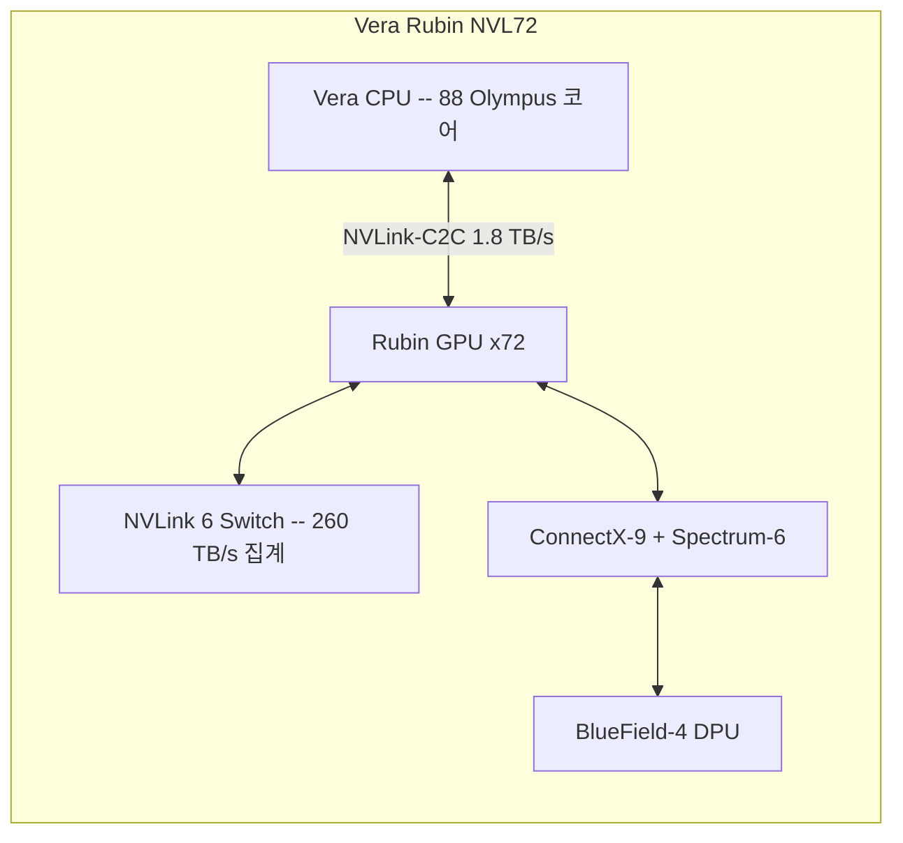

# NVIDIA Vera Rubin 플랫폼

Blackwell 후속 세대 AI 슈퍼컴퓨터 플랫폼. [[blackwell-ultra-b300|GPU]]/CPU/네트워크 등 6개 칩을 하나의 시스템으로 공동 설계(Extreme Co-Design)하여, 추론 토큰 비용 10배 절감, MoE 학습 GPU 4배 절감을 달성한다. 2026년 하반기 출하 예정.

## 개요

NVIDIA Vera Rubin은 GPU, CPU, NVLink 스위치, 네트워크 인터페이스, DPU, 이더넷 스위치 등 6개의 목적별 프로세서를 단일 AI 팩토리 시스템으로 통합한 차세대 플랫폼이다. 각 칩을 독립적으로 최적화하는 대신 "극단적 공동 설계(Extreme Co-Design)" 철학으로 전체 시스템을 하나의 AI 슈퍼컴퓨터로 설계했다.

## 핵심 특징

### 6개 핵심 칩

| 칩 | 역할 | 주요 사양 |
|----|------|-----------|
| **Rubin GPU** | 트랜스포머 워크로드 가속 | 50 PFLOPS (NVFP4 추론), 3,360억 트랜지스터, 288GB HBM4 |
| **Vera CPU** | AI 팩토리 최적화 범용 프로세서 | 88 Olympus 코어, 176 스레드, Arm 호환 |
| **NVLink 6 Switch** | GPU 간 스케일업 패브릭 | GPU당 3.6 TB/s 양방향 대역폭 |
| **ConnectX-9** | 스케일아웃 네트워킹 | 고처리량, 저지연 엔드포인트 |
| **BlueField-4 DPU** | 데이터 처리 유닛 | Grace CPU + ConnectX-9 듀얼 다이 패키지 |
| **Spectrum-6 Switch** | 이더넷 스케일아웃 | Co-Packaged Optics(CPO) 기반 |

### 성능 지표

| 지표 | Rubin GPU | Vera CPU |
|------|-----------|----------|
| 추론 성능 | 50 PFLOPS (NVFP4) | - |
| 학습 성능 | 35 PFLOPS (NVFP4) | - |
| 메모리 대역폭 | 22 TB/s (HBM4) | 최대 1.2 TB/s |
| 메모리 용량 | 최대 288GB | 최대 1.5TB (LPDDR5X) |
| NVLink 대역폭 | GPU당 3.6 TB/s | 1.8 TB/s (NVLink-C2C) |
| 코어/스레드 | - | 88 코어 / 176 스레드 |

## 기술 상세

### NVLink 6 토폴로지

NVL72 구성에서 72개 GPU를 풀 올투올(All-to-All) 토폴로지로 연결한다. 랙당 총 **260 TB/s** 집계 대역폭을 제공하며, 통합 SHARP 인네트워크 컴퓨트(In-Network Compute)로 FP8 집합 연산을 스위치 트레이당 14.4 TFLOPS로 가속한다. 초저지연 균일 레이턴시 설계로 MoE 모델의 전문가 라우팅(expert routing)을 효율적으로 처리한다.

### 세대별 개선 (Blackwell 대비)

| 비교 항목 | Rubin GPU | Vera CPU |
|-----------|-----------|----------|
| 추론 성능 | **5배 향상** | - |
| 학습 성능 | **3.5배 향상** | - |
| 메모리 대역폭 | **2.8배** (8 -> 22 TB/s) | **2.4배** (vs Grace) |
| NVLink 대역폭 | **2배** | **2배** (vs Grace) |
| 트랜지스터 수 | **1.6배** | - |
| 메모리 용량 | - | **3배** (vs Grace) |

시스템 수준에서의 효과:
- 추론 토큰 비용 **10배 절감**, 추론 처리량 **10배 향상**
- MoE 학습 필요 GPU **약 1/4로 감소**
- HPC 시뮬레이션 코드 **최대 3.2배** 성능 향상

### 추가 플랫폼 컴포넌트

**ConnectX-9 SuperNIC**: 포트당 800 Gb/s, 프로그래머블 RDMA 트랜스포트, 통합 암호 엔진을 탑재한 스케일아웃 네트워크 인터페이스. GPU당 1.6 Tb/s의 네트워크 대역폭을 제공한다.

**BlueField-4 DPU**: 64코어 Grace CPU(Arm Neoverse V2)와 ConnectX-9를 듀얼 다이 패키지로 통합. 250 GB/s LPDDR5 메모리 대역폭, 800 Gb/s 인라인 암호화를 지원한다.

**Spectrum-6 이더넷 스위치**: 칩당 102.4 Tb/s 총 대역폭, 512 x 200 Gb/s 포트 구성. Co-Packaged Optics(CPO) 기반으로 32개 실리콘 포토닉스 엔진을 탑재하여 기존 방식 대비 약 5배의 전력 효율 향상을 달성한다.

### NVL72 랙 시스템

NVL72는 Vera Rubin 플랫폼의 플래그십 구성으로, 트레이당 200 PFLOPS(NVFP4), 2TB 고속 메모리, 14.4 TB/s NVLink 6 내부 대역폭을 제공한다. 완전 액체 냉각 설계로 전력 효율을 극대화했다.

### 출하 일정 및 확장
- CES 2026에서 최초 발표
- 2026년 3월 16일: NVIDIA Groq 3 LPX를 7번째 칩으로 추가하여 디코드 코프로세서 통합
- 2026년 하반기(H2 2026) 출하 예정

## Extreme Co-Design 철학

Vera Rubin의 핵심 설계 원칙은 "극단적 공동 설계"다. 기존 접근법이 GPU, CPU, 네트워크 칩을 각각 독립적으로 최적화한 뒤 조합하는 방식이었다면, Vera Rubin은 6개(이후 7개) 칩을 하나의 AI 팩토리 시스템으로 동시 설계한다. GPU-CPU 간 NVLink-C2C 코히런트 메모리 공유, NVLink 6의 균일 레이턴시 설계, ConnectX-9의 프로그래머블 RDMA 트랜스포트가 이 철학의 구체적 구현이다.

이 접근법의 실질적 효과는 MoE 모델 학습에서 특히 두드러진다. 전문가 라우팅이 GPU 간 고대역폭/저지연 통신을 요구하기 때문에, NVLink 6의 3.6 TB/s 양방향 대역폭과 SHARP 인네트워크 컴퓨트가 직접적인 병목 해소에 기여한다.

## 관련 문서

- [[nvidia-groq-3-lpu]] -- Vera Rubin 디코드 코프로세서
- [[nvidia-dynamo]] -- NVIDIA 분산 추론 OS
- [[nvfp4-quantization]] -- Rubin GPU의 NVFP4 추론 포맷
- [[google-tpu-ironwood]] -- 경쟁 플랫폼: Google TPU v7
- [[amd-mi400-helios]] -- 경쟁 플랫폼: AMD MI400
- [NVIDIA Rubin Platform 공식 발표](https://nvidianews.nvidia.com/news/rubin-platform-ai-supercomputer)
- [Inside the NVIDIA Rubin Platform](https://developer.nvidia.com/blog/inside-the-nvidia-rubin-platform-six-new-chips-one-ai-supercomputer/)
