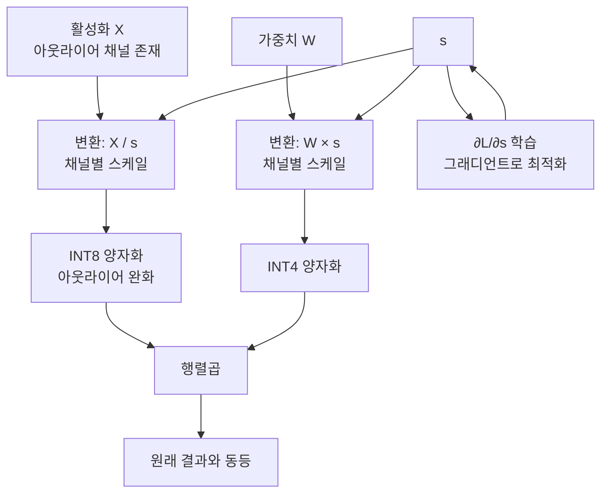
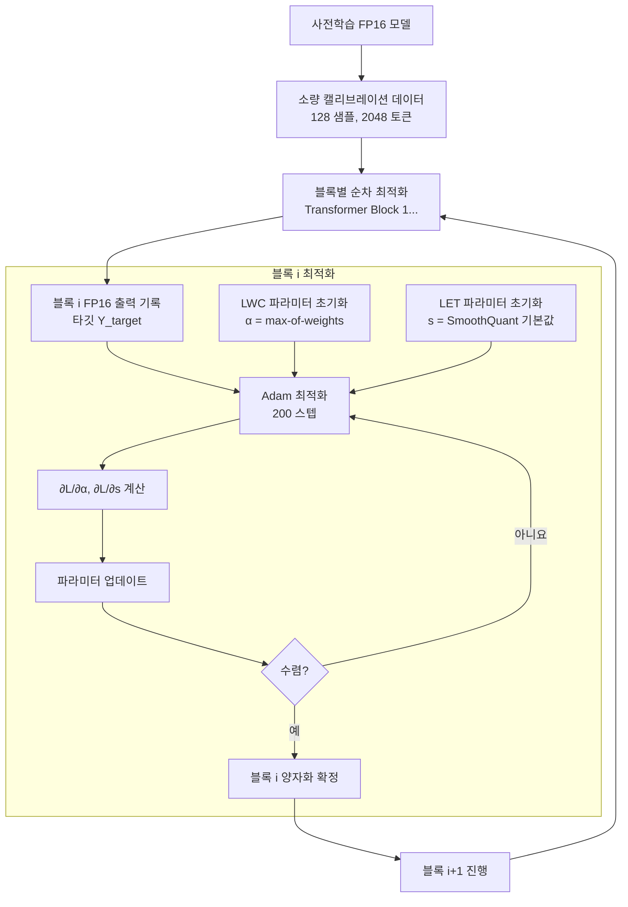
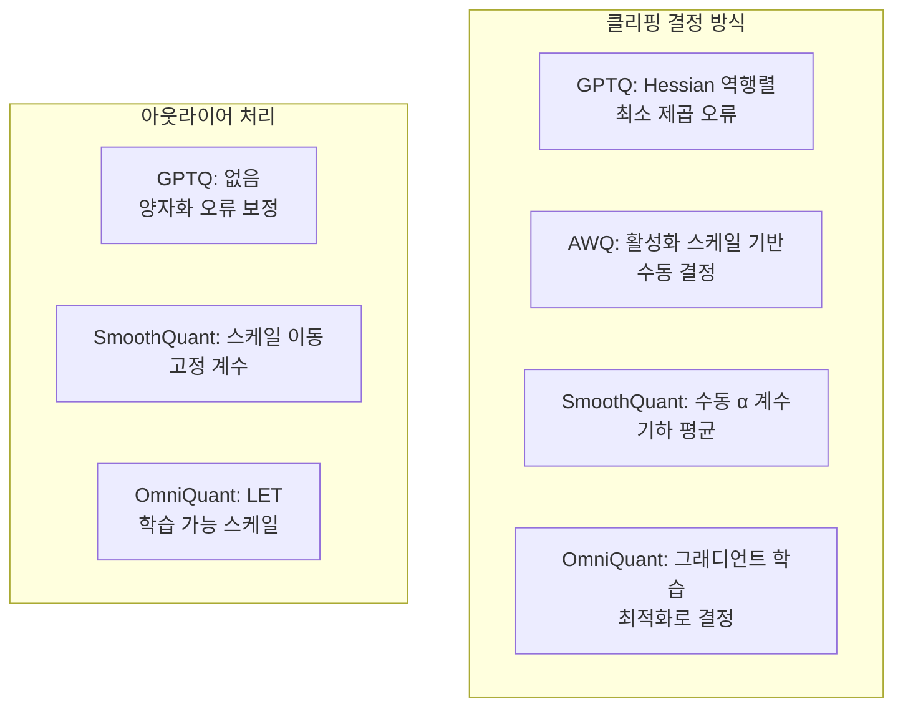

# OmniQuant - 학습 가능 등가 변환 양자화

## 개요

OmniQuant(Omnidirectional Calibration for Quantization)은 LLM 양자화의 정확도를 높이기 위해 **학습 가능한 가중치 클리핑(Learnable Weight Clipping, LWC)**과 **학습 가능한 등가 변환(Learnable Equivalent Transformation, LET)**을 도입한 프레임워크다.

기존 방식(GPTQ, AWQ 등)이 양자화 파라미터를 고정 규칙으로 결정하는 것과 달리, OmniQuant는 소량의 캘리브레이션 데이터로 블록 단위 그래디언트 하강(block-wise gradient descent)을 수행해 최적 클리핑 임계값과 등가 변환 계수를 학습한다.

특히 W4A4(가중치 4비트, 활성화 4비트) 전 레이어 양자화에서 기존 방법을 크게 상회하는 SOTA(최고 수준) 결과를 기록한다.

## 핵심 기법 두 가지

### 1. LWC - 학습 가능 가중치 클리핑

가중치를 INT 범위로 클리핑할 때 쓰는 상/하한 임계값을 학습 가능한 파라미터로 만든다.

기존 방식: 최댓값/백분위수(percentile)로 고정 계산
$$\alpha_{\text{fixed}} = \max(|W|) \quad \text{또는} \quad \text{percentile}(|W|, 99.9)$$

OmniQuant LWC: 그래디언트로 최적화
$$\alpha^* = \arg\min_\alpha \mathcal{L}(\hat{y}, y) \quad \text{where } \hat{y} = f(Q_\alpha(W) \cdot x)$$

```mermaid
flowchart LR
    A[FP16 가중치 W] --> B["클리핑\n[-α, α]로 제한"]
    B --> C[INT 양자화\nround(W_clip / s)]
    C --> D[역양자화\n×s]
    D --> E[행렬곱\n양자화 가중치 × 활성화]
    E --> F[손실 계산]
    F -->|"∂L/∂α 역전파"| B

    style B fill:#ffe0b2
    style A fill:#e3f2fd
```

**학습 목적 함수**

블록 $i$의 입출력을 보존하도록 지역적(local) 최적화:

$$\min_{\alpha, T} \|f_i(X; W_{\text{float}}) - f_i(X; Q(W, \alpha, T))\|_F^2$$

### 2. LET - 학습 가능 등가 변환

활성화 아웃라이어 문제를 해결하기 위해 [[smoothquant|SmoothQuant]]의 아이디어를 확장한다. SmoothQuant는 스무딩 계수를 수동으로 결정하는 반면, OmniQuant는 이를 학습으로 최적화한다.

**등가 변환 원리**

입력 $X$와 가중치 $W$의 행렬곱을 변환해 양자화가 쉬운 형태로 만든다.

$$Y = X W^T = (X \cdot \text{diag}(s)^{-1}) \cdot (\text{diag}(s) \cdot W^T) = \hat{X} \hat{W}^T$$

여기서 스케일 벡터 $s = (s_1, ..., s_d)$를 학습으로 결정한다. $s$ 값이 크면 활성화가 작아지고 가중치가 커져 활성화 양자화가 쉬워진다.



## 전체 학습 절차



**시간/리소스 비용**

- 단일 A100 GPU 기준 LLaMA-7B 처리 시간: ~30분
- GPTQ 대비 ~3-4배 더 오래 걸림
- 그러나 데이터 효율이 높아 128 샘플로도 충분

## 성능 벤치마크

### W4A16 (가중치 4비트, 활성화 FP16)

| 방법 | LLaMA-7B PPL | LLaMA-13B PPL |
|------|-------------|--------------|
| FP16 기준 | 5.47 | 4.88 |
| GPTQ | 5.68 | 5.05 |
| AWQ | 5.60 | 4.97 |
| **OmniQuant** | **5.53** | **4.93** |

### W4A4 (전 레이어 4비트) - 핵심 강점

| 방법 | LLaMA-7B PPL | LLaMA-13B PPL |
|------|-------------|--------------|
| FP16 기준 | 5.47 | 4.88 |
| GPTQ W4A4 | 15.17 | 9.95 |
| QuIP W4A4 | 8.21 | 7.04 |
| **OmniQuant W4A4** | **6.94** | **6.01** |

W4A4에서의 격차가 가장 두드러진다. 활성화 양자화가 어려운 환경에서 LET의 효과가 극명히 나타난다.

### W3A16 (가중치 3비트)

| 방법 | LLaMA-7B PPL |
|------|-------------|
| GPTQ W3 | 6.24 |
| **OmniQuant W3** | **5.97** |

## 코드 예시

```python
# OmniQuant 양자화 (개념적 코드)
from omniquant import OmniQuantConfig, quantize_llm

config = OmniQuantConfig(
    weight_bits=4,
    act_bits=4,                # W4A4 설정
    group_size=128,
    use_lwc=True,              # 학습 가능 가중치 클리핑
    use_let=True,              # 학습 가능 등가 변환
    lwc_lr=1e-2,
    let_lr=5e-3,
    max_steps=200,             # 블록당 최적화 스텝
    calibration_samples=128,
    calibration_seqlen=2048,
)

# 양자화 실행 (블록별 순차 처리)
quantized_model = quantize_llm(
    model=pretrained_model,
    config=config,
    calibration_data=calibration_loader,
)

quantized_model.save_pretrained("llama-7b-omniquant-w4a4")
```

## 다른 양자화 기법과의 비교



| 특성 | GPTQ | AWQ | SmoothQuant | OmniQuant |
|------|------|-----|-------------|-----------|
| 클리핑 최적화 | 간접 | 있음 | 없음 | 직접(그래디언트) |
| 활성화 처리 | 없음 | 부분 | 있음 | 학습 가능 |
| W4A4 지원 | 부실 | 부실 | 부실 | SOTA |
| 속도 | 빠름 | 보통 | 빠름 | 느림 |

## 실무 고려사항

**OmniQuant가 적합한 경우**
- W4A4 전 레이어 양자화가 필요한 극한 압축 시나리오
- 양자화 시간을 투자할 수 있고 최대 정확도가 목표인 경우
- 매우 긴 컨텍스트로 KV 캐시 + 가중치 모두 INT4로 줄여야 하는 경우

**주의사항**
- 블록별 최적화이므로 누적 오류가 긴 모델에서 증가할 수 있음
- 캘리브레이션 데이터 도메인과 추론 도메인 미스매치 시 정확도 저하
- 구현이 복잡해 현재 vLLM 등 주류 서빙 스택의 기본 지원 없음

## 관련 문서

- [[smoothquant]] - LET의 선행 연구, 수동 스케일 이동
- [[awq-quantization]] - AWQ, 학습 없는 활성화 인식 양자화
- [[gptq-quantization]] - Hessian 기반 양자화 보정
- [[spqr-sparse-quantized]] - 희소+양자화 혼합 (같은 큐)
- [[squeezellm-quantization]] - k-평균 비균일 양자화 (같은 큐)
- [[atom-int8-quant]] - 아웃라이어 처리 INT8 (같은 큐)
- [[fp6-llm-quantization]] - FP6 부동소수점 양자화 (같은 큐)
- [[ai-inference-quantization-2026]] - 최신 양자화 동향
