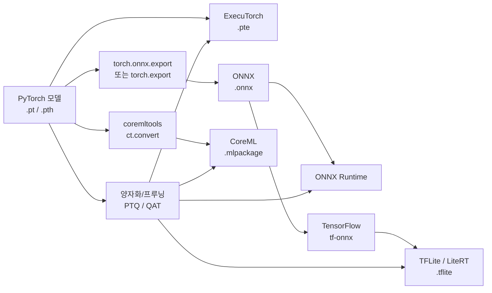

# 온디바이스 추론 스택 (On-Device Inference)

## 개요

온디바이스 추론(On-Device Inference)은 클라우드 서버 없이 엣지 디바이스(스마트폰, 임베디드 기기, 노트북)에서 직접 모델을 실행하는 방식이다. 프라이버시 보호, 오프라인 동작, 지연 시간 최소화가 주요 동기다.

## 주요 런타임 프레임워크

### ONNX Runtime (크로스플랫폼)

Microsoft가 개발한 오픈 소스 추론 엔진. ONNX(Open Neural Network Exchange) 포맷을 기반으로 다양한 하드웨어를 추상화한다.

- CPU, CUDA, DirectML, CoreML, TensorRT 등 다수 Execution Provider 지원
- Python, C++, C#, Java, JavaScript API 제공
- 변환: PyTorch -> `torch.onnx.export()` -> `.onnx` -> ONNX Runtime

### TFLite / LiteRT (안드로이드/모바일)

Google이 개발. TensorFlow 모델을 경량화하여 모바일 및 임베디드 환경에서 실행.

- 2024년부터 LiteRT(Lite Runtime)로 브랜드 변경
- Android Neural Networks API(NNAPI)를 통해 NPU 가속
- FlatBuffers 기반 `.tflite` 포맷, 매우 작은 바이너리

### CoreML (iOS/macOS)

Apple 플랫폼 전용 추론 프레임워크. Neural Engine(NPU)을 직접 활용.

- `.mlpackage`/`.mlmodel` 포맷
- `coremltools`로 PyTorch/TensorFlow 변환 지원
- Apple Silicon(M 시리즈)에서 CPU/GPU/Neural Engine 자동 스케줄링

### ExecuTorch (PyTorch 네이티브)

Meta의 PyTorch 모바일 추론 런타임. `torch.export()`를 기반으로 완전한 PyTorch 시맨틱을 엣지에서 유지.

- 모바일, 웨어러블, MCU까지 타겟
- XNNPACK, CoreML, Vulkan 등 백엔드 플러그인 구조
- Llama 등 LLM 모델의 온디바이스 배포에 활용

## 모델 변환 파이프라인

## 프레임워크 비교

| 항목 | ONNX Runtime | TFLite/LiteRT | CoreML | ExecuTorch |
|------|-------------|---------------|--------|------------|
| 플랫폼 | 범용 | Android/임베디드 | iOS/macOS | PyTorch 생태계 전체 |
| 원본 프레임워크 | 범용 | TensorFlow 우선 | 범용 | PyTorch |
| NPU 지원 | EP 플러그인 | NNAPI | Neural Engine | 백엔드 플러그인 |
| LLM 지원 | 보통 | 제한적 | Phi/Mistral | Llama 계열 |
| 오픈소스 | O | O | 부분 | O |

## 양자화/프루닝과의 결합

온디바이스 배포는 거의 항상 양자화(Quantization)나 프루닝(Pruning)과 함께 적용된다.

- **PTQ (Post-Training Quantization)**: INT8/INT4로 변환 후 각 런타임에 적재
- **QAT (Quantization-Aware Training)**: 훈련 시 양자화를 시뮬레이션하여 정확도 회복
- **가중치 전용 양자화 (Weight-Only)**: 활성화는 FP, 가중치만 INT4 (LLM에서 일반적)

## 실전 고려사항

- 모델 크기: 1-7B 파라미터 모델이 스마트폰 현실적 상한 (INT4 양자화 기준)
- 메모리: 스마트폰 RAM 8-16GB, 모델이 상당 부분 점유
- 발열/배터리: 장시간 추론은 NPU > GPU > CPU 순으로 에너지 효율적
- 포맷 변환 손실: 변환 체인이 길수록 정확도 손실 누적

## 관련 문서

- [[model-pruning-inference]] - 온디바이스 배포를 위한 프루닝
- [[ai-inference-quantization-2026]] - 양자화 기법 상세
- [[litert-lm]] - LiteRT LLM 추론 지원
- [[nvfp4-quantization]] - FP4 양자화 최신 동향
