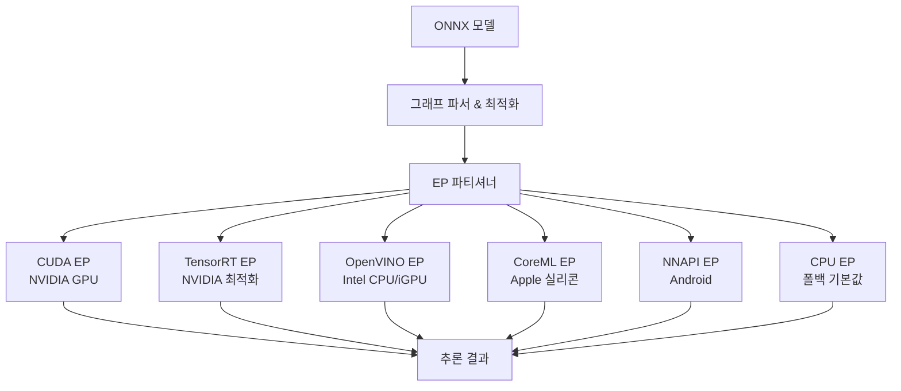

# ONNX Runtime

## 개요

**ONNX Runtime**은 Microsoft가 개발하고 오픈소스로 관리하는 크로스 플랫폼 머신러닝 추론 엔진이다. Open Neural Network Exchange(ONNX) 포맷으로 직렬화된 모델을 다양한 하드웨어와 운영체제에서 실행할 수 있도록 설계되었으며, PyTorch, TensorFlow, scikit-learn 등 주요 프레임워크가 모두 ONNX 내보내기를 지원한다. 단일 프레임워크에 종속되지 않는 배포 레이어를 제공한다는 점이 핵심 가치다.

## 아키텍처: Execution Provider (EP) 시스템

ONNX Runtime의 가장 중요한 설계 결정은 **Execution Provider(EP) 플러그인 아키텍처**다. 그래프의 각 연산(op)을 어느 하드웨어에서 실행할지를 EP가 결정하며, 지원하지 않는 연산은 자동으로 CPU EP로 폴백된다.



EP 파티셔닝 덕분에 동일한 추론 코드가 로컬 개발 환경(CPU EP), 프로덕션 서버(CUDA EP + TensorRT EP), 모바일 기기(CoreML EP 또는 NNAPI EP)에서 수정 없이 실행된다.

## 그래프 최적화 파이프라인

EP 실행 전에 ONNX Runtime은 3단계 그래프 최적화를 수행한다:

1. **기본 최적화**: 불필요한 Identity 연산 제거, 상수 폴딩(constant folding), 노드 제거
2. **확장 최적화**: 연산자 퓨전(Operator Fusion) - LayerNorm, GELU, Attention 패턴을 단일 커널로 합침
3. **레이아웃 최적화**: 데이터 형식을 대상 하드웨어의 선호 레이아웃(NCHW vs NHWC 등)으로 변환

이 최적화만으로도 원본 프레임워크 대비 1.5-3배의 속도 향상이 일반적으로 보고된다.

## LLM 추론 지원: ORT GenAI

대형 언어 모델(LLM)을 위한 전용 레이어인 **ORT GenAI(onnxruntime-genai)**가 별도로 존재한다. Phi, Llama, Mistral 계열 모델의 ONNX 변환과 최적화된 자기회귀 생성 루프를 제공한다:

- 양자화된 ONNX 모델 (INT4, INT8) 로드 및 실행
- KV 캐시 관리 내장
- Greedy/Beam Search 디코딩 지원
- C/C++, Python, C#, Java, JavaScript 바인딩

```python
# ORT GenAI 기본 사용 예시
import onnxruntime_genai as og

model = og.Model("phi-3-mini-onnx")
tokenizer = og.Tokenizer(model)
params = og.GeneratorParams(model)
params.set_search_options(max_length=200)

prompt = "한국의 수도는?"
input_ids = tokenizer.encode(prompt)
params.input_ids = input_ids

output = og.generate(model, params)
print(tokenizer.decode(output[0]))
```

## 양자화 지원

ONNX Runtime은 자체 양자화 도구(`onnxruntime.quantization`)를 제공한다:

| 양자화 방식 | 정밀도 손실 | 속도 향상 | 지원 EP |
|------------|-----------|----------|--------|
| 동적 양자화 | 낮음 | 1.5-2x | CPU |
| 정적 양자화 | 중간 | 2-4x | CPU, CUDA |
| QDQ (Quantize-DeQuantize) | 낮음 | 2-3x | TensorRT EP |

## 배포 범위

ONNX Runtime은 클라우드부터 엣지까지 폭넓은 배포 시나리오를 단일 런타임으로 커버한다. Hugging Face Optimum 라이브러리는 ONNX Runtime과의 통합을 표준화하여, Transformers 모델을 `optimum-cli`로 ONNX로 내보내고 ORT로 최적화하는 파이프라인을 제공한다. [[tflite-litert]]가 Android/iOS 온디바이스에 특화되고 [[coreml|CoreML]]이 Apple 생태계에 특화된 것과 달리, ONNX Runtime은 범용 크로스 플랫폼 레이어를 목표로 한다. 실제 서빙 인프라에서의 배포 전략은 [[model-serving]]을 참조한다.

## 관련 문서

- [[model-serving]] - 프로덕션 서빙 인프라와 ONNX Runtime 통합
- [[tflite-litert]] - Google의 온디바이스 추론 런타임 (비교 대상)
- [[coreml]] - Apple 생태계 전용 추론 런타임
- [[quantization-model-compression]] - 양자화 이론 및 기법
