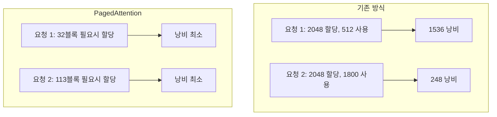

# PagedAttention

Kwon et al. (2023)이 [[vllm-semantic-router|vLLM]]에서 제안한 KV 캐시 메모리 관리 기법. OS의 가상 메모리/페이징에서 영감을 받아, KV 캐시를 고정 크기 **블록(페이지)**으로 분할하고 비연속 메모리에 저장한다.

## 문제: KV 캐시 메모리 낭비

기존 LLM 서빙은 요청마다 최대 시퀀스 길이에 해당하는 연속 메모리를 사전 할당한다. 실제 생성 길이를 예측할 수 없으므로:

- **내부 단편화**: 할당했지만 사용하지 않는 메모리 (평균 60-80% 낭비)
- **외부 단편화**: 요청 간 빈 공간이 파편화되어 새 요청 수용 불가

## 동작 원리

### 1. 블록 테이블

각 시퀀스는 **블록 테이블**--논리 블록 번호를 물리 블록 번호에 매핑하는 페이지 테이블--을 가진다. 블록 크기는 보통 16 토큰.

### 2. 동적 할당

토큰이 생성될 때마다 필요한 블록만 할당. 마지막 블록이 가득 차면 새 물리 블록을 할당하고 블록 테이블에 매핑을 추가한다.

### 3. Copy-on-Write

Beam search에서 여러 후보가 같은 프리픽스를 공유할 때, 물리 블록을 공유하다가 분기 시점에만 복사한다. 이로써 beam search의 메모리 사용량을 최대 55% 절감.

## 성능 영향

| 지표 | 기존 방식 | PagedAttention |
|------|----------|----------------|
| 메모리 낭비율 | 60-80% | **4% 미만** |
| 처리량 (동시 요청) | 기준 | **2-4x 향상** |
| 메모리 공유 (beam) | 불가 | Copy-on-Write |

## vLLM 이후의 확산

PagedAttention은 vLLM에서 시작되었지만, 이제 LLM 서빙의 사실상 표준이다:

- [[sglang|SGLang]]: RadixAttention으로 확장 (트리 구조 공유)
- TensorRT-LLM: 유사 메커니즘 내장
- [[prefix-caching|Prefix Caching]]: PagedAttention 위에 프리픽스 재사용

## 관련 문서

- [[kv-cache-inference]] -- KV 캐시 추론 최적화
- [[vllm-semantic-router]] -- vLLM
- [[prefix-caching]] -- Prefix Caching
- [[model-serving]] -- 모델 서빙
