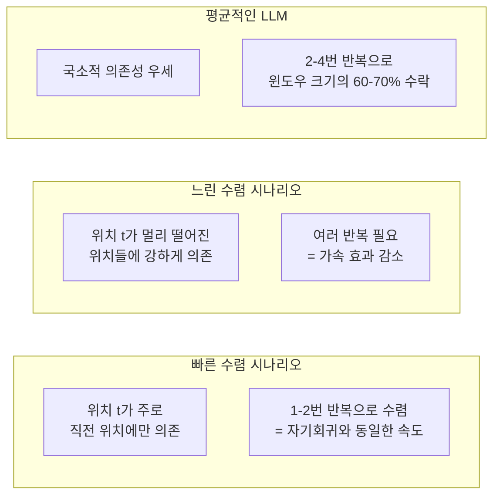
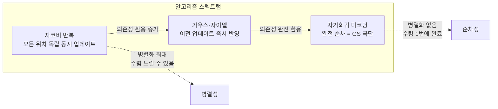

# 병렬 자코비 디코딩

## 개요

병렬 자코비 디코딩(Parallel Jacobi Decoding)은 LLM 자기회귀 디코딩의 순차적 토큰 생성을 비선형 방정식 시스템의 자코비 반복(Jacobi Iteration) 으로 해석해 병렬화하는 기법이다.

모든 미래 위치를 동시에 추정하고, 이 추정값이 자기 일관성(self-consistency)을 갖도록 반복 수렴시킨다. 이론적으로 **수렴이 보장**되며 (수렴하면 자기회귀와 동일한 출력), 추가 모델이나 학습 없이 적용 가능하다.

[[lookahead-decoding|Lookahead Decoding]]의 이론적 기반이자, 드래프트 모델 없는 추론 가속의 원리적 출발점이다.

## 핵심 개념: 자기회귀 디코딩을 방정식으로

자기회귀 언어 모델의 생성은 다음과 같이 표현된다.

$$x_t = \arg\max_x P(x \mid x_1, ..., x_{t-1})$$

전체 시퀀스 $(x_1, ..., x_T)$를 한 번에 구하면, 이는 **고정점 방정식 시스템**이 된다.

$$x_t^* = f_t(x_1^*, ..., x_{t-1}^*) \quad \text{for all } t \in \{1, ..., T\}$$

자코비 반복은 이를 다음과 같이 반복 업데이트로 푼다.

$$x_t^{(k+1)} = f_t(x_1^{(k)}, ..., x_{t-1}^{(k)}) \quad \text{for all } t \text{ simultaneously}$$

$k$번째 추정값으로 $k+1$번째 추정값을 모든 위치에 대해 동시에 계산한다.

## 알고리즘 상세

```mermaid
flowchart TD
    A[프롬프트 x1...xn] --> B["초기화: x'_{n+1},...,x'_{n+W}\n무작위 또는 고정값 (EOS 등)"]
    B --> C[반복 k = 0, 1, 2, ...]

    subgraph 자코비 반복 단계
        C --> D["단일 포워드 패스\n입력: x1...xn + x'_{n+1}^k...x'_{n+W}^k"]
        D --> E["출력: x''^{k+1}_{n+1}...x''^{k+1}_{n+W}\n각 위치 greedy 예측"]
        E --> F{수렴 확인\nx''^{k+1} == x'^k 인 위치}
        F --> G["수렴 위치 카운팅\n연속 수렴 접두사 측정"]
        G --> H{충분한 토큰 수렴?}
        H -- 예 --> I[수렴 토큰 수락\n다음 윈도우로 이동]
        H -- 아니요 --> J["x'^{k+1} ← x''^{k+1}\n추정값 업데이트"]
        J --> D
    end

    I --> K{EOS 또는 최대 길이?}
    K -- 아니요 --> B
    K -- 예 --> L[생성 완료]
```

**수렴 보장**

자코비 반복에서 위치 $t$의 값이 수렴했다고 해도, 더 앞 위치의 값이 바뀌면 다시 발산할 수 있다. 따라서 **연속 수렴 접두사(longest consistent prefix)**만 수락하는 것이 정확도를 보장한다.

수렴 조건:
$$x_t^{(k+1)} = x_t^{(k)} \quad \text{and} \quad x_{t'}^{(k+1)} = x_{t'}^{(k)} \text{ for all } t' < t$$

이 조건이 성립하는 최장 접두사 길이만큼 수락한다.

## 수렴 속도와 반복 횟수

자코비 반복의 수렴 속도는 시퀀스의 자기 의존성 구조에 따라 달라진다.



실험적으로 LLM은 대부분 2-4번의 반복으로 수렴하며, 평균 수락 토큰은 윈도우 크기의 60-70% 수준이다.

**효율성 계산 예시**

윈도우 크기 W = 8, 반복 횟수 r = 3이면:
- 총 포워드 패스: r = 3번
- 수락 토큰: 약 8 × 0.65 = 5.2개
- 자기회귀 대비 속도: 5.2 / 3 ≈ 1.73x

## Gauss-Seidel 변형

순수 자코비 방식은 이전 반복의 추정값을 사용한다. 가우스-자이델(Gauss-Seidel) 변형은 이미 업데이트된 위치의 값을 즉시 활용한다.

$$x_t^{(k+1)} = f_t(x_1^{(k+1)}, ..., x_{t-1}^{(k+1)}, x_t^{(k)}, ..., x_W^{(k)})$$

자기회귀 디코딩은 Gauss-Seidel의 특수 케이스(W=1 또는 순차 업데이트)로 볼 수 있다.



## 다른 병렬 디코딩 기법과의 관계

자코비 디코딩은 여러 병렬 디코딩 기법의 이론적 기반이다.

```mermaid
flowchart TD
    JD[자코비 반복\n이론적 기반]

    JD --> LD[[lookahead-decoding\|Lookahead Decoding]]
    JD --> BD[블록단위 병렬 디코딩]
    JD --> CD[연속 초안 디코딩]

    LD -->|n-gram 캐시 추가| LD2[히트율 향상\n1.5-2x 실용 가속]
    BD -->|고정 블록 크기| BD2[단순한 구현\n1.3-1.7x 가속]
    JD --> MD[[medusa-multi-head-decoding\|Medusa]]
    MD -->|학습된 헤드 활용| MD2[2-3x 가속]
```

| 기법 | 기반 원리 | 추가 요소 | 실용 가속 |
|------|----------|----------|---------|
| **순수 자코비** | 자코비 반복 | 없음 | 1.3-1.7x |
| [[lookahead-decoding\|Lookahead]] | 자코비 + n-gram | n-gram 캐시 | 1.5-2.0x |
| [[medusa-multi-head-decoding\|Medusa]] | 다중 헤드 검증 | 학습된 헤드 | 2.0-3.0x |
| [[speculative-decoding\|추측 디코딩]] | 드래프트+검증 | 드래프트 모델 | 2.0-3.5x |

## 구현 예시

```python
# 병렬 자코비 디코딩 (핵심 루프)
import torch

def jacobi_decode(
    model,
    input_ids: torch.Tensor,
    max_new_tokens: int = 100,
    window_size: int = 8,
    max_iters: int = 10,
) -> torch.Tensor:
    device = input_ids.device
    prompt_len = input_ids.shape[1]
    generated = input_ids.clone()

    while generated.shape[1] - prompt_len < max_new_tokens:
        W = min(window_size, max_new_tokens - (generated.shape[1] - prompt_len))

        # 윈도우 위치 초기화 (EOS 토큰으로)
        draft_ids = torch.full(
            (1, W), model.config.eos_token_id, device=device
        )
        current_sequence = torch.cat([generated, draft_ids], dim=1)

        prev_draft = None
        accepted_count = 0

        for iteration in range(max_iters):
            # 전체 시퀀스 단일 포워드 패스
            with torch.no_grad():
                logits = model(current_sequence).logits

            # 각 위치의 greedy 예측 (프롬프트 이후 위치)
            new_draft = logits[:, generated.shape[1]-1:-1].argmax(dim=-1)

            # 수렴 확인: 이전 추정과 동일한 위치 찾기
            if prev_draft is not None:
                consistent = (new_draft == prev_draft)
                # 연속 일치 접두사 길이 계산
                accepted_count = 0
                for c in consistent[0]:
                    if c:
                        accepted_count += 1
                    else:
                        break
                if accepted_count >= W:  # 전체 수렴
                    break

            # 추정값 업데이트
            current_sequence[:, generated.shape[1]:] = new_draft
            prev_draft = new_draft

        # 수렴한 토큰 수락 (최소 1개 보장)
        accepted_count = max(1, accepted_count)
        accepted_tokens = new_draft[:, :accepted_count]
        generated = torch.cat([generated, accepted_tokens], dim=1)

        # EOS 감지
        if (accepted_tokens == model.config.eos_token_id).any():
            break

    return generated
```

## 장단점 분석

**장점**
- 추가 모델, 학습, 외부 캐시 없이 즉시 적용 가능
- 수렴 시 자기회귀와 완전히 동일한 출력 보장
- 이론적으로 깔끔하고 이해하기 쉬운 알고리즘
- 어떤 LLM에도 블랙박스로 적용 가능

**단점**
- 최대 가속이 Lookahead/Medusa/추측 디코딩보다 낮음
- 초기값이 나쁘면 반복 횟수 증가 → 가속 효과 감소
- 배치 내 시퀀스별 수렴 속도가 달라 배치 처리 어려움
- 샘플링(temperature > 0) 환경에서 이론적 수렴 보장 약해짐

## 실용적 의의

순수 자코비 디코딩 자체보다는, 이를 개선한 Lookahead Decoding이 실용적으로 더 많이 쓰인다. 하지만 자코비 디코딩은 다음 관점에서 중요하다.

1. **이론적 분석 도구**: 병렬 디코딩의 가속 상한과 수렴 속도 분석
2. **알고리즘 초기화**: Medusa/Lookahead 등의 초기 드래프트 생성 방법으로 활용
3. **연구 기반**: 새로운 병렬 디코딩 기법 설계의 출발점

## 관련 문서

- [[lookahead-decoding]] - 자코비 + n-gram 캐시 결합 실용 기법 (같은 큐)
- [[speculative-decoding]] - 드래프트 모델 기반 추측 디코딩
- [[medusa-multi-head-decoding]] - 학습 기반 병렬 헤드 디코딩 (같은 큐)
- [[mirror-speculative-decoding]] - 거울 추측 디코딩
- [[eagle-3-speculative-decoding]] - 고수락률 추측 디코딩
- [[flash-decoding]] - 어텐션 디코딩 GPU 최적화
- [[vllm-v1-engine]] - 병렬 디코딩 통합 서빙 엔진
