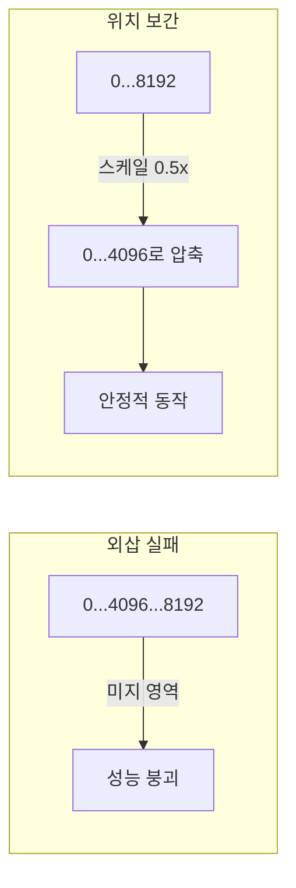

# 위치 보간 (Position Interpolation)

Chen et al. (2023)이 제안한 [[rotary-position-embedding|RoPE]] 컨텍스트 확장 기법. 학습 시 사용한 위치 범위 [0, L]을 넘어서는 외삽(extrapolation) 대신, 확장된 범위를 원래 범위로 **보간(interpolation)**하여 축소한다.

## PI -> NTK -> YaRN 계보

| 기법 | 원리 | 확장 비율 | 품질 |
|------|------|---------|------|
| PI | 균일 스케일 다운 | 2-4x | 기본 |
| NTK-aware | 고주파만 스케일, 저주파 보존 | 4-16x | 개선 |
| [[rope-scaling-ntk-yarn\|YaRN]] | NTK + 어텐션 온도 스케일링 | 8-128x | **최고** |

PI는 **모든 주파수를 균일 압축**하므로 고주파 정보(인접 토큰 관계)가 손실된다. NTK-aware는 이를 해결하고, YaRN은 어텐션 분포까지 보정한다.

## 관련 문서

- [[rotary-position-embedding]] -- RoPE
- [[rope-scaling-ntk-yarn]] -- NTK/YaRN 확장
- [[long-context-scaling]] -- Long Context Scaling
- [[alibi-positional-encoding]] -- ALiBi
