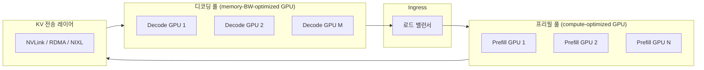

# Prefill-Decode 분리 서빙 (Disaggregated Serving)

## 개요

**Prefill-Decode 분리(Disaggregated Prefill-Decode Serving)**는 LLM 추론의 두 단계인 프리필(prefill)과 디코딩(decode)을 **서로 다른 GPU 풀**에 물리적으로 배치하는 인프라 아키텍처다. 두 단계가 근본적으로 다른 컴퓨팅 특성을 가지기 때문에 같은 하드웨어에서 함께 실행하면 서로의 효율을 갉아먹는다는 통찰에서 출발한다. Mooncake(문캐인, ByteDance), DistServe, NIXL 기반 시스템들이 대표적 구현이다.

## 프리필 vs. 디코딩의 근본적 차이

| 속성 | 프리필(Prefill) | 디코딩(Decode) |
|------|----------------|----------------|
| 연산 특성 | **계산(compute) 바운드** | **메모리 대역폭(memory-BW) 바운드** |
| 병렬성 | 모든 입력 토큰 병렬 처리 | 자기회귀적, 한 번에 1 토큰 |
| 산술 집약도 | 높음 (FLOPs/byte 큼) | 낮음 (매 스텝 전체 KV 읽기) |
| GPU 활용률 | Tensor Core 포화 | HBM 대역폭이 병목 |
| 배치 효과 | 배치 크기 비례 개선 | 배치 증가해도 BW 제한 |

같은 GPU에서 두 작업을 함께 처리하면, 디코딩 중에는 Tensor Core가 유휴 상태가 되고 프리필 중에는 디코딩 요청들의 레이턴시가 급등하는 비효율이 발생한다.

## 분리 아키텍처

이 다이어그램은 요청이 프리필 풀에서 처리된 후 KV 캐시가 디코딩 풀로 전송되는 분리 서빙 구조를 나타낸다.

## KV 캐시 전송이 핵심 과제

분리 서빙에서 가장 큰 엔지니어링 과제는 **KV 캐시 전송**이다. 프리필 GPU에서 생성된 KV 캐시를 디코딩 GPU로 빠르게 옮겨야 한다. 지연이 발생하면 분리에 따른 이점이 사라진다.

주요 전송 기술:

- **NVLink**: 같은 노드 내 GPU 간 고속 전송 (900GB/s, H100 NVL 기준)
- **RDMA(InfiniBand, RoCE)**: 노드 간 네트워크를 통한 직접 메모리 접근
- **[[nixl-kv-transfer|NIXL]]**: NVIDIA가 개발한 KV 캐시 전송 전용 라이브러리. TCP/RDMA/NVLink를 추상화

## Mooncake 아키텍처 (ByteDance)

ByteDance의 Mooncake는 프리필-디코딩 분리를 프로덕션에서 대규모 적용한 선구적 사례다. 핵심 특징:

1. **KV 캐시 중심 스케줄링**: 프리필 결과를 캐시 서버에 저장하고, 디코딩 GPU가 필요 시 가져오는 간접 구조
2. **지역성 인식 라우팅**: 동일한 프리픽스를 가진 요청을 같은 캐시 노드로 유도하여 캐시 히트율 극대화
3. **이기종 GPU 풀**: 계산 집약적 프리필에는 H100, 대역폭 우선 디코딩에는 A100 또는 L40S 활용

## 비용 및 성능 효과

| 지표 | 단일 풀 서빙 | 분리 서빙 |
|------|------------|----------|
| TTFT (P50) | 기준 | 30-50% 개선 |
| TTFT (P99) | 기준 | 50-70% 개선 |
| 처리량(토큰/초) | 기준 | 20-40% 개선 |
| GPU 활용률 | 60-70% | 85-90% |
| 인프라 복잡도 | 낮음 | 높음 |

분리 서빙은 인프라 복잡도를 대가로 성능과 비용 효율을 크게 높인다.

## 적합한 서비스 유형

분리 서빙이 특히 효과적인 경우:

- **대용량 RAG / 롱 컨텍스트**: 프리필이 길고 디코딩이 짧은 패턴
- **코드 완성**: 긴 코드베이스 컨텍스트 + 짧은 응답
- **배치 추론 + 인터랙티브 혼합**: 두 워크로드를 분리된 풀로 격리 가능

반면 짧은 프롬프트 + 짧은 응답의 균일한 워크로드에서는 복잡도 증가 대비 효과가 미미할 수 있다.

## Chunked Prefill과의 관계

[[chunked-prefill|Chunked Prefill]]이 "같은 GPU에서 두 작업을 인터리빙하는 소프트웨어적 해법"이라면, Prefill-Decode 분리는 "물리적으로 분리하는 하드웨어적 해법"이다. 두 접근은 상호 배타적이지 않다. 분리 서빙 아키텍처에서도 각 풀 내부에서 Chunked Prefill을 적용해 추가 최적화를 달성할 수 있다.

## 관련 문서

- [[model-serving]] - LLM 서빙 인프라 전반
- [[kv-cache-inference]] - KV 캐시 관리와 메모리 최적화
- [[chunked-prefill]] - 동일 GPU에서의 프리필-디코딩 인터리빙 기법
- [[nixl-kv-transfer]] - NVIDIA의 KV 캐시 전송 전용 라이브러리
- [[nvidia-dynamo]] - 분리 서빙을 지원하는 NVIDIA 추론 플랫폼
