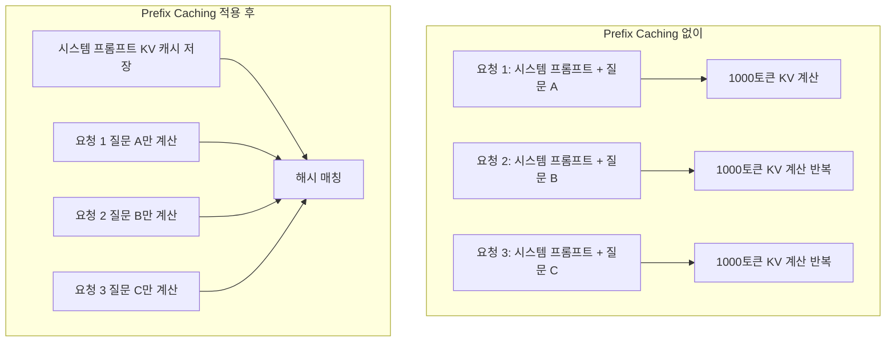
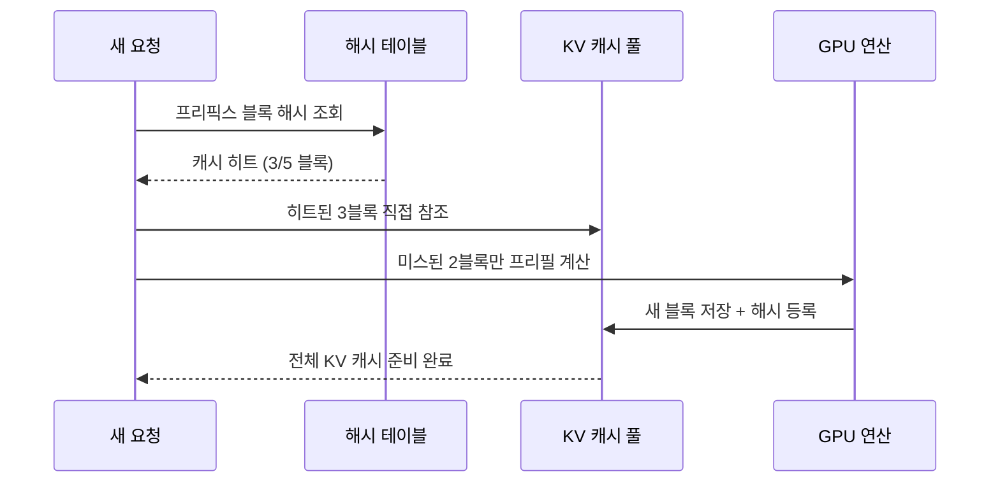

# Prefix Caching (KV 캐시 해시 재사용)

## 개요

**Prefix Caching(프리픽스 캐싱)**은 반복적으로 등장하는 프롬프트 접두사(prefix)의 KV 캐시를 해시 기반으로 식별하고 재사용하는 추론 최적화 기법이다. 동일한 시스템 프롬프트를 공유하는 다수의 요청, RAG(검색 증강 생성)에서 반복되는 컨텍스트 문서, 멀티-턴 대화의 이전 히스토리 등에서 큰 효과를 발휘한다. vLLM의 **APC(Automatic Prefix Caching)**, SGLang의 RadixAttention이 대표적인 구현이다.

## 핵심 문제: 동일 프리픽스의 반복 계산

LLM 추론에서 **프리필(prefill)** 단계는 입력 토큰 전체에 대해 주의(attention) 연산을 수행하고 KV 캐시를 생성한다. 모든 요청이 동일한 1000-토큰 시스템 프롬프트를 포함할 경우, 매 요청마다 이 1000토큰의 KV 계산을 반복하는 것은 명백한 낭비다.



## 해시 기반 블록 매칭

vLLM APC의 구현 방식은 다음과 같다:

1. **블록 단위 분할**: KV 캐시를 고정 크기의 블록(block size=16 또는 32 토큰)으로 관리한다.
2. **해시 키 생성**: 각 블록의 해시는 `(이전 블록 해시, 현재 블록의 토큰 ID 튜플)`로 결정된다. 이를 통해 토큰 시퀀스의 **정확한 프리픽스 매칭**이 가능하다.
3. **캐시 룩업**: 새로운 요청의 토큰을 블록 단위로 분해하고 해시를 계산하여 기존 캐시와 비교한다. 히트(hit)된 블록은 재계산 없이 재사용된다.
4. **LRU 퇴출**: GPU 메모리가 부족하면 최근에 사용되지 않은(Least Recently Used) 블록을 먼저 퇴출한다.



## TTFT 단축 효과

**TTFT(Time-To-First-Token)**은 사용자가 요청을 보낸 후 첫 번째 토큰이 생성되기까지의 시간이다. Prefix Caching은 프리필 계산량을 줄여 TTFT를 직접적으로 단축시킨다.

| 시나리오 | 캐시 히트율 | TTFT 절감 |
|----------|------------|-----------|
| 고정 시스템 프롬프트 (1K 토큰) | ~95% | 80-90% |
| RAG 문서 (5K 토큰 컨텍스트) | ~70% | 60-75% |
| 멀티-턴 대화 (평균 10턴) | ~60% | 50-65% |

## 효과적인 워크로드 패턴

Prefix Caching이 특히 효과적인 시나리오:

- **시스템 프롬프트 공유**: 동일한 긴 시스템 프롬프트를 사용하는 챗봇, 코드 어시스턴트
- **RAG 파이프라인**: 동일한 문서 청크(chunk)를 여러 질문에 걸쳐 반복 사용
- **멀티-턴 대화**: 이전 대화 히스토리를 매 턴 반복 전송하는 구조
- **Few-shot 프롬프트**: 동일한 예시들을 포함하는 프롬프트 템플릿
- **트리 탐색 에이전트**: 같은 루트 상태에서 여러 분기를 탐색하는 [[agent-trees|에이전트 트리]] 패턴

## vLLM APC 활성화

```python
from vllm import LLM

# enable_prefix_caching=True로 APC 활성화
llm = LLM(
    model="meta-llama/Llama-3-8B-Instruct",
    enable_prefix_caching=True,
    max_model_len=8192,
)

# 동일한 시스템 프롬프트를 공유하는 요청들은 자동으로 캐시 히트
outputs = llm.generate(prompts)
```

서버 모드에서는 `--enable-prefix-caching` 플래그로 활성화한다.

## SGLang RadixAttention

SGLang은 **RadixAttention**이라는 고급 prefix caching 변형을 구현한다. vLLM APC가 선형 프리픽스만 다루는 것과 달리, RadixAttention은 **트리(radix tree)** 구조로 캐시를 관리해 공통 프리픽스를 공유하는 여러 분기를 효율적으로 처리한다. 병렬 샘플링이나 트리 검색 에이전트에서 특히 유리하다.

## 한계와 주의점

- **정확한 매칭만 지원**: 토큰 시퀀스가 1토큰이라도 다르면 캐시 미스(miss)가 발생한다. 동적 날짜/시간 삽입이나 랜덤 시드 등은 캐시 효과를 파괴한다.
- **메모리 트레이드오프**: 캐시 풀이 클수록 히트율이 높아지지만, 새로운 요청의 KV 공간이 줄어든다.
- **Chunked Prefill 연동**: 긴 프리픽스는 [[chunked-prefill|Chunked Prefill]]과 함께 사용해 TTFT를 추가로 개선할 수 있다.

## 관련 문서

- [[kv-cache-inference]] - KV 캐시 메모리 관리 기법 전반
- [[prompt-caching-agentic]] - 에이전트 환경에서의 프롬프트 캐싱 전략
- [[chunked-prefill]] - 프리필을 청크로 나눠 처리하는 보완 기법
- [[model-serving]] - 프리픽스 캐싱을 적용하는 서빙 인프라
- [[sglang]] - RadixAttention 구현체
