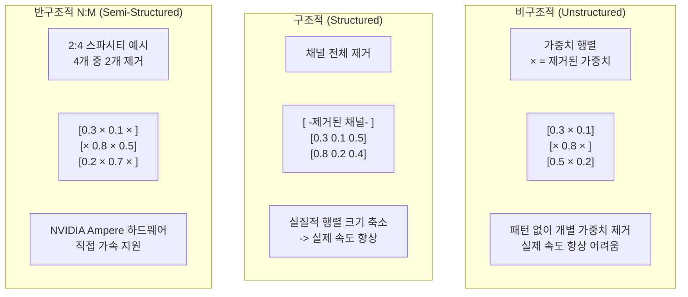
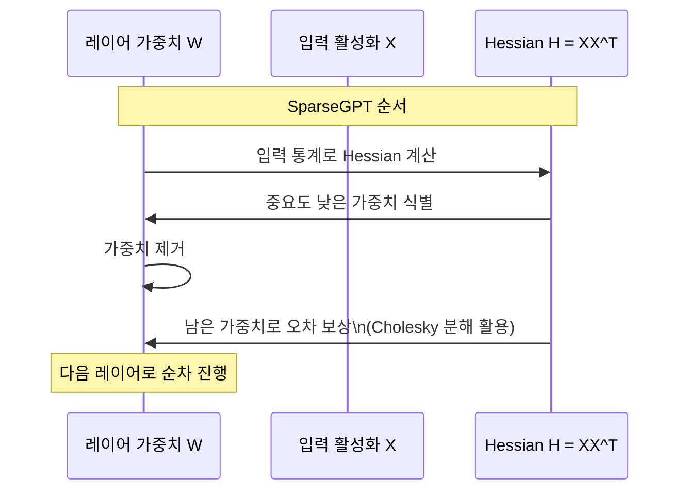

# 프루닝 심화 (구조적/비구조적/반구조적)

프루닝(Pruning)은 훈련된 신경망에서 중요도가 낮은 가중치를 제거하거나 0으로 만들어 모델을 경량화하는 기법이다. 이 문서는 비구조적, 구조적, 반구조적(N:M 스파시티)의 세 유형과 LLM에 특화된 포스트 트레이닝 프루닝(PTQ 프루닝) 기법, 그리고 프루닝과 양자화 조합을 다룬다.

## 세 가지 프루닝 유형



### 비구조적 프루닝 (Unstructured Pruning)

개별 가중치를 제거한다. 70% 이상의 높은 스파시티(sparsity)에서도 정확도 손실이 작은 것이 장점이다. 하지만 희소 행렬은 대부분의 하드웨어에서 일반 조밀 행렬보다 연산이 느리거나 복잡하다. NVIDIA A100 이하 GPU에서는 실제 추론 속도 향상이 제한적이다. 표준 BLAS 라이브러리가 희소 패턴을 활용하지 않기 때문이다.

### 구조적 프루닝 (Structured Pruning)

Attention 헤드(head pruning), MLP의 뉴런/채널(channel pruning), 레이어 전체(layer pruning)를 단위로 제거한다. 제거 후 모델의 행렬 크기가 실제로 줄어들기 때문에, 특수 라이브러리 없이도 표준 행렬 연산이 빨라진다. 단점은 동일 스파시티에서 비구조적 대비 정확도 손실이 크다.

**헤드 프루닝**: 중요도가 낮은 Attention 헤드를 제거. Michel et al.(2019)은 헤드 수를 절반으로 줄여도 성능 손실이 미미함을 보였다.

**레이어 프루닝**: 연속된 여러 레이어 중 일부를 제거. 인접 레이어의 출력이 비슷할 경우(레이어 붕괴, layer collapse) 효과적이다.

### 반구조적 프루닝: N:M 스파시티

NVIDIA Ampere(A100) 아키텍처부터 하드웨어 수준에서 **2:4 스파시티**를 지원한다. 가중치 행렬을 4개 연속 블록으로 나누고, 그 중 정확히 2개(50%)를 0으로 만든다. 이 패턴은 NVIDIA의 희소 텐서 코어(Sparse Tensor Core)가 직접 처리해 조밀 행렬 대비 이론적으로 2배 연산 처리량을 달성한다.

```
2:4 스파시티 예시 (4개 중 2개 0):
[0.5,  0,  0,  0.3]  -> 2개 비영 가중치
[0,  0.7,  0.2,  0]  -> 2개 비영 가중치
```

50% 고정 스파시티임에도 fine-tuning 후 정확도 손실이 작아 실무적으로 유용하다.

## SparseGPT: LLM PTQ 프루닝

Frantar & Alistarh(2023)가 발표한 SparseGPT는 재학습 없이 LLM을 단일 GPU에서 50% 스파시티로 프루닝할 수 있는 방법이다. 핵심 아이디어는 레이어별로 최소 제곱 재구성(least-squares reconstruction) 문제를 풀어 제거된 가중치의 영향을 남은 가중치가 보상하도록 조정하는 것이다.



OPT-175B를 단일 A100에서 몇 시간 내에 프루닝 가능했다. 비구조적 50~60% 스파시티에서 perplexity 손실이 1~2점 수준이다.

## Wanda: 가중치 × 활성화 크기

Sun et al.(2023)의 Wanda(Weights AND Activations)는 SparseGPT보다 단순하면서도 비슷한 성능을 보인다. 프루닝 기준이 가중치 절댓값이 아니라 **가중치 절댓값 × 입력 활성화 노름**이다.

$$\text{score}(W_{ij}) = |W_{ij}| \cdot \|X_j\|_2$$

입력 활성화가 크면 그 가중치가 출력에 더 큰 영향을 미치므로, 이를 프루닝 기준에 반영한다. Hessian 계산이 필요 없어 SparseGPT보다 5~10배 빠르고, 유사한 정확도를 달성한다.

## 프루닝 + 양자화 조합

두 기법을 결합하면 단독 적용보다 높은 압축률을 달성할 수 있다.

| 조합 | 예상 메모리 절감 | 속도 향상 | 정확도 손실 |
|------|-----------------|-----------|------------|
| 4비트 양자화만 | 4x | 1.5-2x | 낮음 |
| 50% 프루닝만 | 2x | 1.2-1.5x (구조적) | 중간 |
| 4비트 + 50% 프루닝 | 8x | 2-3x | 중간~높음 |
| 2:4 스파시티 + INT8 | 4x | 3-4x | 낮음~중간 |

SparseGPT 논문에서도 sparse+quantization 조합을 검토해, 비구조적 50% 스파시티와 4비트 양자화 동시 적용 시 perplexity 손실이 각각 단독 적용 수준과 유사함을 보였다.

## 관련 문서

- [[model-pruning-inference]] - 프루닝 기초 개념 및 분류
- [[deepspeed-zero-internals]] - 모델 메모리 절감의 학습 단계 접근
- [[awq-quantization]] - 프루닝과 함께 사용하는 양자화 기법
