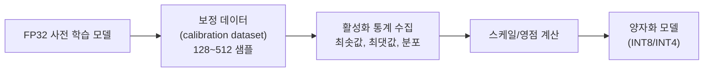
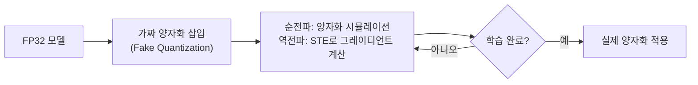
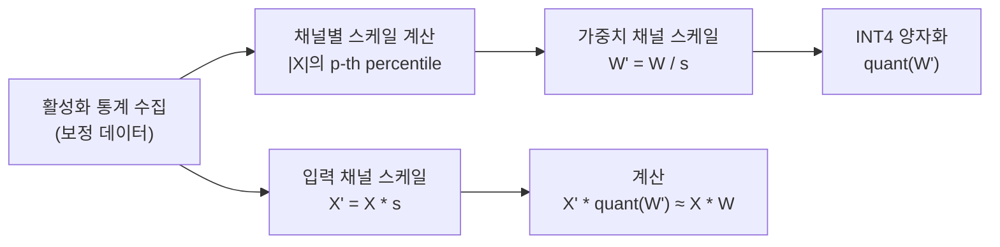
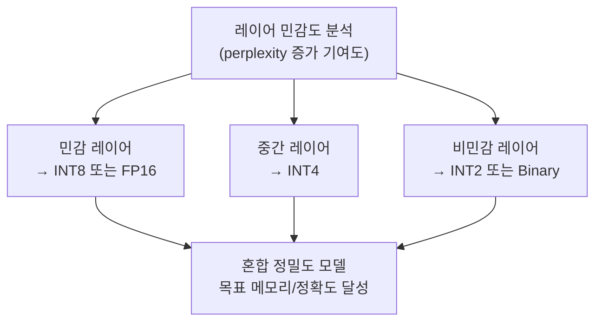
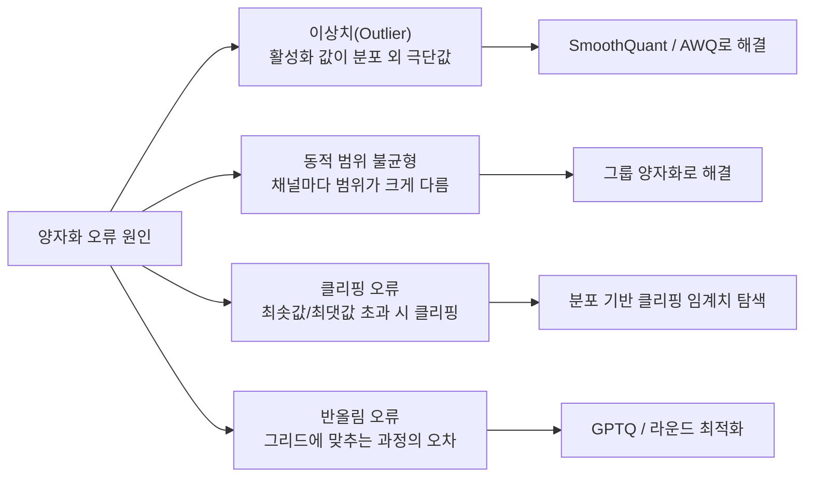
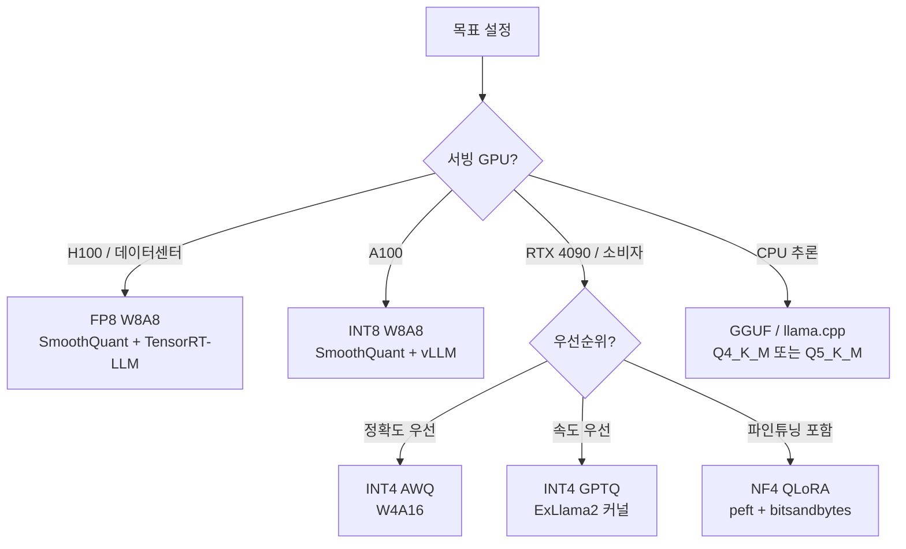

# 양자화 (Quantization)

## 개념 정의

양자화(Quantization)는 신경망 가중치(weight)와 활성화(activation)를 **높은 정밀도(float32/bfloat16)에서 낮은 비트 정밀도(INT8, INT4, FP8 등)로 변환**하여 모델 크기, 메모리 사용량, 추론 속도를 개선하는 기법이다.

핵심 트레이드오프: **정확도 vs 효율성**. 비트폭이 줄수록 표현 가능한 값의 범위와 해상도가 감소하여 수치 오류(quantization error)가 발생하지만, 메모리·레이턴시·에너지 소비는 크게 감소한다.

```mermaid
flowchart TD
    BF16["BF16 모델 (원본)\n7B = ~14 GB"] --> Q8["INT8 양자화\n7B = ~7 GB"]
    Q8 --> Q4["INT4 양자화\n7B = ~3.5 GB"]
    Q4 --> Q2["INT2/Binary\n7B = ~1.75 GB"]
    BF16 --> FP8["FP8 양자화\n7B = ~7 GB\n(BF16과 유사 정확도)"]
    BF16 --> FP4["FP4 양자화\n7B = ~3.5 GB\n(NVIDIA Blackwell 전용)"]

    Q8 --> A1[단일 GPU\n추론 가능]
    Q4 --> A2[소비자 GPU\n(16GB) 추론 가능]
    Q2 --> A3[Edge Device\n배포 가능]
    FP8 --> A4[H100 텐서코어\n최적화]
    FP4 --> A5[B200 NVfp4\n최고 처리량]
```

---

## 수치 포맷 비교

### 부동소수점(Floating Point) 포맷

| 포맷 | 부호 | 지수 | 가수 | 범위 | 정밀도 |
|------|------|------|------|------|-------|
| FP32 | 1 | 8 | 23 | ±3.4×10^38 | 높음 |
| BF16 | 1 | 8 | 7 | ±3.4×10^38 | 중간 |
| FP16 | 1 | 5 | 10 | ±65504 | 중간 |
| FP8 E4M3 | 1 | 4 | 3 | ±448 | 낮음 |
| FP8 E5M2 | 1 | 5 | 2 | ±57344 | 매우 낮음 |
| FP4 | 1 | 2 | 1 | ±6 | 최소 |
| FP6 | 1 | 3 | 2 | ±28 | 매우 낮음 |

**BF16**: 지수 범위가 FP32와 동일하여 수치 안정성이 좋고 LLM 학습/추론에 많이 사용된다.
**FP8 E4M3**: 순전파(forward pass) 가중치 표현에 적합. **FP8 E5M2**: 역전파(backward pass) 그레이디언트에 적합.

### 정수(Integer) 포맷

| 포맷 | 범위 | 주요 사용처 |
|------|------|------------|
| INT8 | -128~127 (부호) / 0~255 (무부호) | 가중치 + 활성화 |
| INT4 | -8~7 (부호) / 0~15 (무부호) | 가중치만 (W4A16 패턴) |
| INT2 | -2~1 (부호) | 극한 압축 (실험적) |
| Binary | 0, 1 | 이진 신경망 (BitNet) |

---

## PTQ vs QAT

### 훈련 후 양자화 (PTQ, Post-Training Quantization)

이미 학습이 완료된 모델에 양자화를 적용한다. **재학습 없이** 빠르게 적용 가능.



**장점**: 학습 비용 없음, 즉시 적용 가능
**단점**: INT4 이하에서 정확도 저하 가능, 활성화 이상치(outlier)에 취약

### 양자화 인식 훈련 (QAT, Quantization-Aware Training)

학습 과정에서 **양자화 효과를 시뮬레이션**하여 모델이 낮은 정밀도에 적응하도록 한다.



**STE (Straight-Through Estimator)**: 양자화 함수는 미분 불가능하므로, 역전파 시 그레이디언트를 그대로 통과시키는 근사법.

$$\frac{\partial \hat{x}}{\partial x} \approx 1 \quad (\text{STE})$$

| 비교 항목 | PTQ | QAT |
|-----------|-----|-----|
| 학습 비용 | 없음 | 전체 학습의 10-20% |
| 정확도 | INT8 수준에서 양호 | INT4 이하에서도 양호 |
| 적용 용이성 | 매우 쉬움 | 학습 인프라 필요 |
| 주요 사용처 | 빠른 배포, INT8 | 엣지 디바이스, 극소형 모델 |

---

## 주요 양자화 알고리즘

### GPTQ (2022)

GPT 모델을 위한 레이어별 PTQ 방법. **OBQ(Optimal Brain Quantization)** 프레임워크 기반.

핵심 아이디어: 레이어 단위로 가중치를 순차적으로 양자화하면서, 각 가중치 양자화로 발생하는 오류를 **헤시안 정보**를 이용해 나머지 가중치로 보상한다.

$$W_q = \text{quant}(W) + (W - \text{quant}(W)) \cdot \frac{H^{-1}_{FF}}{[H^{-1}_{FF}]_{qq}}$$

- 170B 모델을 단일 GPU에서 4-bit 양자화, FP16 대비 ~3-4% 성능 저하
- 특히 가중치 전용 양자화(W4A16)에 효과적

```python
# AutoGPTQ 사용 예시
from auto_gptq import AutoGPTQForCausalLM, BaseQuantizeConfig
from transformers import AutoTokenizer

quantize_config = BaseQuantizeConfig(
    bits=4,                  # 양자화 비트폭
    group_size=128,          # 그룹 양자화 크기
    damp_percent=0.01,       # 댐핑 계수
)

model = AutoGPTQForCausalLM.from_pretrained(
    "meta-llama/Llama-2-7b-hf",
    quantize_config=quantize_config,
)
tokenizer = AutoTokenizer.from_pretrained("meta-llama/Llama-2-7b-hf")

# 보정 데이터 준비
examples = [tokenizer("calibration text example", return_tensors="pt")]
model.quantize(examples)
model.save_quantized("./llama2-7b-gptq-4bit")
```

### AWQ (Activation-aware Weight Quantization, 2023)

**가중치 중요도가 활성화 크기에 비례**한다는 관찰에서 출발. 활성화 이상치(outlier)에 해당하는 채널의 가중치를 스케일 업하여 보호한다.



- GPTQ 대비 더 적은 보정 데이터로 유사하거나 더 좋은 성능
- 그룹 양자화(group_size=128)와 조합 효과 좋음

### SmoothQuant (2022)

활성화의 이상치(outlier)가 INT8 양자화의 주요 장애물임을 밝히고, **활성화의 이상치 규모를 가중치로 이전**한다.

수식: $Y = (X \cdot \text{diag}(s)^{-1}) \cdot (\text{diag}(s) \cdot W)$

- 활성화 $X$는 나누기로 부드럽게(smooth), 가중치 $W$는 곱하기로 이상치 수용
- W8A8(가중치+활성화 모두 INT8) 양자화 가능 → 행렬 연산 전용 INT8 하드웨어 활용

### HQQ (Half-Quadratic Quantization, 2024)

보정 데이터 없이 최적화 기반으로 양자화하는 방법. 자세한 내용은 [[hqq-half-quadratic-quant]] 참조.

---

## 그룹 양자화 (Group Quantization)

채널 전체를 하나의 스케일로 양자화하는 대신, **작은 그룹(보통 64~128개)별로 독립적인 스케일/영점**을 적용한다.

```
가중치 행렬 행: [...w1, w2, ..., w128 | w129, ..., w256 | ...]
                  ←-- 그룹 1 --→      ←-- 그룹 2 --→
                  (스케일1, 영점1)   (스케일2, 영점2)
```

정확도 향상과 약간의 메모리 오버헤드(스케일 저장) 트레이드오프.

---

## 혼합 정밀도 양자화 (Mixed Precision)

모든 레이어를 동일 비트폭으로 양자화하지 않고, **레이어별로 다른 비트폭을 할당**한다.



**LLM.int8()**: 가중치는 INT8, 행렬 곱은 FP16으로 수행. 이상치 채널은 FP16으로 분리 처리.

---

## 하드웨어별 최적 포맷

| 하드웨어 | 최적 포맷 | 이유 |
|----------|----------|------|
| NVIDIA H100 | FP8 (E4M3/E5M2) | Transformer Engine 하드웨어 지원 |
| NVIDIA B200 (Blackwell) | FP4 (NVfp4) | NVfp4 전용 텐서코어 |
| NVIDIA A100 | INT8 (W8A8) | INT8 텐서코어 |
| 소비자 GPU (RTX) | INT4 (W4A16) | GPTQ/AWQ 소프트웨어 에뮬레이션 |
| Apple Silicon (M 시리즈) | INT4/INT8 | Metal 최적화 |
| CPU (x86) | INT8 | VNNI 명령어 활용 |

FP4 및 FP8 상세 내용은 [[fp6-llm-quantization]] 참조.

---

## 정확도-크기 트레이드오프

LLaMA-2-7B 기준 perplexity(낮을수록 좋음) 비교:

| 포맷 | 모델 크기 | Wikitext-2 PPL | 단일 GPU 요건 |
|------|----------|----------------|--------------|
| BF16 (원본) | 13.5 GB | 5.47 | A100 40GB |
| FP8 | 6.75 GB | 5.48 | RTX 4090 |
| INT8 (W8A8) | 6.75 GB | 5.52 | RTX 4090 |
| INT4 GPTQ | 3.9 GB | 5.63 | RTX 3090 |
| INT4 AWQ | 3.9 GB | 5.60 | RTX 3090 |
| INT4 NF4 (QLoRA) | 3.9 GB | 5.64 | RTX 3090 |
| INT2 | 2.0 GB | ~7.0+ | RTX 3080 |

※ 수치는 참고용. 실제 결과는 구현·보정 데이터에 따라 다름.

---

## 양자화 오류 분석



---

## 실무 선택 가이드



```python
# bitsandbytes로 4-bit 로드 예시
from transformers import AutoModelForCausalLM, BitsAndBytesConfig
import torch

bnb_config = BitsAndBytesConfig(
    load_in_4bit=True,
    bnb_4bit_quant_type="nf4",           # NormalFloat4
    bnb_4bit_compute_dtype=torch.bfloat16,
    bnb_4bit_use_double_quant=True,      # 더블 양자화로 추가 절약
)

model = AutoModelForCausalLM.from_pretrained(
    "meta-llama/Llama-2-70b-hf",
    quantization_config=bnb_config,
    device_map="auto",
)
```

---

## 관련 문서

- [[quantization-model-compression]] - 양자화 기반 모델 압축 전략
- [[quantization-aware-training]] - QAT 상세 학습 기법
- [[hqq-half-quadratic-quant]] - HQQ: 보정 데이터 없는 양자화
- [[fp6-llm-quantization]] - FP6/FP4 부동소수점 양자화
- [[awq-quantization]] - AWQ 상세
- [[lora]] - QLoRA의 기반인 LoRA
