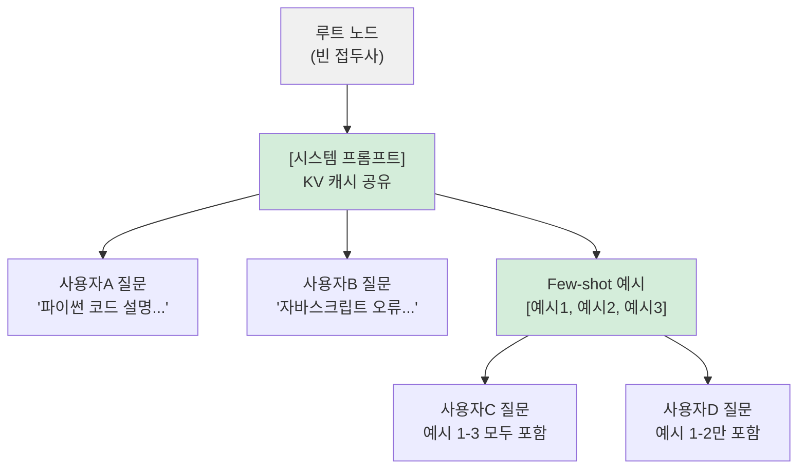
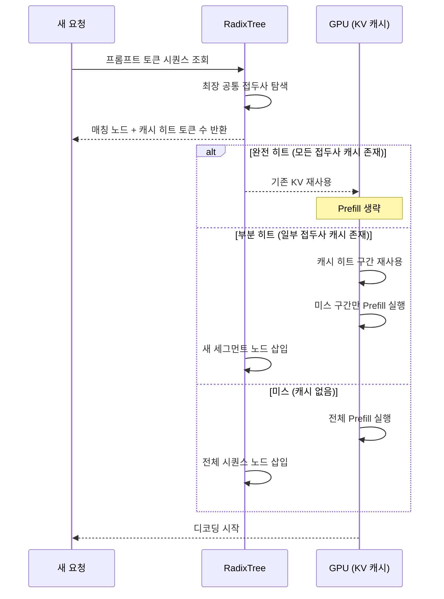

# RadixTree KV 캐시 (SGLang)

## 개요

**RadixTree KV 캐시**는 SGLang이 도입한 KV 캐시 공유 알고리즘으로, 접두사(prefix)가 동일한 여러 요청이 KV 캐시를 재사용하도록 Radix Tree(기수 트리) 자료구조로 관리하는 기법이다. 시스템 프롬프트나 few-shot 예시처럼 많은 요청에서 반복되는 공통 접두사의 prefill 비용을 제거하여, 처리량을 수 배 향상시킨다.

[[prefix-caching]]의 개념을 한 단계 발전시켜, 단순한 정확한 접두사 일치를 넘어 부분 일치(partial match)와 동적 LRU 교체까지 처리하는 프로덕션 수준의 구현이다.

## 기존 Prefix Caching의 한계

[[prefix-caching]]의 가장 단순한 구현은 전체 접두사를 해시값으로 캐시하는 방식이다. 이는 "정확히 동일한 접두사"에만 적용된다. 다음 케이스들을 처리하지 못한다:

- 시스템 프롬프트 + 서로 다른 사용자 질문 (부분 일치)
- Few-shot 예시 중 일부만 공유하는 경우
- 캐시 용량 초과 시 어떤 캐시를 교체할지 결정

Radix Tree는 이 문제를 트리 구조로 해결한다.

## Radix Tree 구조

Radix Tree(압축 트라이, Compressed Trie)는 공통 접두사를 트리 노드로 압축하여 저장하는 자료구조다. KV 캐시 맥락에서 각 노드는 토큰 시퀀스 세그먼트와 해당 KV 텐서를 저장한다.



각 요청은 트리에서 자신의 접두사와 가장 긴 공통 경로를 찾는다. 공통 경로에 해당하는 KV 캐시는 재사용하고, 그 이후 부분만 새로 prefill한다.

## 알고리즘 동작



## LRU 교체 정책

캐시 공간이 가득 차면 **LRU(Least Recently Used)** 정책으로 교체한다. Radix Tree에서의 LRU는 세 가지 조건을 고려한다:

1. **리프 노드 우선 교체**: 다른 요청이 공유하지 않는 리프 노드를 먼저 제거
2. **최근 미사용**: 가장 오래 전에 접근된 노드 우선
3. **부모 보존**: 부모 노드가 다른 자식과 공유 중이면 교체 금지

이 정책 덕분에 자주 사용되는 시스템 프롬프트의 KV 캐시는 메모리에 오래 유지되고, 드물게 사용되는 사용자별 KV 캐시는 빠르게 교체된다.

## SGLang 구현 특징

SGLang의 Radix Attention은 다음 기능을 추가로 제공한다:

- **멀티 쿼리 배치**: 동일 배치 내 여러 요청이 트리 노드를 공유
- **토큰 블록 단위 관리**: KV 캐시를 페이지(vLLM의 Paged Attention)와 통합
- **다중 LoRA 어댑터**: 어댑터별로 트리를 분리하여 캐시 오염 방지
- **프리픽스 인식 스케줄링**: 접두사 히트율을 고려해 요청 배치 순서 결정

```python
# SGLang RadixAttention 기본 사용 (서버 실행)
# python -m sglang.launch_server \
#     --model-path meta-llama/Llama-3-8b-instruct \
#     --enable-radix-cache \
#     --mem-fraction-static 0.9

import sglang as sgl

@sgl.function
def shared_system_prompt(s, user_message):
    s += sgl.system("당신은 전문 코드 리뷰어입니다.")  # 공유 KV
    s += sgl.user(user_message)
    s += sgl.assistant(sgl.gen("response", max_new_tokens=256))

# 동일 시스템 프롬프트를 가진 여러 요청 → KV 자동 공유
```

## vLLM과의 비교

| 기능 | vLLM Prefix Caching | SGLang RadixTree |
|------|--------------------|--------------------|
| 매칭 방식 | 정확한 전체 접두사 | 최장 부분 접두사 |
| 교체 정책 | LRU | LRU + 트리 인식 |
| 배치 내 공유 | 제한적 | 완전 지원 |
| 멀티 LoRA | 미지원 | 지원 |
| 구현 복잡도 | 낮음 | 높음 |

SGLang 기반 추론 인프라 전반은 [[sglang]] 참조. 프리픽스 캐싱의 기본 개념은 [[prefix-caching]] 참조.

## 성능 효과

시스템 프롬프트 재사용이 많은 워크로드(챗봇, 코드 어시스턴트, RAG)에서:
- 캐시 히트 시 prefill 비용 90%+ 절감
- 전체 처리량 2-5배 향상 (워크로드에 따라 다름)
- TTFT(첫 토큰 지연) 대폭 감소

효과는 캐시 히트율에 비례하므로, 사용자 세션 단위로 요청을 동일 서버로 라우팅하는 **세션 어피니티(session affinity)** 설정이 중요하다.

## 관련 문서

- [[sglang]] - SGLang 프레임워크 전반
- [[prefix-caching]] - 기본 접두사 캐싱 개념
- [[kv-cache-inference]] - KV 캐시 메모리 관리 전반
- [[kv-cache-quantization]] - KV 캐시 양자화로 용량 확보
