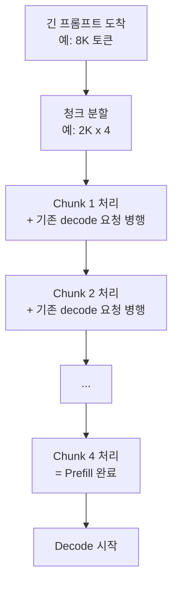
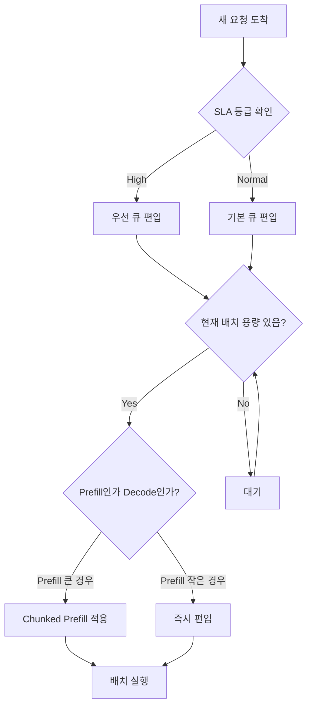

# 요청 스케줄링 (LLM Request Scheduling)

## 개요

LLM 서빙 시스템에서 요청 스케줄러는 어떤 요청을 언제 처리할지를 결정한다. 스케줄링 정책에 따라 지연시간(latency)과 처리량(throughput)의 트레이드오프가 달라진다.

## 핵심 개념: Prefill과 Decode의 비대칭성

LLM 추론은 두 단계로 나뉜다:

- **Prefill**: 프롬프트 전체를 한 번에 처리 (병렬, 연산 집약적)
- **Decode**: 토큰을 하나씩 자동회귀적으로 생성 (순차, 메모리 대역폭 집약적)

두 단계의 연산 특성이 다르므로 스케줄링 전략도 단계별로 고려해야 한다.

## 스케줄링 정책 비교

### FCFS (First Come, First Served)

가장 단순한 정책. 도착 순서대로 처리.

- 장점: 구현 단순, 공정성 보장
- 단점: 긴 프롬프트 요청이 이후 짧은 요청을 차단 (Head-of-Line Blocking)

### Priority-Based Scheduling

각 요청에 우선순위를 부여. SLA 등급, 고객 티어, 요청 유형에 따라 구분.

- 실시간 챗봇: 높은 우선순위
- 배치 요약 작업: 낮은 우선순위

### Prefill-Priority vs Decode-Priority

| 전략 | 설명 | 결과 |
|------|------|------|
| Prefill-Priority | 새 요청 프리필 먼저 처리 | TTFT 감소, 기존 decode 지연 |
| Decode-Priority | 진행 중 decode 우선 | 기존 요청 완료 빠름, 신규 TTFT 증가 |
| Balanced | 청크 단위로 혼합 | 균형 잡힌 지연 분포 |

## Chunked Prefill

큰 프롬프트를 청크(chunk)로 분할하여 iteration별로 나눠서 처리하는 기법.

- 기존 decode 요청의 지연 스파이크(latency spike)를 방지
- GPU 활용률 균등화
- vLLM, SGLang 등에서 기본 지원

## SLA-Aware Scheduling

서비스 수준 협약(SLA, Service Level Agreement) 기반 스케줄링. 각 요청에 지연 목표(deadline)를 부여하고, 마감에 가까운 요청을 우선 처리한다.

- EDF(Earliest Deadline First)와 유사한 개념
- 비용 vs SLA 위반 패널티 최적화

## 스케줄링 의사결정 흐름

## 지연시간 vs 처리량 트레이드오프

- 배치 크기 크게 + Prefill-priority: 처리량 최대화, TTFT 증가
- 배치 크기 작게 + Decode-priority: TTFT 최소화, 처리량 감소
- Chunked Prefill: 두 지표의 균형점 탐색

실제 서비스에서는 워크로드 특성에 따라 정책을 조율해야 한다.

## 관련 문서

- [[continuous-batching]] - Iteration-level 배치 처리
- [[disaggregated-serving]] - Prefill/Decode 물리적 분리
- [[inference-benchmarking]] - TTFT, TPOT 측정 방법
- [[sglang]] - SGLang의 RadixAttention 스케줄러
