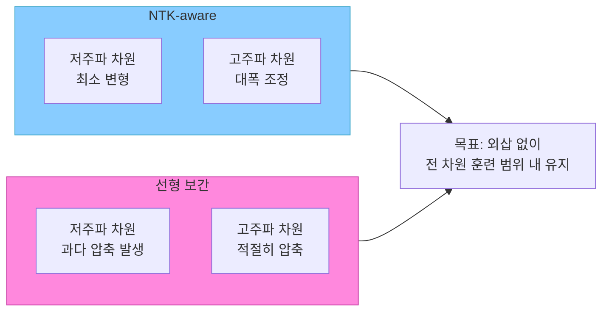
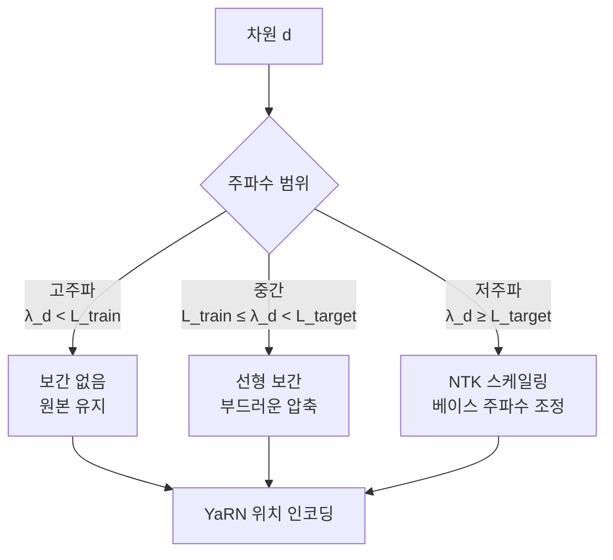

# RoPE 컨텍스트 확장 - NTK와 YaRN 기법

## 개요

RoPE(Rotary Position Embedding, [[rotary-position-embedding]])는 현재 주류 LLM(LLaMA, Mistral, Gemma 등)에서 사용하는 위치 인코딩 방식이다. 그러나 RoPE는 훈련 시 사용한 컨텍스트 길이를 초과하면 성능이 급격히 저하된다. NTK-aware Scaling과 YaRN(Yet another RoPE extensioN)은 추가 파인튜닝 없이 또는 최소한의 파인튜닝으로 RoPE의 유효 컨텍스트 길이를 확장하는 기법이다.

## RoPE 기본 원리

RoPE는 각 토큰의 위치 $m$을 복소수 회전으로 표현한다. 주파수는 차원 $d$와 베이스 $\theta$로 결정된다.

$$f(x, m) = x \cdot e^{im\theta_d}, \quad \theta_d = \theta^{-2d/D}$$

- $D$: 임베딩 차원 전체
- $\theta$: 베이스 주파수 (기본값 10,000)
- 낮은 차원 = 높은 주파수 (짧은 거리 감지)
- 높은 차원 = 낮은 주파수 (긴 거리 감지)

훈련 컨텍스트 $L_{\text{train}}$을 넘으면 높은 주파수 차원에서 회전값이 "처음 보는" 범위로 벗어나며 성능이 저하된다.

## 선형 위치 보간 (Linear Position Interpolation)

가장 단순한 접근: 모든 위치를 훈련 범위 내로 압축한다.

$$m' = m \cdot \frac{L_{\text{train}}}{L_{\text{target}}}$$

- 장점: 구현 간단, 파인튜닝과 함께 사용 시 효과적
- 단점: 모든 차원을 동일 비율로 압축 - 고주파 차원에서 분해능 손실

Meta의 Code Llama가 이 방식을 사용하여 4K에서 100K 컨텍스트로 확장했다.

## NTK-aware Scaling

NTK(Neural Tangent Kernel) 관점에서 영감을 받은 기법으로, **베이스 주파수 $\theta$를 키워** 모든 차원의 유효 주파수를 낮춘다.

$$\theta' = \theta \cdot s^{D/(D-2)}, \quad s = \frac{L_{\text{target}}}{L_{\text{train}}}$$

핵심 아이디어: 차원 전체를 균등하게 압축하는 대신 베이스를 스케일링하여 **고주파 차원은 더 많이, 저주파 차원은 덜 변형**한다.



- 파인튜닝 없이 즉시 적용 가능 (dynamic NTK scaling)
- 일부 모델에서 perplexity 저하 없이 2-4배 컨텍스트 확장
- vLLM, llama.cpp에서 `--rope-scaling ntk` 옵션으로 지원

## YaRN: 혼합 보간 기법

YaRN(Peng et al., 2023)은 차원별로 서로 다른 보간 전략을 적용하는 정교한 방법이다.

차원을 세 영역으로 분류한다:
1. **고주파 차원** (작은 d): 보간 없이 그대로 사용 (이미 주기가 짧아서 extrapolation이 안전)
2. **중간 차원**: 선형 보간 적용
3. **저주파 차원** (큰 d): NTK 스케일링 적용



추가로 YaRN은 **어텐션 온도(attention temperature)** 조정도 포함한다:

$$\text{Attention Score} = \frac{q \cdot k}{\sqrt{d} \cdot t}, \quad t = 0.1 \ln(s) + 1$$

컨텍스트가 길어질수록 어텐션 분포가 지나치게 분산되는 문제를 온도로 보정한다.

## 성능 비교

| 방법 | 파인튜닝 필요 | 2x 확장 품질 | 4x 확장 품질 | 구현 복잡도 |
|------|--------------|-------------|-------------|------------|
| 선형 보간 (파인튜닝 없음) | X | 나쁨 | 매우 나쁨 | 낮음 |
| 선형 보간 (파인튜닝) | O | 좋음 | 좋음 | 낮음 |
| NTK (파인튜닝 없음) | X | 좋음 | 보통 | 낮음 |
| YaRN (파인튜닝 있음) | O | 매우 좋음 | 매우 좋음 | 높음 |
| LongRoPE | O | 매우 좋음 | 매우 좋음 | 매우 높음 |

## [[long-context-scaling]]과의 관계

RoPE 확장은 [[long-context-scaling]] 전략의 위치 인코딩 파트를 담당한다. 전체 그림은 다음과 같다:

- **위치 인코딩**: NTK / YaRN / LongRoPE (이 문서)
- **어텐션 효율화**: Sliding Window, Flash Attention, Sparse Attention
- **KV 캐시 관리**: [[kv-cache-compression]], PagedAttention
- **데이터**: 장문 데이터로 파인튜닝 (YARN은 LongAlpaca 등 활용)

## 실제 모델 적용 사례

| 모델 | 기본 컨텍스트 | 확장 방법 | 확장 길이 |
|------|-------------|----------|----------|
| Mistral 7B | 8K | Sliding Window | 32K |
| LLaMA-3 8B | 8K | RoPE + 파인튜닝 | 128K |
| Qwen2 72B | 32K | YaRN 파인튜닝 | 128K |
| Phi-3 mini | 4K | YARN 계열 | 128K |
| Claude 3 Haiku | 200K | 비공개 (ALiBi 계열 추정) | 200K |

## 구현 예시

```python
# llama.cpp / vLLM에서 NTK scaling 적용 예시
# vLLM의 경우 --rope-scaling-type ntk --rope-scaling-factor 4.0

# transformers 라이브러리에서 직접 적용 (개념 코드)
from transformers import AutoConfig

config = AutoConfig.from_pretrained("meta-llama/Meta-Llama-3-8B")
config.rope_scaling = {
    "type": "yarn",
    "factor": 4.0,            # 8K -> 32K
    "original_max_position_embeddings": 8192,
}
# 파인튜닝 또는 해당 설정으로 이미 학습된 모델 로드
```

## 한계

- 파인튜닝 없는 NTK는 8x 이상 확장 시 perplexity 증가
- YaRN도 훈련 데이터가 장문을 충분히 포함해야 효과적
- 컨텍스트 길이가 늘면 [[kv-cache-inference]] 메모리도 선형으로 증가
- 매우 긴 컨텍스트(1M+)는 아직 attention mechanism 자체의 개선이 필요

## 관련 문서

- [[rotary-position-embedding]] - RoPE 기본 원리
- [[long-context-scaling]] - 장문 컨텍스트 처리 전략 전반
- [[kv-cache-inference]] - 장문 처리 시 KV 캐시 메모리 관리
- [[kv-cache-compression]] - 장문에서의 KV 캐시 압축
- [[flashattention-4]] - 장문 어텐션 연산 최적화
