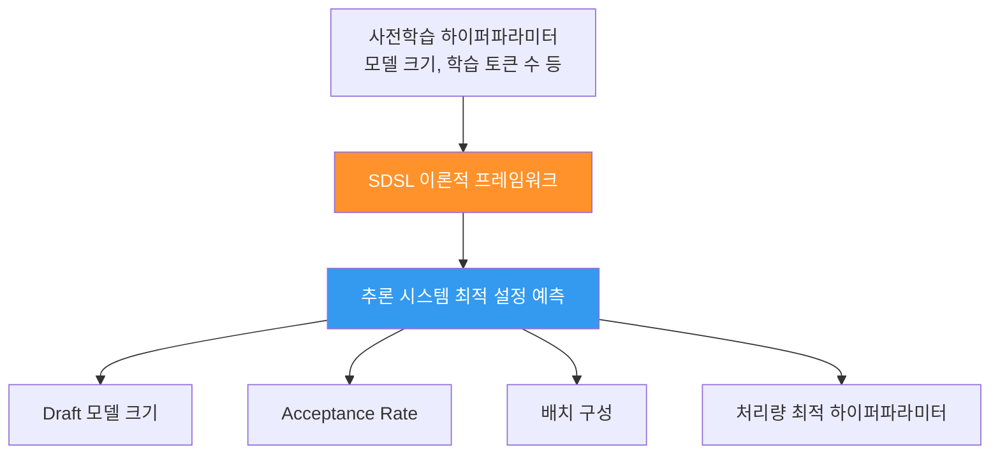
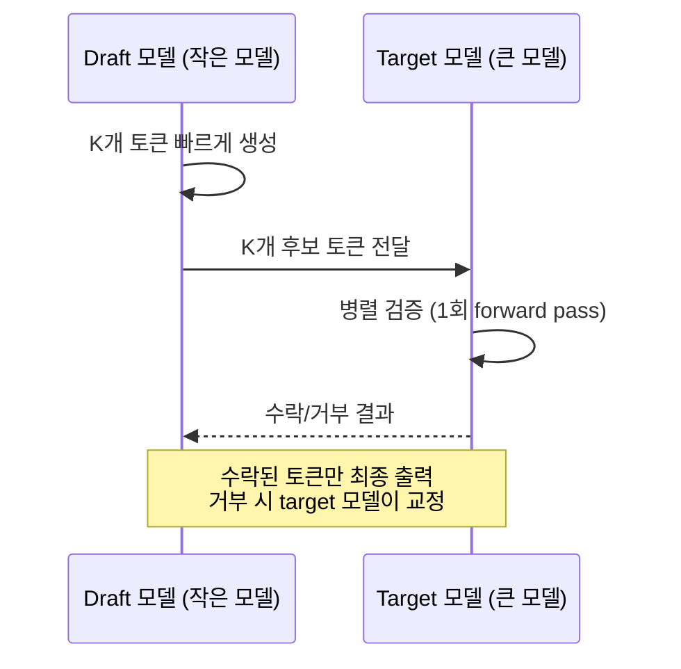
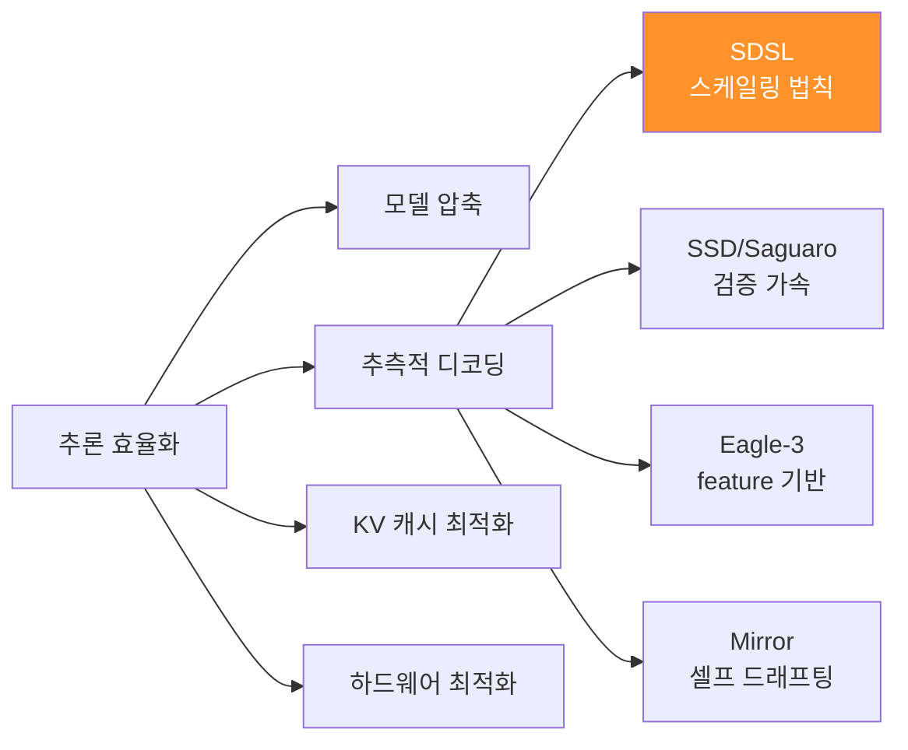

# SDSL (Speculative Decoding Scaling Laws)

사전학습된 LLM의 핵심 하이퍼파라미터를 추측적 디코딩 기반 추론 시스템의 처리량 효율과 분석적으로 연결하는 이론. 사전학습 이전에 추론 시스템의 최적 구성을 예측할 수 있게 해주며, 기존의 비용이 큰 실험적 접근을 대체한다.

## 왜 지금 중요한가

추측적 디코딩(speculative decoding)은 LLM 추론 속도를 높이는 핵심 기법이지만, 최적 설정(draft 모델 크기, acceptance rate, 배치 구성 등)을 찾기 위해 매번 LLM을 학습시키고 실험해야 했다. SDSL은 이 과정을 이론적으로 예측 가능하게 만들어 추론 최적화의 비용과 시간을 대폭 줄인다.

## 핵심 아이디어

### 기존 접근법의 문제
- 추측적 디코딩의 처리량 최적화는 **실험적 접근**에 의존
- 다양한 draft 모델 크기/구성을 시도하려면 **LLM 학습이 반복** 필요
- 비용과 시간이 과다 소모

### SDSL의 해결책
- 사전학습 파라미터(모델 크기, 학습 토큰 수, 데이터 구성 등)에서 **분석적으로** 추론 최적 설정 도출
- 학습 전에 최적 추론 구성을 예측 가능
- 실험 비용 없이 처리량 최적화 달성

## 추측적 디코딩 배경

추측적 디코딩은 작은 draft 모델이 여러 토큰을 빠르게 생성하고, 큰 target 모델이 이를 병렬 검증하는 방식이다.

### SDSL이 예측하는 변수들
| 변수 | 설명 | SDSL 기여 |
|------|------|-----------|
| Draft 모델 크기 | 작을수록 빠르지만 acceptance rate 하락 | 최적 크기 예측 |
| Acceptance rate | draft 토큰의 수락 비율 | 사전학습 파라미터에서 추정 |
| Lookahead 길이(K) | 한 번에 생성하는 draft 토큰 수 | 최적 K 도출 |
| 배치 크기 | 병렬 처리 단위 | 처리량 최대화 구성 |

## 관련 연구와의 관계

SDSL은 다음 연구 흐름과 교차한다:

### Speculative Speculative Decoding (SSD)
같은 ICLR 2026에 발표된 SSD(Saguaro 알고리즘)는 검증 단계의 병목을 해결한다. Draft 모델이 검증 결과를 미리 예측하여 drafting 오버헤드를 완전 제거하며, 최적화된 speculative decoding 대비 평균 30%, 자동회귀 디코딩 대비 최대 5배 속도 향상을 달성했다.

### Chinchilla Scaling Laws와의 비유
Chinchilla가 "학습 컴퓨트 예산이 주어졌을 때 최적 모델 크기와 데이터 양을 예측"했듯이, SDSL은 "학습 설정이 주어졌을 때 최적 추론 구성을 예측"한다. 학습 단계의 스케일링 법칙을 추론 단계로 확장한 셈이다.

### 추론 효율화 생태계

## 실무 관점

SDSL의 실용적 가치는 다음과 같다:

1. **인프라 계획**: 새 모델 학습 전에 추론 서빙 아키텍처를 미리 설계 가능
2. **비용 절감**: draft 모델 크기 탐색을 위한 반복 실험 불필요
3. **서빙 최적화**: [[vllm-v1-engine|vLLM]], [[sglang|SGLang]], [[tensorrt-llm|TensorRT-LLM]] 등의 추론 엔진 설정에 이론적 근거 제공

## 논문 정보

| 항목 | 내용 |
|------|------|
| 정식 제목 | Speculative Decoding Scaling Laws: Throughput Optimization Made Simple |
| 저자 | Amirhossein Bozorgkhoo, Igor Molybog |
| 학회 | ICLR 2026 |
| arXiv | 2603.11053 |
| 제출일 | 2026-02-25 |
| 라이선스 | Creative Commons Zero (공개 도메인) |

## 관련 페이지

- [[eagle-3-speculative-decoding|Eagle-3 Speculative Decoding]] -- feature 기반 추측적 디코딩
- [[mirror-speculative-decoding|Mirror Speculative Decoding]] -- 셀프 드래프팅 방식
- [[speculative-speculative-decoding|Speculative Speculative Decoding]] -- 검증 병목 해결
- [[kv-cache-compression|KV Cache Compression]] -- 추론 메모리 최적화
- [[gpt-5-architecture|GPT-5 Architecture]] -- 듀얼 모델 라우팅과 추론 효율화

## 대표 레퍼런스

- [Speculative Decoding Scaling Laws -- arXiv:2603.11053](https://arxiv.org/abs/2603.11053)
- [Speculative Speculative Decoding (Saguaro) -- arXiv:2603.03251](https://arxiv.org/abs/2603.03251)
- [SDSL -- OpenReview (ICLR 2026)](https://openreview.net/pdf?id=aL1Wnml9Ef)
