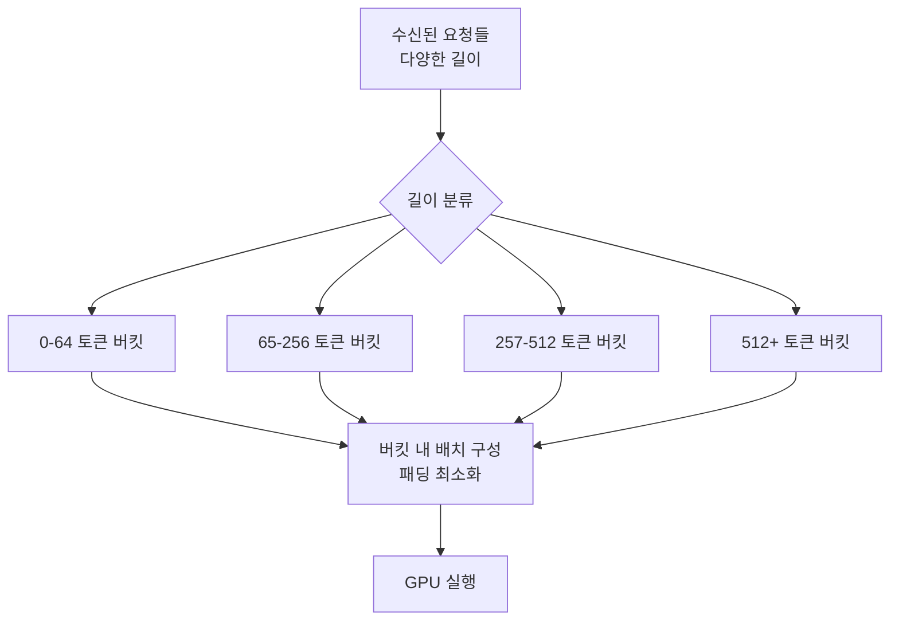

# 선택적 배치 처리 (Selective Batching)

## 개요

선택적 배치 처리(Selective Batching)는 LLM 추론에서 길이가 서로 다른 시퀀스들을 배치(batch)로 묶을 때 발생하는 **패딩(padding) 낭비를 최소화**하는 기법이다. 동일 배치 내 모든 시퀀스를 최장 길이에 맞추어 패딩하는 대신, 유사한 길이의 요청끼리 선별적으로 묶거나 패딩 없이 패킹(packing)하여 처리량(throughput)을 30-50% 향상시킨다.

## 패딩 낭비 문제

표준 배치 처리에서 배치 내 모든 시퀀스는 최장 시퀀스 길이에 맞게 패딩된다:

```
요청 A: [t1, t2, t3, t4, t5]          (길이 5)
요청 B: [t1, t2, PAD, PAD, PAD]       (실제 길이 2, 패딩 3)
요청 C: [t1, t2, t3, PAD, PAD]        (실제 길이 3, 패딩 2)
```

이 경우 배치 전체 연산에서 패딩 토큰 $5$개 중 $3+2=5$개(50%)가 낭비된다. 패딩 토큰에 대한 어텐션 연산, 피드포워드 연산이 모두 낭비 연산이 된다.

## 선택적 배치의 핵심 전략

### 1. 길이 기반 분류 (Length-Bucketed Batching)

요청을 길이 구간(bucket)으로 분류하여 같은 구간의 요청끼리 배치를 구성한다:



버킷 크기를 2의 거듭제곱(64, 128, 256, 512)으로 설정하면, 각 버킷 내 최대 패딩이 버킷 크기의 절반 이하로 제한된다.

### 2. 시퀀스 패킹 (Sequence Packing)

여러 짧은 시퀀스를 하나의 긴 시퀀스로 이어 붙여 처리한다. 어텐션 계산 시 각 시퀀스 경계를 마스크(mask)로 분리한다:

```
[A_1, A_2, A_3 | B_1, B_2 | C_1, C_2, C_3, C_4]
                 ^           ^
             경계 마스크   경계 마스크
```

시퀀스 패킹에서 어텐션 마스크는 각 토큰이 자신이 속한 시퀀스 내에서만 주의(attention)를 계산하도록 제한한다. 이를 **문서 마스킹(document masking)** 또는 **샘플 패킹(sample packing)**이라 부른다.

패킹 효율 계산:
$$\text{패킹 효율} = \frac{\sum_i \text{길이}(s_i)}{\text{패킹된 시퀀스 총 길이}}$$

잘 구성된 패킹에서 이 값이 0.95 이상이 되어 GPU 활용률이 대폭 향상된다.

### 3. 동적 배치 구성 (Dynamic Batch Composition)

고정 배치 크기 대신, **총 토큰 수(total token budget)**를 기준으로 배치를 구성한다:

```python
def compose_batch(request_queue, token_budget):
    batch = []
    current_tokens = 0

    for req in sorted(request_queue, key=lambda r: r.length):
        if current_tokens + req.length <= token_budget:
            batch.append(req)
            current_tokens += req.length
        elif len(batch) == 0:
            # 단일 요청이 버짓 초과: 분할 처리 또는 수용
            batch.append(req)
            break
        else:
            break

    return batch
```

토큰 버짓 방식은 GPU 메모리와 연산 효율을 더 정밀하게 제어할 수 있게 한다.

## 비균질 배치 문제

선택적 배치의 도전 과제는 **비균질 시퀀스(heterogeneous sequences)**다. LLM 추론에서는:

- 프리필(prefill) 중인 요청: 연산 집약(compute-bound)
- 디코딩(decode) 중인 요청: 메모리 대역폭 집약(bandwidth-bound)

이 두 종류를 같은 배치에서 처리하면 하드웨어 효율이 낮아진다. [[continuous-batching-internals]]의 Chunked Prefill 방식은 이 비균질성을 제어하는 방법 중 하나다.

## Flash Attention과의 통합

선택적 배치와 [[flash-decoding]] (Flash Attention 기반)은 잘 맞는 조합이다. Flash Attention의 varlen (가변 길이) 모드는 패딩 없이 서로 다른 길이의 시퀀스를 연속 메모리에 이어 붙여 처리할 수 있게 한다:

```python
# Flash Attention varlen API (개념 예시)
from flash_attn import flash_attn_varlen_func

# cu_seqlens: 각 시퀀스의 누적 길이 [0, len_A, len_A+len_B, ...]
output = flash_attn_varlen_func(
    q, k, v,
    cu_seqlens_q=cu_seqlens,
    cu_seqlens_k=cu_seqlens,
    max_seqlen_q=max_len,
    max_seqlen_k=max_len,
    causal=True,
)
```

이 인터페이스를 통해 패딩 없이 여러 시퀀스를 하나의 텐서로 처리한다.

## 처리량 개선 수치

실제 측정된 처리량 개선은 워크로드에 따라 다르지만 일반적으로:

| 기법 | 처리량 향상 | 조건 |
|------|-----------|------|
| 길이 버킷팅 | 10-20% | 다양한 길이 혼합 |
| 시퀀스 패킹 | 20-40% | 짧은 시퀀스 다수 |
| 토큰 버짓 배치 | 15-30% | 연속 배치와 결합 |
| 종합 적용 | 30-50% | 최적 구성 시 |

## 구체적 구현 사례

### vLLM의 경우

[[vllm-v1-engine]]은 `--enable-chunked-prefill` 옵션을 통해 청크 단위 프리필을 지원하며, 이는 선택적 배치의 일환이다. 또한 `--max-num-batched-tokens` 파라미터로 배치당 최대 토큰 수를 제어한다.

### SGLang의 경우

[[sglang]]은 RadixAttention을 통해 공통 프리픽스를 공유하는 요청들을 자동으로 감지하고 배치에서 중복 연산을 제거한다. 이는 선택적 배치의 특수한 형태다.

### HuggingFace TGI의 경우

TGI는 `--max-batch-total-tokens` 파라미터로 배치당 총 토큰 수를 제한하며, 길이 기반 버킷팅을 내부적으로 수행한다.

## 지연 시간 영향

선택적 배치는 처리량 중심 최적화이므로 지연 시간(latency)에는 부정적 영향을 줄 수 있다:

- **버킷팅**: 같은 버킷의 다른 요청을 기다려야 할 수 있음
- **패킹**: 패킹 최적화 계산 자체에 시간이 소요됨

이를 완화하기 위해 대기 시간(waiting timeout)을 설정하여, 일정 시간 이상 대기한 요청은 비효율적 배치라도 즉시 처리한다.

## 학습 시 응용

선택적 배치 기법은 추론뿐만 아니라 **사전학습(pretraining)에서도 활발히 사용**된다. 긴 문서와 짧은 문서가 혼합된 훈련 데이터를 효율적으로 처리하기 위해:

- **문서 패킹(Document Packing)**: 여러 문서를 하나의 시퀀스로 연결하여 최대 컨텍스트 길이를 채운다
- **경계 마스킹**: 서로 다른 문서 간의 어텐션을 차단하여 오염을 방지

이 기법은 학습 효율을 크게 향상시키며 LLaMA, Mistral 등 주요 모델 학습에 적용되었다.

## 관련 문서

- [[continuous-batching-internals]] - 연속 배치 내부 구조 (선택적 배치의 보완)
- [[dynamic-batching]] - 동적 배치 기초 개념
- [[paged-attention]] - KV 캐시 메모리 관리
- [[flash-decoding]] - 가변 길이 Flash Attention 지원
- [[prefix-caching]] - 공통 프리픽스 재사용
- [[vllm-v1-engine]] - vLLM 서빙 엔진
- [[sglang]] - SGLang 서빙 시스템
- [[tensorrt-llm]] - TensorRT-LLM 구현
