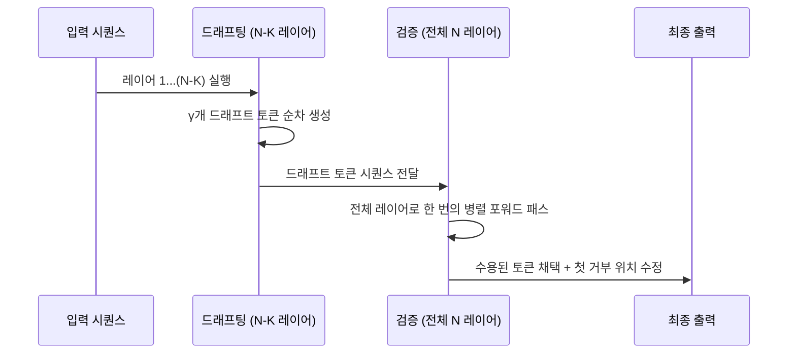

# Self-Speculative Decoding (자기 추측 디코딩)

## 개요

Self-Speculative Decoding(자기 추측 디코딩)은 하나의 LLM만을 사용하여 추측 디코딩([[speculative-decoding]])의 이점을 얻는 기법이다. 별도의 소형 드래프트 모델(draft model) 없이, **동일 모델의 일부 레이어를 건너뛰는(layer skipping)** 방식으로 드래프트를 생성하고, 전체 모델로 검증한다.

핵심 개념: 같은 LLM을 두 가지 정밀도로 활용한다.
- **드래프팅 단계**: 특정 레이어를 스킵하거나 중간 레이어 출력을 활용해 빠르게 초안 토큰 생성
- **검증 단계**: 전체 레이어를 거쳐 초안 토큰의 정확도를 검증 및 수용

## 왜 별도 드래프트 모델 없이도 동작하는가

표준 추측 디코딩이 성립하는 전제는 "드래프트 모델과 타겟 모델 사이에 토큰 분포 유사성이 있어야 한다"는 것이다. Self-Speculative Decoding은 다음 관찰에 기반한다:

> 대부분의 LLM 레이어에서 중간 표현(intermediate representation)은 이미 최종 분포에 근접한다. 즉, 앞쪽 레이어들만으로도 토큰 예측이 상당히 정확하다.

이는 조기 종료(early exit) 연구에서 검증된 현상이다. Transformer 모델에서 최종 레이어에 가까울수록 증분 정보(incremental information)가 감소한다.

## 동작 방식



### 단계별 동작

1. **스킵 레이어 선정**: 드래프팅에 사용할 레이어 집합을 결정한다. 일반적으로 후반 $K$개 레이어를 스킵하거나, 중간 레이어에 조기 종료 헤드(early exit head)를 부착한다.

2. **드래프트 생성**: 스킵된 경량 모델로 $\gamma$개의 드래프트 토큰을 자기회귀 방식으로 생성한다. 연산량은 전체 모델 대비 $\frac{N-K}{N}$ 비율로 감소한다.

3. **병렬 검증**: 드래프트 토큰 $\gamma$개를 포함한 시퀀스 전체에 대해 원본 모델로 단 한 번의 병렬 포워드 패스를 수행한다. 각 위치에서 검증 분포와 드래프트 분포를 비교한다.

4. **수용/거부 판정**: 추측 디코딩 표준 알고리즘([[speculative-decoding]])에 따라 수용 여부를 확률적으로 결정한다. 수용된 토큰만 최종 시퀀스에 추가한다.

## 레이어 스킵 전략

레이어를 어떻게 스킵하느냐에 따라 여러 변형이 존재한다:

### 1. 후반 레이어 제거 (Shallow Draft)

```python
# 전체 레이어 중 마지막 K개를 제거하여 드래프트
def draft_forward(model, x, skip_last_k=4):
    for layer in model.layers[:-skip_last_k]:
        x = layer(x)
    # 조기 종료 헤드로 로짓 계산
    logits = model.early_exit_head(x)
    return logits
```

- 가장 단순한 방식
- 모델 하단부 레이어가 표현력의 대부분을 담당한다고 가정

### 2. 선택적 레이어 스킵 (Selective Layer Skipping)

중요도가 낮은 레이어를 선별적으로 스킵한다. 레이어 중요도는 다음 기준으로 평가한다:
- 어텐션 헤드의 활성화 빈도
- 레이어 제거 시 퍼플렉시티 증가량
- 레이어별 표현 변화량 (hidden state cosine similarity)

### 3. 스펙트럴 드래프팅 (Spectral Drafting)

모델 파라미터의 낮은 랭크 근사를 드래프트 모델로 활용. 본질적으로 양자화(quantization)와 유사한 접근이다.

## SDSL (Self-Draft Speculative Lookahead)과의 관계

[[sdsl]]은 Self-Speculative Decoding의 구체적 구현 중 하나로, n-gram 룩어헤드([[lookahead-decoding]])와 조기 종료를 결합한다. Self-Speculative Decoding이 일반적 개념이라면, SDSL은 특정 최적화 기법을 통합한 시스템이다.

## Eagle/Eagle-3와의 비교

[[eagle-3-speculative-decoding]] 계열은 별도로 학습된 드래프트 헤드를 사용하는 반면, Self-Speculative Decoding은 기존 모델 가중치만을 재활용한다:

| 항목 | Self-Speculative | Eagle-3 |
|------|-----------------|---------|
| 드래프트 모델 | 동일 모델 (레이어 스킵) | 별도 드래프트 헤드 |
| 추가 학습 | 최소 (조기 종료 헤드만) | 필요 (드래프트 헤드 학습) |
| 수용률 | 중간 | 높음 |
| 배포 단순성 | 높음 | 중간 |

## 실무 구현 패턴

### HuggingFace Transformers 기반 적용

HuggingFace의 `generate()` API는 `assistant_model` 파라미터로 추측 디코딩을 지원한다. Self-Speculative Decoding은 동일 모델을 두 가지 설정으로 로드하거나, 커스텀 드래프팅 함수를 제공하는 방식으로 구현한다:

```python
from transformers import AutoModelForCausalLM, AutoTokenizer

# 메인 모델 로드
model = AutoModelForCausalLM.from_pretrained("meta-llama/Llama-3-8B")
tokenizer = AutoTokenizer.from_pretrained("meta-llama/Llama-3-8B")

# 드래프트: 레이어 스킵 설정 (모델 수정 필요)
# - model.config.num_hidden_layers를 줄여 shallow copy 생성
# - 또는 custom generate 루프에서 중간 레이어 출력 활용

outputs = model.generate(
    inputs,
    assistant_model=draft_model,  # 스킵된 버전
    do_sample=False,
    max_new_tokens=200,
)
```

### 메모리 효율

Self-Speculative Decoding의 핵심 장점 중 하나는 **드래프트 모델과 메인 모델 간 KV 캐시를 공유**할 수 있다는 점이다. 레이어가 동일한 모델이기 때문에, 공유 레이어의 KV 캐시를 재계산하지 않아도 된다.

## 속도 향상 분석

실제 속도 향상은 다음 변수들의 함수다:

- **$\alpha$**: 수용률 (드래프트 토큰이 채택되는 비율)
- **$r$**: 드래프트 연산 비용 비율 ($r = (N-K)/N$)
- **$\gamma$**: 드래프트 토큰 수

유효 속도 향상 배율 근사:

$$\text{속도 향상} \approx \frac{1 + \gamma \cdot \alpha}{1 + \gamma \cdot r}$$

$K = 4$, $N = 32$, $\gamma = 4$, $\alpha = 0.8$이면 약 $1.9$배 가속이 가능하다.

## 한계와 주의사항

- **레이어 스킵 비율 튜닝**: 모델과 태스크마다 최적의 스킵 레이어 수가 다르다
- **조기 종료 헤드 학습**: 별도 학습이 없으면 드래프팅 품질이 낮아진다
- **수용률 태스크 의존성**: 창의적 생성보다 결정론적 태스크에서 효과적이다
- **KV 캐시 크기**: 드래프트와 검증 모두 동일 모델이므로 KV 캐시 절약 효과가 제한적이다

## 관련 문서

- [[speculative-decoding]] - 추측 디코딩 일반 개념과 표준 알고리즘
- [[eagle-3-speculative-decoding]] - 학습된 드래프트 헤드 기반 추측 디코딩
- [[sdsl]] - Self-Draft Speculative Lookahead 구현
- [[blockwise-parallel-decoding]] - 블록단위 병렬 디코딩 (유사 접근)
- [[hydra-speculation-cascade]] - 캐스케이드 추측 디코딩
- [[lookahead-decoding]] - n-gram 기반 룩어헤드 디코딩
- [[medusa-multi-head-decoding]] - 다중 헤드 추측 디코딩
