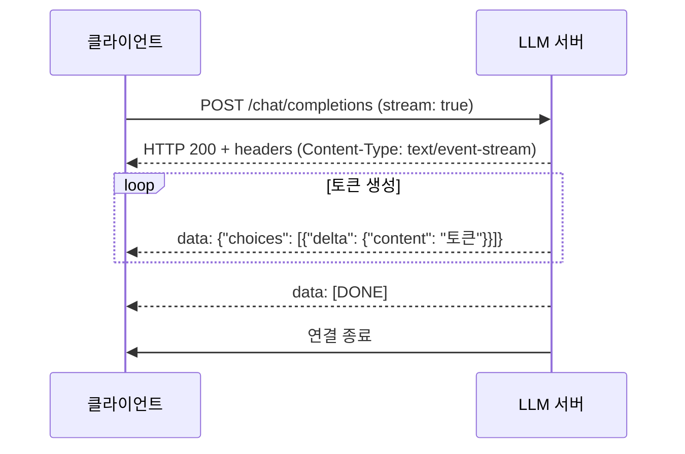
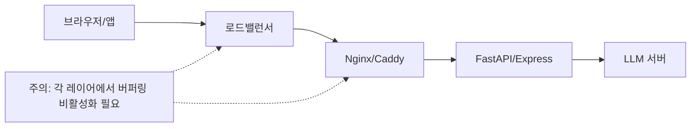

# SSE 기반 LLM 스트리밍 (Server-Sent Events)

## 배경과 문제 의식

LLM이 긴 응답을 생성할 때, 전체 텍스트가 완성될 때까지 기다린 후 한꺼번에 응답하면 사용자 경험이 매우 나쁘다. GPT-4로 500단어 응답을 받을 때 15-30초를 아무것도 없는 화면 앞에서 기다려야 한다.

**스트리밍의 목표**: 토큰이 생성되는 즉시 클라이언트에게 전달 → TTFT(Time to First Token)을 체감 지연으로 줄임

LLM API 스트리밍의 사실상 표준은 **SSE (Server-Sent Events)**다. OpenAI API, Anthropic Claude API, Hugging Face API 모두 SSE를 채택한다.

## SSE 프로토콜 개요

SSE는 HTTP/1.1 기반의 단방향 서버-to-클라이언트 푸시 프로토콜이다.

**핵심 특성**:
- HTTP 연결을 열어두고 서버가 주도적으로 데이터를 전송
- 텍스트 기반 (UTF-8): `data:`, `event:`, `id:`, `retry:` 필드
- 단방향: 서버 → 클라이언트만. 클라이언트 응답은 HTTP 요청으로 별도 전송
- 자동 재연결: 브라우저 EventSource가 연결 끊기면 자동 재시도
- HTTP/2에서도 동작 (멀티플렉싱 활용)

```
Content-Type: text/event-stream
Cache-Control: no-cache
Connection: keep-alive

data: {"token": "안녕"}

data: {"token": "하세요"}

data: [DONE]
```

## SSE 메시지 형식 (LLM API 표준)



**OpenAI 호환 형식**:
```
data: {"id":"chatcmpl-xxx","object":"chat.completion.chunk","model":"gpt-4","choices":[{"delta":{"content":"안녕"},"finish_reason":null}]}

data: {"id":"chatcmpl-xxx","choices":[{"delta":{"content":"하세요"},"finish_reason":null}]}

data: {"id":"chatcmpl-xxx","choices":[{"delta":{},"finish_reason":"stop"}]}

data: [DONE]
```

**Anthropic Claude 형식**:
```
event: content_block_delta
data: {"type":"content_block_delta","delta":{"type":"text_delta","text":"안녕"}}

event: message_stop
data: {"type":"message_stop"}
```

## 서버 측 구현 (Python FastAPI)

```python
from fastapi import FastAPI
from fastapi.responses import StreamingResponse
import asyncio
import json
from typing import AsyncGenerator

app = FastAPI()


async def token_stream_generator(
    prompt: str,
    model,  # 실제 LLM 모델 인스턴스
) -> AsyncGenerator[str, None]:
    """SSE 형식으로 토큰을 스트리밍하는 제너레이터"""

    async for token in model.generate_stream(prompt):
        # SSE 메시지 형식: "data: {json}\n\n"
        chunk_data = {
            "choices": [{
                "delta": {"content": token},
                "finish_reason": None,
            }]
        }
        yield f"data: {json.dumps(chunk_data, ensure_ascii=False)}\n\n"

    # 종료 신호
    done_data = {
        "choices": [{
            "delta": {},
            "finish_reason": "stop",
        }]
    }
    yield f"data: {json.dumps(done_data)}\n\n"
    yield "data: [DONE]\n\n"


@app.post("/v1/chat/completions")
async def chat_completions(request: dict):
    messages = request.get("messages", [])
    stream = request.get("stream", False)
    prompt = messages[-1]["content"] if messages else ""

    if not stream:
        # 비스트리밍 응답 (생략)
        pass

    return StreamingResponse(
        token_stream_generator(prompt, model=None),
        media_type="text/event-stream",
        headers={
            "Cache-Control": "no-cache",
            "X-Accel-Buffering": "no",  # Nginx 버퍼링 비활성화 필수!
        }
    )


# Hugging Face Transformers 스트리밍 연동
from transformers import AutoTokenizer, AutoModelForCausalLM, TextIteratorStreamer
from threading import Thread

def hf_streaming_generator(
    model, tokenizer, prompt: str
) -> AsyncGenerator[str, None]:
    """HuggingFace TextIteratorStreamer를 SSE로 래핑"""
    inputs = tokenizer(prompt, return_tensors="pt")
    streamer = TextIteratorStreamer(tokenizer, skip_prompt=True, skip_special_tokens=True)

    # 별도 스레드에서 생성 실행
    generation_kwargs = {
        **inputs,
        "streamer": streamer,
        "max_new_tokens": 512,
    }
    thread = Thread(target=model.generate, kwargs=generation_kwargs)
    thread.start()

    async def _generate():
        for token_text in streamer:
            chunk = {"choices": [{"delta": {"content": token_text}, "finish_reason": None}]}
            yield f"data: {json.dumps(chunk, ensure_ascii=False)}\n\n"
            await asyncio.sleep(0)  # 이벤트 루프 양보
        yield "data: [DONE]\n\n"

    return _generate()
```

## 클라이언트 측 구현

### Python (requests/httpx)

```python
import httpx
import json

def stream_llm_response(prompt: str) -> None:
    """SSE 스트리밍 응답 수신 (Python 클라이언트)"""

    payload = {
        "model": "gpt-4",
        "messages": [{"role": "user", "content": prompt}],
        "stream": True,
    }

    with httpx.stream(
        "POST",
        "https://api.openai.com/v1/chat/completions",
        json=payload,
        headers={"Authorization": "Bearer YOUR_API_KEY"},
        timeout=60.0,
    ) as response:
        for line in response.iter_lines():
            if not line or line == "data: [DONE]":
                continue
            if line.startswith("data: "):
                data = json.loads(line[6:])
                content = data["choices"][0]["delta"].get("content", "")
                if content:
                    print(content, end="", flush=True)

    print()  # 줄바꿈


# Anthropic Python SDK 스트리밍
import anthropic

def stream_claude(prompt: str) -> None:
    client = anthropic.Anthropic()

    with client.messages.stream(
        model="claude-opus-4-5",
        max_tokens=1024,
        messages=[{"role": "user", "content": prompt}],
    ) as stream:
        for text in stream.text_stream:
            print(text, end="", flush=True)
```

### JavaScript (브라우저 EventSource / fetch)

```javascript
// 방법 1: 브라우저 네이티브 EventSource (GET 요청만 가능, 헤더 제한)
const evtSource = new EventSource("/api/stream?prompt=안녕하세요");
evtSource.onmessage = (event) => {
  if (event.data === "[DONE]") {
    evtSource.close();
    return;
  }
  const data = JSON.parse(event.data);
  const token = data.choices[0]?.delta?.content ?? "";
  document.getElementById("output").textContent += token;
};

// 방법 2: fetch + ReadableStream (POST 요청, 헤더 자유 - 실무 권장)
async function streamCompletion(prompt) {
  const response = await fetch("/v1/chat/completions", {
    method: "POST",
    headers: {
      "Content-Type": "application/json",
      "Authorization": "Bearer API_KEY",
    },
    body: JSON.stringify({
      messages: [{ role: "user", content: prompt }],
      stream: true,
    }),
  });

  const reader = response.body.getReader();
  const decoder = new TextDecoder();
  let buffer = "";

  while (true) {
    const { done, value } = await reader.read();
    if (done) break;

    buffer += decoder.decode(value, { stream: true });
    const lines = buffer.split("\n");
    buffer = lines.pop(); // 미완성 라인은 버퍼에 유지

    for (const line of lines) {
      if (!line.startsWith("data: ") || line === "data: [DONE]") continue;
      const data = JSON.parse(line.slice(6));
      const token = data.choices[0]?.delta?.content ?? "";
      if (token) {
        document.getElementById("output").textContent += token;
      }
    }
  }
}
```

## SSE 아키텍처 및 인프라 주의사항



**인프라 함정**:

| 레이어 | 문제 | 해결 |
|--------|------|------|
| Nginx | 응답 버퍼링으로 토큰이 묶여서 옴 | `X-Accel-Buffering: no` 헤더 또는 `proxy_buffering off` |
| AWS ALB | 60초 기본 타임아웃 | idle timeout 증가 (300초+) |
| CloudFront | SSE 미지원 문제 | WebSocket으로 대체 고려 |
| Vercel | 60초 함수 타임아웃 | Edge Runtime + Response Streaming 사용 |

## SSE vs WebSocket 선택 기준

| 기준 | SSE 유리 | WebSocket 유리 |
|------|----------|----------------|
| 방향 | 서버 → 클라이언트 단방향 | 양방향 필요 시 |
| 재연결 | 자동 (브라우저 네이티브) | 직접 구현 필요 |
| 프록시 호환성 | HTTP이므로 높음 | 별도 설정 필요 |
| 인터럽트/취소 | 연결 끊기로 처리 | 별도 메시지로 처리 |
| 멀티모달 스트리밍 | 텍스트 제한 | 바이너리 지원 |

LLM 텍스트 스트리밍의 80%는 SSE로 충분하다. [[websocket-llm-streaming]]은 실시간 인터럽트, 음성/이미지 등 멀티모달, 양방향 제어가 필요한 경우에 적합하다.

## 성능 지표

- **TTFT (Time to First Token)**: 요청 후 첫 토큰까지 걸리는 시간. 스트리밍의 핵심 지표
- **TBT (Time Between Tokens)**: 토큰 간 간격. 균일할수록 좋은 사용자 경험
- **Throughput**: 초당 생성 토큰 수 (서버 측 지표)

SSE 스트리밍은 TTFT를 줄이는 것이지, 총 생성 시간을 줄이지는 않는다. 사용자가 먼저 읽기 시작하므로 체감 속도가 빨라진다.

## 관련 문서

- [[token-streaming-sse]] - SSE 토큰 스트리밍 상세
- [[websocket-llm-streaming]] - 양방향 WebSocket 스트리밍
- [[llm-inference-metrics]] - TTFT, TBT 등 추론 성능 지표
- [[latency-throughput-tradeoff]] - 지연 vs 처리량 트레이드오프
- [[llm-gateway]] - API 게이트웨이 패턴
- [[continuous-batching-internals]] - 스트리밍과 배치 처리 연동
