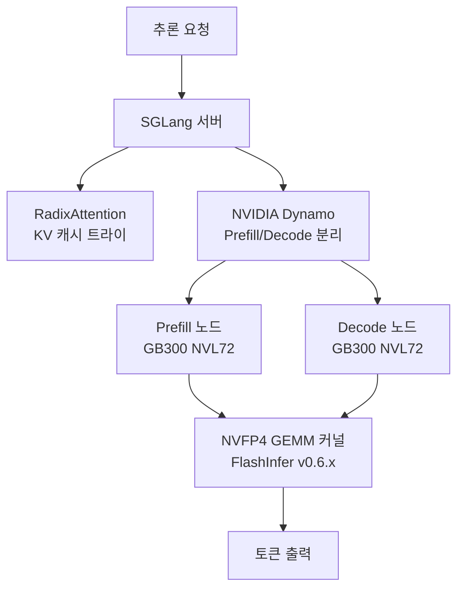

# SGLang on GB300 NVL72 with NVFP4

UC Berkeley LMSYS 연구팀이 개발한 고성능 LLM 서빙 프레임워크. NVFP4(NVIDIA FP4 양자화) GEMM과 Dynamo 디스어그리게이션으로 GB300 NVL72에서 DeepSeek-R1을 최대 25배 가속한 결과로 주목받고 있다.

## 제품 정체성

- **RadixAttention**: 트라이(trie) 구조 KV 캐시 재사용. 공통 접두사(prefix)를 자동 감지해 캐시 히트율 극대화
- **구조화 생성(structured generation)**: XGrammar-2 기반 JSON/문법 제약 디코딩 내장
- **멀티 모달(multimodal) 지원**: 이미지·오디오 입력 처리
- **Dynamo 연동**: NVIDIA Dynamo를 통한 Prefill/Decode 디스어그리게이션

## 왜 중요한가

2026년 2월 InferenceXv2 벤치마크에서 H200 대비 25배, GB200 NVL72 대비 8배 성능 향상을 공개적으로 증명했다. GB300 세대 하드웨어의 전환점 벤치마크로 광범위하게 인용되고 있다.

## GB300 NVL72 최적화 스택



## 성능 수치 (2026-02 InferenceXv2 기준)

| 비교 대상 | 배속 |
|-----------|-----|
| H200 (FP16) | 25x |
| GB200 NVL72 | 8x |
| 장기 컨텍스트 (128k tokens) | 10x+ |

단, 이 수치는 DeepSeek-R1 특정 워크로드 기준이며 일반화에 주의 필요.

## RadixAttention 원리

전통적인 접두사 캐싱은 **정확히 일치하는** 접두사만 재사용한다. RadixAttention은 트라이(trie) 자료구조로 **부분 일치** 접두사도 최대 재사용한다.

```
전통 캐싱: "시스템 프롬프트 A + 질문" = 전체 재계산
RadixAttention: "시스템 프롬프트 A" 부분을 여러 요청이 공유
```

멀티 턴 대화, RAG 쿼리, 에이전트 루프처럼 공통 컨텍스트를 공유하는 패턴에서 효과가 극대화된다.

## 2026 Q1 로드맵 주요 항목

- Blackwell FP4 GEMM 완전 통합
- CUDA Graph 기반 디코딩 최적화
- 멀티 모달 배치 스케줄링 개선
- llm-d Gateway API 통합 강화
- Speculative Decoding 안정화

## 실무 적용 관점

- **DeepSeek 계열 서빙**: MoE 아키텍처 특화 최적화로 DeepSeek-V3/R1 서빙에서 뛰어난 성능
- **장기 컨텍스트 워크로드**: RadixAttention이 128k+ 토큰 시나리오에서 KV 메모리를 획기적으로 절감
- **구조화 출력 필수 서비스**: XGrammar-2 내장으로 별도 후처리 없이 JSON 출력 보장
- **AMD 지원**: ROCm 위에서도 SGLang 공식 지원 (성능은 NVIDIA 대비 낮음)

## 대표 레퍼런스

- [Unlocking 25x Inference Performance with SGLang on NVIDIA GB300 NVL72 (2026-02-20)](https://lmsys.org/blog/2026-02-20-gb300-inferencex/)
- [Deploying DeepSeek on GB300 NVL72: Big Wins in Long-Context Inference (2026-02-19)](https://www.lmsys.org/blog/2026-02-19-gb300-longctx/)
- [sgl-project/sglang GitHub Repository](https://github.com/sgl-project/sglang)
- [SGLang Development Roadmap (2026 Q1) - Issue #12780](https://github.com/sgl-project/sglang/issues/12780)
- [SGLang Documentation](http://docs.sglang.io/)

## 관련 문서

- [[ai-hot-topics-2026-04|2026년 4월 AI 개발 핫토픽 100선]]
- [[vllm-v1-engine|vLLM V1 Engine on Blackwell]]
- [[llm-d|llm-d & Gateway API Inference Extension]]
- [[flashinfer|FlashInfer Kernel Library for LLM Serving]]
- [[xgrammar-2|XGrammar-2 Constrained Decoding]]
- [[deepseek-sparse-attention|DeepSeek Sparse Attention (DSA) for Long Context]]
