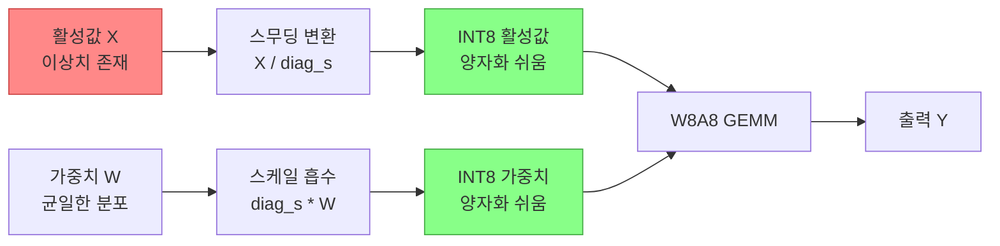

# SmoothQuant - 활성값 이상치 분산을 통한 W8A8 양자화

## 개요

SmoothQuant는 MIT CSAIL과 MIT-IBM Watson AI Lab이 2022년에 발표한 훈련 후 양자화(PTQ, Post-Training Quantization) 기법이다. 핵심 아이디어는 "양자화하기 어려운 활성값(activation)의 이상치를 가중치(weight) 쪽으로 수학적으로 분산"시켜 가중치와 활성값 모두 INT8로 양자화하는 W8A8 형식을 실현하는 것이다.

## 문제 배경: 왜 W8A8이 어려운가

기존 [[quantization-model-compression]] 연구에서 W8A8(가중치 8비트 + 활성값 8비트) 양자화는 다음과 같은 이유로 어려웠다.

- **가중치**: 채널별 분포가 상대적으로 균일 - INT8 변환 시 오차가 작음
- **활성값**: 특정 채널에 극단적인 이상치(outlier)가 집중 - 동적 범위가 수백 배 차이 나는 경우 존재

GPT 계열 모델에서 활성값의 일부 채널은 정상 채널 대비 100배 이상 큰 값을 가지는 "systematic outlier" 현상이 관찰된다. 이런 채널을 INT8로 억지로 표현하면 다른 채널의 정밀도가 급격히 떨어진다.

## 핵심 원리: 수학적 분산

SmoothQuant의 해법은 채널별 스케일 인수(per-channel scaling factor) $s$를 이용해 활성값과 가중치 사이에서 양자화 난이도를 균등하게 나누는 것이다.

$$\hat{Y} = (X \cdot \text{diag}(s)^{-1}) \cdot (\text{diag}(s) \cdot W)$$

여기서 $s_j$는 $j$번째 채널의 스케일 인수이며 다음 공식으로 결정된다:

$$s_j = \frac{\max(|X_j|)^\alpha}{\max(|W_j|)^{1-\alpha}}$$

- $\alpha = 0$: 활성값을 그대로, 가중치에 모든 분산을 부여 (가중치가 어려워짐)
- $\alpha = 1$: 가중치를 그대로, 활성값에 모든 분산을 부여 (활성값이 어려워짐)
- $\alpha = 0.5$: 기본값. 두 텐서에 균등하게 난이도를 분산

스케일 인수 $s$는 가중치에 미리 흡수(offline으로 적용)되므로 추론 시 추가 오버헤드가 없다.



활성값의 이상치 에너지를 스케일 인수를 통해 가중치로 이전하면 양쪽 모두 INT8로 안정적으로 표현할 수 있는 분포가 된다.

## W8A8의 하드웨어 이점

W8A8 형식은 NVIDIA Tensor Core 등 현대 하드웨어에서 큰 이점을 제공한다.

| 양자화 형식 | GEMM 속도 | 메모리 | 활성화 메모리 |
|-------------|-----------|--------|--------------|
| FP16 | 기준 | 기준 | 기준 |
| W8A16 | ~1.2x | 0.5x | 1.0x |
| W8A8 | ~1.5-2x | 0.5x | 0.5x | 
| W4A8 | ~2.5x | 0.25x | 0.5x |

특히 [[kv-cache-inference]] 용량이 크고 배치 크기가 큰 서빙 환경에서 W8A8은 처리량(throughput)을 크게 향상시킨다.

## 적용 범위 및 호환성

- **지원 모델**: OPT, BLOOM, LLaMA, Falcon 등 decoder-only 트랜스포머 계열
- **레이어 대상**: Linear 레이어 (Attention QKV, FFN 등) - LayerNorm 이후에 적용
- **보정 데이터**: 소량의 calibration 데이터셋으로 스케일 인수 추출
- **프레임워크 통합**: TensorRT-LLM, FasterTransformer, vLLM에서 공식 지원

## [[gptq-quantization]]과의 비교

| 항목 | SmoothQuant | GPTQ |
|------|------------|------|
| 비트폭 | W8A8 | W4 or W3 (가중치만) |
| 활성값 | INT8 | FP16 유지 |
| 계산 방식 | 수학적 변환 | Hessian 기반 업데이트 |
| 캘리브레이션 비용 | 낮음 (몇 분) | 중간 (수십 분) |
| 하드웨어 활용 | Tensor Core 최대 활용 | 가중치 압축 중심 |

SmoothQuant는 속도 지향, GPTQ는 메모리 절약 지향으로 사용 목적에 따라 선택한다.

## 한계 및 발전 방향

- 모든 레이어가 균등하게 이상치를 가지지 않으므로 레이어별 $\alpha$ 탐색이 필요한 경우 있음
- Attention 레이어 이후 활성값은 LN(LayerNorm) 이전과 다른 분포를 가짐 - 적용 위치 주의
- 후속 연구인 **AWQ**, **QuaRot**, **QuIP** 등에서 채널 분산 아이디어를 확장

## 실무 적용 시 고려사항

```python
# SmoothQuant 적용 흐름 (개념 의사코드)
from smoothquant import smooth_lm, quantize_model

# 1. 소량의 캘리브레이션 데이터로 활성값 통계 수집
act_scales = get_act_scales(model, calibration_data)

# 2. 스케일 인수를 가중치에 흡수 (오프라인)
smooth_lm(model, act_scales, alpha=0.5)

# 3. 가중치 + 활성값 모두 INT8로 양자화
quantized_model = quantize_model(model, weight_quant="per_channel",
                                  act_quant="per_token")
```

- `alpha` 하이퍼파라미터는 모델마다 최적값이 다름 (0.5가 무난한 기본값)
- 활성값 이상치가 특히 심한 레이어는 `alpha`를 높여 가중치 쪽에 더 많이 분산

## 관련 문서

- [[quantization-model-compression]] - 양자화 전반 개요, PTQ vs QAT
- [[gptq-quantization]] - Hessian 기반 가중치 전용 양자화
- [[awq-quantization]] - 활성값 가중 가중치 양자화
- [[kv-cache-inference]] - W8A8이 효과적인 KV 캐시 메모리 절감
- [[nvfp4-quantization]] - NVIDIA FP4 초저비트 양자화 (차세대)
