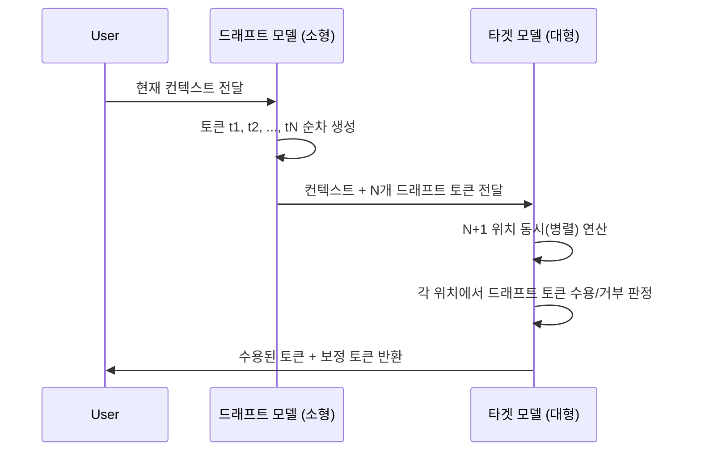

# 추측적 디코딩 (Speculative Decoding)

## 핵심 아이디어

LLM 추론의 병목은 자기회귀(autoregressive) 생성 방식에 있다. 대형 모델(target model)은 토큰 하나를 생성할 때마다 전체 파라미터를 통과해야 하며, 이는 직렬적(serial)으로 수행된다.

추측적 디코딩(speculative decoding)은 이 병목을 **소형 드래프트 모델(draft model)과 대형 검증 모델(target model)의 비대칭 협력**으로 해결한다. 드래프트 모델이 N개 토큰을 빠르게 추측하면, 타겟 모델이 이를 **병렬로** 검증한다. 타겟 모델의 포워드 패스 1회로 N+1개 토큰을 처리할 수 있다.

## Draft-Verify 파이프라인

타겟 모델의 병렬 연산 덕분에, 모든 드래프트 토큰이 수용될 경우 N+1개 토큰을 타겟 모델 1회 호출 비용으로 얻는다.

## 수용/거부 메커니즘 (Lossless Guarantee)

드래프트 토큰 $t_d$에 대해 타겟 모델 확률 $p(t)$와 드래프트 모델 확률 $q(t)$를 비교한다.

- **수용**: 확률 $\min(1, p(t_d)/q(t_d))$로 드래프트 토큰을 그대로 사용
- **거부**: 보정 분포 $\max(0, p(t) - q(t))$에서 새 토큰을 샘플링

이 절차는 **출력 분포가 타겟 모델의 분포와 수학적으로 동일함을 보장**한다. 즉 speculative decoding은 근사(approximation)가 아니라 **lossless 가속**이다.

## Acceptance Rate와 속도

수용률(acceptance rate) $\alpha$는 드래프트 토큰이 평균적으로 수용되는 비율이다.

- $\alpha \approx 1$: 드래프트 모델이 타겟 모델과 거의 일치 → 최대 가속
- $\alpha \approx 0$: 드래프트 모델이 부정확 → 거의 가속 없음 (오히려 오버헤드)
- **실용 범위**: $\alpha = 0.7$~$0.9$에서 2~4x 속도 향상 달성

이론적 속도 향상은 $\frac{N+1}{1 + N(1-\alpha^N)/(1-\alpha)}$에 근사한다 (단순화 모델 기준). 실제로는 드래프트 생성 비용, 배치 크기, 메모리 대역폭에 따라 다르다.

## 드래프트 모델 선택 전략

| 방식 | 설명 | 대표 예시 |
|------|------|----------|
| 소형 독립 모델 | 동일 계열의 소형 모델 사용 | Llama 7B가 Llama 70B를 드래프트 |
| Self-Draft | 타겟 모델 자체를 일부만 사용 | 초기 레이어만 통과 후 예측 |
| Medusa Heads | 타겟 모델에 병렬 헤드 추가 | 동일 컨텍스트에서 다음 N개 동시 예측 |
| n-gram / Retrieval | 이전 컨텍스트에서 후보 패턴 재사용 | Lookahead Decoding |

드래프트 모델은 타겟 모델과 **동일 토크나이저**를 공유해야 한다. 그렇지 않으면 토큰 정렬이 불가능하다.

## 주요 변형 알고리즘

### Medusa
- 타겟 모델의 마지막 은닉 상태(hidden state)에서 여러 개의 독립적인 LM 헤드를 사용
- 각 헤드가 +1, +2, ... +N 위치를 동시에 예측
- 드래프트 모델 없이 단일 모델로 구현 가능

### EAGLE (Extrapolation Algorithm for Greater Language-model Efficiency)
- 타겟 모델의 feature를 드래프트에 피드백해 정확도 향상
- EAGLE-2는 컨텍스트 인식 동적 드래프트 길이 조절
- Medusa 대비 수용률 향상

### Lookahead Decoding
- 드래프트 모델 없이 n-gram 캐시를 활용
- Jacobi iteration으로 여러 토큰 경로를 병렬 탐색
- 모델 수정 불필요, 즉시 적용 가능

### SpecInfer
- 복수의 소형 모델을 트리 기반으로 조합
- 여러 드래프트 후보를 트리로 구성 후 일괄 검증

## 실무 적용 관점

**적합한 상황:**
- 인터랙티브 대화 (대기 시간 단축 효과 큼)
- 단일 요청 저배치(batch size 1~4) 서빙
- 타겟 모델보다 10~100배 작은 검증된 드래프트 모델이 존재할 때

**비적합한 상황:**
- 대형 배치(GPU 이미 포화 상태) — 기존 토큰 처리가 병목이 아님
- 드래프트 모델과 타겟 모델의 분포 차이가 클 때 (예: 다른 아키텍처)

> 추측적 디코딩은 모델 출력 품질을 변경하지 않고 지연 시간(latency)을 줄인다. 처리량(throughput) 개선 효과는 배치 크기에 따라 제한적일 수 있다.

## 관련 문서
- [[calibrated-speculative-decoding-paper]] -- CSD: 보정된 스펙큘러티브 디코딩

- [[eagle-3-speculative-decoding]] - EAGLE-3 상세 분석
- [[speculative-speculative-decoding]] - 중첩 추측 디코딩 변형
- [[mirror-speculative-decoding]] - 미러 추측 디코딩
- [[sdsl]] - 추측적 디코딩 서비스 레이어
- [[kv-cache]] - KV 캐시와 추측적 디코딩 상호작용
