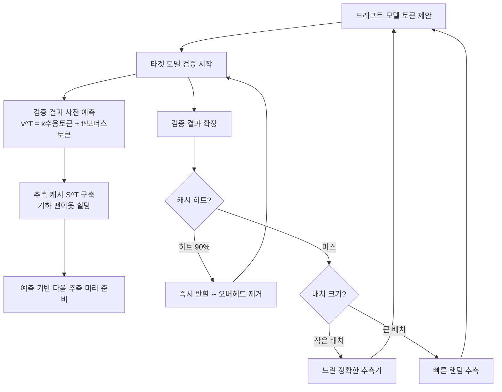

# 이중 추측적 디코딩 (Speculative Speculative Decoding, SSD)

## 개요

이중 추측적 디코딩(SSD)은 기존 추측적 디코딩([[eagle-3-speculative-decoding|speculative decoding]])의 순차적 의존성 자체를 병렬화하는 기법이다. 기존 방식에서는 드래프트 모델이 토큰을 제안하고 타겟 모델이 검증하는 과정이 순차적으로 진행되지만, SSD는 검증이 진행되는 동안 드래프트 모델이 검증 결과를 사전 예측하여 다음 추측을 미리 준비한다. 최적화 구현체인 Saguaro는 자기회귀 디코딩 대비 최대 5배 가속을 달성하며, ICLR 2026에서 발표되었다.

## 핵심 개념

### 기존 추측적 디코딩의 한계

표준 추측적 디코딩은 드래프트-검증 사이클이 순차적이다. 빠른 드래프트 모델이 여러 토큰을 제안하고, 느린 타겟 모델이 한 번의 포워드 패스로 병렬 검증한다. 그러나 검증 결과를 받기 전까지 다음 드래프트를 시작할 수 없어, 드래프트 오버헤드가 전체 속도 향상을 제한한다.

### 예측적 추측 (Anticipatory Speculation)

SSD의 핵심 혁신은 검증 결과를 기다리지 않고 사전 예측하는 것이다. 드래프트 모델이 검증 진행 중에 가능한 검증 결과를 예측하고, 각 경우에 대한 추측을 미리 계산하여 **추측 캐시(Speculation Cache)** S^T에 저장한다. 검증 결과 v^T := (k, t*)는 수용된 토큰 수 k와 보너스 토큰 t*로 정의된다.

### Saguaro의 세 가지 핵심 과제 해결

1. **보너스 토큰 예측 (Section 4.1)**: 잔차 분포 r(.) = max(p_target(.) - p_draft(.), 0)에서 샘플링되는 보너스 토큰을 최대 **90% 정확도**로 예측. 각 위치의 상위-F 드래프트 로짓을 활용한다.

2. **캐시 히트 vs 수용률 트레이드오프 (Section 4.2)**: Saguaro 샘플링 스킴은 다운웨이팅 파라미터 C (0-1 범위)로 캐시된 토큰에 대한 드래프트 확률을 억제하여 잔차 질량을 집중시킨다. 이로써 캐시 히트율과 수용률의 균형을 최적화한다.

3. **캐시 미스 폴백 (Section 4.3)**: 배치 크기에 따라 동적으로 전환 -- 작은 배치에서는 정확한 느린 추측기(neural speculator), 큰 배치에서는 빠른 랜덤 추측을 사용한다.

## 작동 원리

### 기하 팬아웃 (Geometric Fan-out) 전략

제한된 예산 B 내에서 각 위치 k에 할당할 팬아웃 F_k의 최적 분배를 제약 최적화 문제로 공식화한다:

- F_k = F_0 * a_p^(k/(1+r)), k < K
- F_K = F_0 * a_p^(K/(1+r)) * (1-a_p)^(-1/(1+r))

기하급수 감소는 토큰 수용이 상한 기하 분포를 따른다는 관찰에 기반한다. 균일 할당(uniform allocation) 대비, 특히 높은 온도(temperature)에서 유의미한 성능 향상을 보인다.

## 성능/효과

### 벤치마크 결과 (Llama-3.1-70B/1B, 4xH100)

| 데이터셋 | 자기회귀 대비 속도 향상 | SD 대비 추가 향상 |
|----------|----------------------|------------------|
| HumanEval | ~5x | ~1.6x |
| UltraFeedback | ~4.5x | ~1.5x |
| Alpaca | ~4.7x | ~1.6x |
| GSM8k | ~4.5x | ~1.6x |
| **평균** | **4.68x** | **1.58x** |

### 핵심 성능 지표

- 자기회귀 디코딩 대비 최대 **5배 가속** (오픈소스 추론 엔진 기준)
- 최적화된 추측적 디코딩 베이스라인 대비 평균 **30% 추가 가속** (최대 2x)
- 출력 품질 **무손실** -- 타겟 모델의 출력 분포와 수학적으로 동일
- ICLR 2026 채택으로 학술적 검증 완료
- 수용률(acceptance rate) 0.5 이하에서는 검증 오버헤드로 역효과 가능

### 이론적 속도 상한 (Theorem 7)

speedup_SSD = [p_hit * E_hit + (1-p_hit) * E_miss] / [p_hit * max(1,T_p) + (1-p_hit) * (1+T_b)]

표준 SD 대비 상대 향상의 상하한(Corollary 9):
- 하한: (1+T_SD) * (E_hit/E_SD) * p_hit
- 상한: (1+T_SD) * (E_hit/E_SD)

### 실험 환경

- **타겟 모델**: Llama-3.1-70B (4x H100)
- **주 드래프트 모델**: Llama-3.2-1B (1x H100)
- **보조 모델**: Qwen-3 패밀리 (Appendix F에서 추가 검증)
- 배치 크기 1에서 주 실험, 16까지 확장 검증

## 관련 문서

- [[eagle-3-speculative-decoding]] -- 보조 드래프트 헤드 기반 추측적 디코딩
- [[mirror-speculative-decoding]] -- 양방향 추측 + 이기종 가속기 병렬화
- [[mit-training-efficiency]] -- 학습 시 추측적 디코딩 활용
- [[kv-cache]] -- 추측적 디코딩의 메모리 관리
